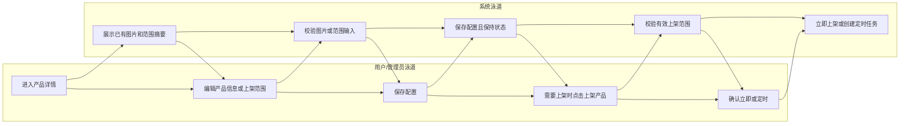
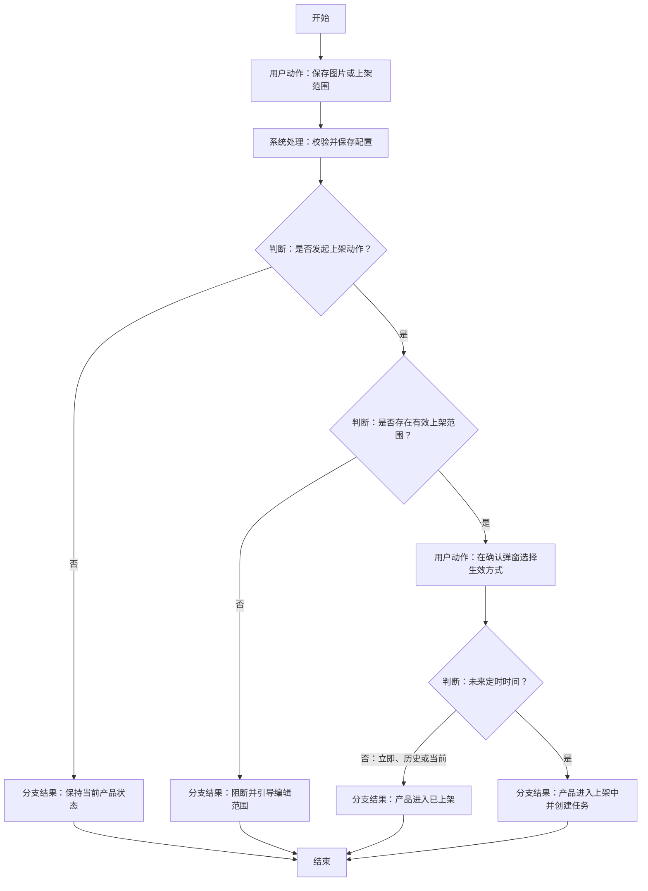

# 可控发布原型 V3｜轻量 PRD

## 1. 产品概述

V3 在冻结的 V2 原型基础上，优化产品图片维护与产品上架操作。版本目标是把三张产品图片的重复上传收敛为一次上传，并把“配置上架范围”与“执行上架动作”拆成两个清晰步骤，降低误触发状态变化和范围失配风险。

## 2. 背景与目标

### 背景与问题

- 当前产品信息维护存在设备主图、设备列表图、原子化配网图三个独立输入入口，运营需重复上传，且容易出现版本不一致。
- 当前上架范围与立即/定时上架混在同一操作中，用户修改范围时可能误以为会同时改变产品状态；定时任务与范围调整的关系也不清晰。
- 已下架产品再次定时上架后，取消任务需要准确恢复到已下架，而不是统一回退为开发中。

### 目标与成功标准

| 目标类型 | 目标 | 成功标准 |
| --- | --- | --- |
| 用户目标 | 一次完成三种图片更新 | 单个源文件保存后可见三种固定尺寸输出预览。 |
| 用户目标 | 明确区分范围配置与上架动作 | 保存范围不改变状态；上架动作始终在独立确认弹窗完成。 |
| 项目目标 | 保持已有数据兼容 | 不新增业务图片类型，不改变三份图片既有存储字段和用途。 |
| 质量目标 | 使状态流转可验证 | 覆盖立即、历史/当前、未来定时、取消任务与范围裁剪回滚。 |

## 3. 用户与场景

| 项目 | 定义 |
| --- | --- |
| 主要用户 | IoT Admin 产品经理、产品运营人员。 |
| 影响角色 | 研发与测试人员，依据状态、范围和图片处理规则实施及验收。 |
| 适用端 | IoT Admin Web 后台。 |
| 适用对象 | 产品详情 > 基础信息中的产品信息、上架范围和产品上架操作。 |

## 4. 用户故事 / JTBD

1. 作为产品运营人员，我想上传一张源图片并得到三种产品图片，以便避免重复上传和图片版本不一致。
2. 作为产品经理，我想单独保存上架范围，以便调整覆盖范围时不意外改变产品上架状态。
3. 作为产品经理，我想在上架确认时明确选择立即或定时生效，以便可预期地安排产品开放时间。
4. 作为产品经理，我想取消尚未生效的定时上架，并恢复原始状态，以便修正计划而不丢失已配置范围。

## 5. 用户旅程图

### 旅程说明

- 配置阶段：用户分别进入产品信息或上架范围抽屉；系统校验输入，保存配置但不将范围保存解释为上架动作。
- 上架阶段：用户从产品详情顶部发起独立上架操作；系统展示最新范围摘要并校验范围有效性。
- 完成阶段：立即/历史时间进入已上架；未来时间进入上架中。用户可取消定时任务，系统恢复任务来源状态。

## 6. 方案取舍

| 方案 | 核心做法 | 取舍结论 |
| --- | --- | --- |
| 三个独立图片入口 | 每张图片分别上传 | 不采用：重复操作且容易造成三份图片不一致。 |
| 单一源图派生三份输出 | 一次上传，后台固定尺寸处理 | 采用：前端和服务端入口统一，存储字段不变。 |
| 范围与上架同一抽屉 | 保存范围时同时处理生效方式 | 不采用：配置与状态动作耦合，易误操作。 |
| 范围配置与上架确认分离 | 范围抽屉只保存配置，独立弹窗执行上架 | 采用：状态变化有明确确认点，定时任务可读取最新范围。 |

## 7. 需求范围

### In Scope

1. 统一产品图片上传。
2. 上架范围与上架动作解耦。
3. 独立产品上架、定时上架、取消定时上架与下架流程。

### Out of Scope

- 不修改 V2 原型、根目录 V2 文档或 V2 已有业务规则。
- 不新增业务图片类型，也不支持单独替换三份派生图片中的任意一份。
- 不新增 GitHub Pages 的 CI/CD、域名或飞书知识库结构；本轮仅发布当前 V3 静态原型和独立 PRD。
- 不新增 OTA/RN 发布能力；仅在范围缩小时执行既有关联子范围裁剪。
- 白名单、固件、虚拟版本、扩展程序等已有功能仅回归验证，不属于 V3 新需求。

## 8. 核心流程

### 流程说明

- 图片或范围保存均是配置动作；只有上架确认弹窗可以改变产品上架状态。
- 保存范围时，范围缩小需要同步裁剪 OTA/RN 自定义子范围；任一关联裁剪失败则整体回滚。
- 上架中定时任务触发时读取最新已保存范围，而非创建任务时的范围快照。

## 9. 功能需求

### 9.1 统一产品图片上传（P0）

| 项目 | 规则 |
| --- | --- |
| 入口 | “编辑产品信息”抽屉中的单一源文件上传控件。 |
| 提示 | 建议源图 `600×600`；不超过 5 MB；支持 PNG、JPG、JPEG。 |
| 校验 | `5 MB = 5 × 1024 × 1024` 字节；阻断空文件、非 PNG/JPG/JPEG、超过限制的文件。建议尺寸不阻断。 |
| 输出 | 同时展示主图 `108×108`、列表图 `108×108`、原子化配网图 `600×600`。 |
| 处理 | 后台按目标像素强制缩放/压缩，不裁剪、不保持原图比例。 |
| 保存 | 新文件整体替换三份派生图片；无新文件时保留三份旧图片。 |
| 数据边界 | 继续使用三份既有存储字段/用途，只收敛前端输入和服务端处理入口。 |

### 9.2 上架范围配置（P0）

| 项目 | 规则 |
| --- | --- |
| 可见状态 | 开发中、已下架、上架中、已上架均可编辑。 |
| 字段 | 仅上架方式、范围模式、范围选项。 |
| 移除字段 | 不展示立即/定时生效；`listingEffectiveMode`、`listingEffectiveTime` 移至上架动作数据。 |
| 保存语义 | 开发中/已下架保持原状态；上架中保持上架中；已上架范围立即生效且状态不变。 |
| 关联事务 | 范围缩小时裁剪 OTA/RN 自定义子范围；范围与关联配置同一事务，失败整体回滚。 |

### 9.3 独立产品上架流程（P0）

| 项目 | 规则 |
| --- | --- |
| 入口 | 开发中或已下架产品点击“上架产品”。 |
| 弹窗 | 展示当前上架范围摘要；每次默认选择立即生效，不继承历史定时时间。 |
| 立即生效 | 确认后进入已上架。 |
| 定时生效 | 时间精确到分钟；历史/当前时间按立即上架，未来时间进入上架中。 |
| 有效范围 | 未配置有效范围时阻断上架，并引导先编辑范围。 |
| 定时任务 | 不保存范围快照；触发时读取最新已保存范围。 |
| 取消任务 | 上架中显示“取消上架”；首次上架恢复开发中，已下架后再次上架恢复已下架。 |
| 下架 | 已上架显示“下架产品”；下架后保留上架范围配置。 |

## 10. 非功能要求、依赖与风险

| 类型 | 项目 | 要求或应对 |
| --- | --- | --- |
| 一致性 | 范围与关联子范围 | 用同一事务保存；失败时整体回滚并提示失败。 |
| 定时依赖 | 服务端时间与调度 | 使用服务器时间按分钟判断；允许秒级调度延迟。 |
| 图片处理 | 派生文件生成 | 三份输出必须一起成功后才替换旧图片，避免部分更新。 |
| 回归 | V2 既有能力 | 白名单、固件、虚拟版本、扩展程序流程保持可用。 |

## 11. 验收标准

| 编号 | 验收标准 |
| --- | --- |
| AC-01 | 合法 PNG/JPG/JPEG 可上传，三种输出预览尺寸正确。 |
| AC-02 | 空文件、非支持格式、超过 5 MB 被阻断；非正方形源图不被尺寸校验阻断。 |
| AC-03 | 无新文件保存后，现有三份图片不被清空。 |
| AC-04 | 四种产品状态均可编辑范围；保存范围后的状态与第 9.2 节一致。 |
| AC-05 | 上架中保存范围后，任务触发时使用最新范围。 |
| AC-06 | 立即、历史/当前、未来时间分别进入已上架、已上架、上架中。 |
| AC-07 | 无有效范围时不能上架；上架中取消后准确恢复来源状态；已上架下架后范围仍保留。 |
| AC-08 | 范围缩小正确裁剪 OTA/RN 子范围；任一裁剪失败时所有范围数据回滚。 |

## 12. 测试用例

| 用例名称 | 前置条件 | 输入 | 操作 | 预期结果 |
| --- | --- | --- | --- | --- |
| 图片上传成功 | 进入编辑产品信息抽屉 | PNG/JPG/JPEG，任意宽高比，≤ 5 MB | 选择文件并保存 | 三份输出预览显示固定尺寸，三份图片同时更新。 |
| 图片上传阻断 | 进入编辑产品信息抽屉 | 空文件、GIF 或超过 5 MB 文件 | 选择文件 | 阻断并展示对应格式、空文件或大小原因。 |
| 无新图保存 | 产品已有三份图片 | 仅修改产品名称 | 保存 | 名称保存成功，三份图片保持不变。 |
| 开发中保存范围 | 产品为开发中 | 修改数据中心或国家地区范围 | 保存范围 | 状态仍为开发中。 |
| 已上架保存范围 | 产品为已上架 | 缩小范围 | 保存范围 | 状态仍为已上架，新范围立即生效且 OTA/RN 子范围被裁剪。 |
| 范围裁剪回滚 | 存在关联 OTA/RN 自定义子范围 | 模拟关联裁剪失败 | 保存范围 | 产品范围和所有关联子范围均保持保存前值。 |
| 立即与历史定时上架 | 产品为开发中或已下架且范围有效 | 立即，或过去时间 | 上架确认 | 产品进入已上架。 |
| 未来定时上架与取消 | 开发中、已下架各一产品且范围有效 | 未来分钟时间 | 创建定时上架后取消 | 分别恢复开发中、已下架，范围配置保留。 |
| 无范围上架拦截 | 产品未配置有效范围 | 点击上架产品 | 尝试确认 | 阻断并引导打开编辑上架范围。 |
