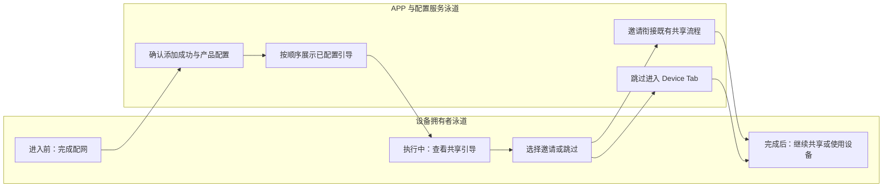
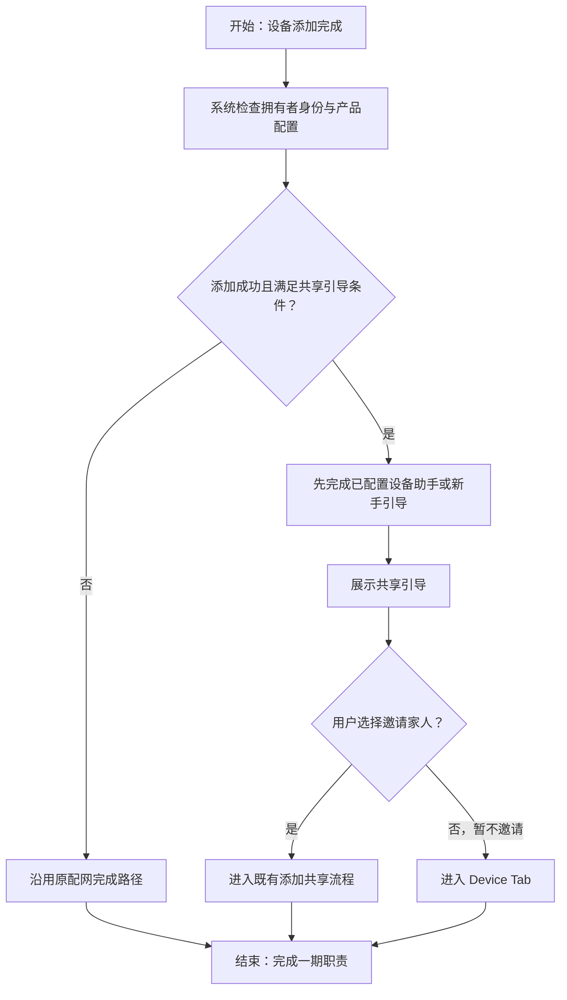

# 设备共享一期 PRD：配网完成后共享引导

| 属性 | 内容 |
| --- | --- |
| 状态 | 已上线能力归档，按批准分期整理；本次未验证生产行为 |
| 日期 | 2026-09-10 |
| 原文 | [飞书 PRD Rev.3356](https://momcozy-in.feishu.cn/wiki/Ao0BwgRIPi2r9IkVbUycOpDUnbc) |
| 原型 | [一期交互原型与页面规格](https://hawzz.github.io/root-interactivable-prototype/prototypes/device-sharing-phase-1/) |
| 本地证据 | `device-sharing/prd.md`、`device-sharing/raw/feishu-prd-reconciliation-2026-09-08.md`、`device-sharing/prototype/src/data/prd-specs.ts` 的 `network-setup` / `device-tab` |
| 当前基准 | 已读取 `raw/feishu-prd-rev3356.json` 的 `data.document.content`，核对“配网完成后增加共享引导”及 `prototype/src/phases/specs.ts`；本次未验证生产 |

## 1. 背景与目标

设备配网完成是拥有者发现共享能力的关键触点。家庭成员共用账号可能导致异常登出，一期在设备添加成功后提示使用独立账号共享设备，并允许用户直接继续使用设备。

一期仅包含已经上线的配网后共享引导。引导跳向既有共享流程是衔接依赖，账号校验、关系建立、通知、权限管理均不属于一期新增交付。本稿用于范围归档与回归，不重新定义完整设备共享。

## 2. 用户、场景与范围

| 项目 | 定义 |
| --- | --- |
| 主要用户 | 已完成设备配网的设备拥有者，Momcozy APP 用户 |
| 触发条件 | 设备添加成功，产品支持共享且 IoT 后台配置配网成功后展示共享引导 |
| 主要场景 | 拥有者邀请家人，进入既有共享入口；或暂不邀请，进入 Device Tab |
| In Scope | 引导展示条件、多个引导顺序、邀请跳转、跳过路径、既有能力衔接回归 |
| Out of Scope | 设置页共享能力改造、添加及管理共享、未注册邀请、通知、权限变更、共享计数、三方平台新增接入 |

用户故事：作为刚配网完成的拥有者，我希望在此时找到邀请家人的入口；当我暂时不需要共享时，我希望跳过引导并立即使用设备。

## 3. 用户旅程泳道

旅程说明：进入前的触点是配网完成页；执行中需保证用户能够跳过，避免共享引导阻碍首次使用；完成后进入既有共享流程或设备列表。引导只增加发现机会，不授予家人权限，也不代表共享成功。

## 4. 核心流程

流程说明：邀请落点沿用现有 `add-share` 对应共享流程，不将该页面业务归入一期。无配置或不支持共享时不展示引导；缺失入口不占位；顺序为设备助手/新手引导后再设备共享。不增加独立“邀请家人”菜单入口。

## 5. 需求与业务约束

| ID | 需求 | 业务规则与边界 | 优先级 |
| --- | --- | --- | --- |
| P1-R01 | 配网完成引导 | 仅拥有者添加成功且配置允许时展示；未成功配网不进入成功引导 | P0，已上线回归 |
| P1-R02 | 引导排序 | 设备助手/新手引导在前，共享在后；未配置项不占位 | P0，已上线回归 |
| P1-R03 | 邀请家人 | 衔接当前设备既有添加共享流程；点击本身不新增关系、不发通知、不计共享成功 | P0，已上线回归 |
| P1-R04 | 暂不邀请 | 进入 Device Tab，已添加设备继续可用；后续可通过既有设置入口共享 | P0，已上线回归 |
| P1-R05 | 范围隔离 | 引导不改变账号、合规、权限、版本或共享限制；不新增注册邀请行为 | P0，已上线回归 |

页面文案、图片、布局、按钮状态和返回行为参见一期原型规格，不在本 PRD 复制。原型中下游共享页面用于说明落点，不能据此扩大一期范围。配置获取异常沿用现有配网兜底，不在本文凭空新增重试或强制引导策略；需回归确认设备添加结果不会被引导失败撤销。

## 6. 成功指标与非功能要求

一期可观察“符合条件的配网成功次数、引导曝光次数、邀请点击次数、跳过次数、落点到达次数”，用于检查触达与路径中断。邀请点击率建议口径为邀请点击次数/引导曝光次数，落点到达率为到达次数/对应点击次数；无已确认数值目标，不伪造上线效果。

原文共享组件 ≥70% 复用、≥50% 效率、≥80% 共享发起成功、≥20% 设备共享率提升不作为一期引导验收成绩。点击邀请不能计为已建立共享关系。日志仅记录必要事件，遵循现有账号及隐私要求；中英文内容应能完整展示，且跳过不影响正常设备使用。

## 7. 风险与依赖

| 类型 | 风险或依赖 | 处理及验收要求 |
| --- | --- | --- |
| 外部依赖 | IoT 产品共享配置与配网完成引导配置 | 覆盖开启、关闭、不支持共享的产品样本 |
| 外部依赖 | 既有添加共享流程可达 | 验证设备上下文正确，不扩展一期职责 |
| 实施风险 | 旧原型同时演示完整共享流程 | 评审按一期范围验收，下游只检查落点 |
| 实施风险 | 多引导顺序或跳过路径阻塞使用 | 覆盖配置组合，保留成功添加的设备 |
| 证据风险 | Rev.3356 和本地分期规格已核对，未验证生产 | 主任务回归已上线行为，差异独立记录 |

## 8. 编号验收与页面映射

以下 AC 与分期规格一致，详细场景归入对应页面编号。

| AC | 前置条件与操作 | 预期结果 | 原型页面 |
| --- | --- | --- | --- |
| P1-AC-01 | 拥有者配网成功，覆盖支持/不支持产品、开关及多引导组合 | 仅条件满足展示，设备助手/新手引导在前，共享在后；关闭项不占位，无独立菜单；不扩入下游业务 | [配网后引导](https://hawzz.github.io/root-interactivable-prototype/prototypes/device-sharing-phase-1/?page=network-setup) |
| P1-AC-02 | 点击邀请家人 | 带入当前设备进入添加共享；该页仅上下文，导航点击不创建关系或计成功 | [添加共享上下文](https://hawzz.github.io/root-interactivable-prototype/prototypes/device-sharing-phase-1/?page=add-share) |
| P1-AC-03 | 点击暂不邀请并查询设备列表 | 进入 Device Tab，设备仍已添加且可用；该页仅上下文 | [设备列表上下文](https://hawzz.github.io/root-interactivable-prototype/prototypes/device-sharing-phase-1/?page=device-tab) |

## 9. 测试用例

| 用例名称 | 前置条件 | 输入 | 操作 | 预期结果 |
| --- | --- | --- | --- | --- |
| 引导成功进入 P1-AC-01、P1-AC-02 | 拥有者配网成功且配置开启 | 当前设备 | 点击邀请家人 | 正确设备上下文进入共享落点 |
| 配置关闭 P1-AC-01 | 产品未配置引导 | 关闭配置 | 完成配网 | 无共享引导，原完成路径有效 |
| 查询设备结果 P1-AC-03 | 配网已成功 | 暂不邀请 | 跳过后查询列表 | 设备仍在且可使用 |
| 引导状态与排序 P1-AC-01 | 多业务配置组合 | 开启和关闭组合 | 逐组完成配网 | 顺序正确、关闭项无占位 |
| 成功口径一致 P1-AC-01、P1-AC-02 | 仅点击引导，未提交共享 | 邀请点击 | 对照共享记录和埋点 | 有引导点击，无新增共享成功 |
