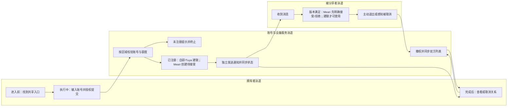
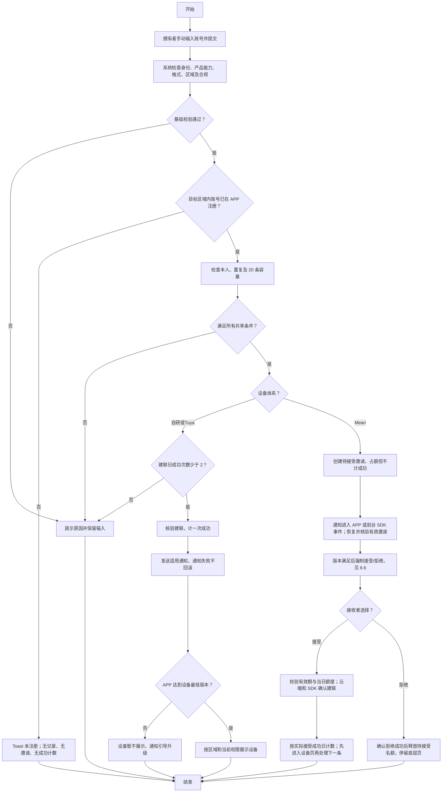

# 设备共享二期 PRD：已注册用户共享完整闭环

| 属性 | 内容 |
| --- | --- |
| 状态 | 已批准分期范围，需求评审稿 |
| 日期 | 2026-09-10 |
| 对照原文 | [飞书原始 PRD Rev.3356](https://momcozy-in.feishu.cn/wiki/Ao0BwgRIPi2r9IkVbUycOpDUnbc) |
| 原型 | [二期交互原型与页面规格](https://hawzz.github.io/root-interactivable-prototype/prototypes/device-sharing-phase-2/) |
| 本地已读来源 | `device-sharing/prd.md`、`device-sharing/raw/feishu-prd-reconciliation-2026-09-08.md`、`device-sharing/prototype/src/data/prd-specs.ts` |
| 核验声明 | Rev.3356 为历史对照来源；本版以最新用户批准的厂商分支规则为准；SDK 能力与 7 天期限待技术确认 |

## 0. 对比原 PRD 的变更说明

对照基线：原飞书 PRD Rev.3356（历史规则）；对照日期：2026-09-10。最新用户批准规则优先于此前统一直接建联、无接受/拒绝的规则：全部厂商仅支持 APP 已注册账号；自研/Tuya 直接建联，仅 Meari 向已注册接收者发邀请并要求接受/拒绝。关系维护方和自动 SDK 账号映射前提继续保留，不扩展连接范围。

二期承接原 PRD 中除“已上线配网后引导”和“新用户共享”以外的全部范围。未列为移出或调整的原有要求继续适用，尤其不因分期删除权限、合规、通知、版本及数据隔离。下表“原文”列为 Rev.3356 规则摘要；原文未明确、来自本地原型补充的规则须保留来源区分。原文埋点及 UIUX 引用继续作为依赖，其标题中的“一期”不直接等同于本次第一阶段。

| 原章节／原规则 | 二期规则 | 变更类型 | 归属期次及原因 | 关联验收项 |
| --- | --- | --- | --- | --- |
| 配网成功后引导；后台配置；设备助手/新手引导优先；可跳过 | 不重新交付引导，只回归其共享落点 | 移出新增范围 | 一期已上线，仅拆交付归属 | P2-AC-13 |
| 设置页共享入口仅拥有者可见，产品能力开关控制 | 保留，服务端同时鉴权并阻断关闭产品请求 | 不变 | 二期原有核心入口 | P2-AC-01 |
| 手动手机号/邮箱输入，按注册区域支持手机号 | 邮箱全区域；US/CA 仅 +1，CN 仅 +86，其余仅邮箱；按分享者注册区域匹配账号 | 明确/收敛 | 二期确认匹配边界；+1 不等于 US/CA 互通 | P2-AC-03 |
| 本人、格式、重复、上限、频次校验，提交 Loading，失败保留输入 | 保留适用校验；删除等待注册重复提示分支 | 保留并收敛 | 二期无等待注册状态 | P2-AC-02、P2-AC-03 |
| 已注册账号直接建联，无接受/拒绝（历史 Rev.3356） | 自研/Tuya 保留；Meari 改为已注册邀请，接受后建联 | 最新用户覆盖 | 二期 Meari 例外，非未注册邀请 | P2-AC-03、P2-AC-14、P2-AC-15 |
| 未注册创建等待注册记录，发送注册提醒 | 仅提示账号未注册 Toast 后结束；不创建记录、不发邀请、不计成功 | 替换 | 新用户能力归三期；二期明确拒绝结果 | P2-AC-03 |
| 等待注册、共享中、已取消、已退出、已过期 | 保留共享中/已取消/已退出；新增 Meari 待接受及拒绝/过期终态；失败不是关系状态 | 最新用户覆盖 | 待接受不等于等待注册；终态不展示在待处理列表 | P2-AC-02、P2-AC-14、P2-AC-15 |
| 等待注册 30 天、到期失效、注册登录自动建联 | 二期不执行；注册完成后需要拥有者重新主动发起二期共享 | 移出 | 三期重新评估期限和建联方式，未定稿 | P2-AC-03 |
| 单台设备最多 20 条有效记录，共享中与等待注册合计 | 共享中 + Meari 待接受合计最多 20 条；待接受不可撤回 | 计数集合调整 | 二期没有等待注册；拒绝/过期自动释放待接受占额 | P2-AC-02、P2-AC-15 |
| 同设备同账号每天最多成功发起 2 次，取消/退出不重置 | 仅成功建联计数；Meari 计实际接受成功日，发送/拒绝/过期不计 | 数值保留、明确日期 | 接受时重新校验每日额度，幂等成功仅一次 | P2-AC-03、P2-AC-14 |
| BBM 等合规勾选、共享确认、成功记录时间/IP/uid/设备 ID | 完整保留，普通设备不展示，不增加接收方二次隐私确认 | 不变 | 二期授权与审计底线 | P2-AC-03 |
| 已注册 Push、消息中心、已绑定验证邮箱邮件并行 | 渠道保留；Meari 通知有效邀请，接受后才建联；同一邀请/关系邮件一次、不催促，失败不回滚业务状态 | 最新用户覆盖 | 二期触达闭环 | P2-AC-04、P2-AC-05、P2-AC-06 |
| 未注册邮箱邮件、下载二维码、期限与注册指引 | 二期不发送、不展示成功结果 | 移出 | 三期能力草案，不提前承诺邀请 | P2-AC-03 |
| 未注册手机号短信及 HTML 指引，多语言，设备名称可展示，禁婴幼儿信息 | 二期不触发该渠道；隐私约束作为三期底线保留 | 移出触发路径 | 三期核实供应商与地区支持 | P2-AC-03 |
| 低于 IoT 配置设备最低 App 版本，关系仍建立、设备不显示 | 自研/Tuya 保留；Meari 保持待接受，升级后恢复仍有效邀请再决策 | 最新用户覆盖 | 沿用设备最低版本；Push/消息中心去商店、低版本邮件无跳转 | P2-AC-10、P2-AC-15 |
| 新注册用户区域错误不展示数据并发送一次邮件 | 二期无新注册自动建联；保留数据大区隔离，不新增已注册用户区域错误邮件触发规则 | 移至三期候选方案 | 注册后区域纠错随未注册链路后移；二期不扩大原通知人群 | P2-AC-10、P2-AC-12 |
| 设备直接进列表，无共享标识，跳过 onboarding | 自研/Tuya 直接展示；Meari 接受且云端/SDK 确认建联后进入设备页；展示样式保留 | 最新用户覆盖 | 待接受无设备访问权 | P2-AC-12、P2-AC-14 |
| 设备控制、实时/历史数据、基础信息只读、受限设置、耗材/客服/助手、告警权限 | 完整保留权限矩阵，见第 6 节 | 不变 | 二期并非仅添加共享页面 | P2-AC-07、P2-AC-08、P2-AC-09 |
| 仅共享设备及其数据，不同步宝宝资料和每日例行记录变更 | 完整保留 | 不变 | 二期隐私与数据范围 | P2-AC-09 |
| 历史原文背景指出蓝牙共享缺口、控制依赖本地蓝牙或云端通信；历史本地规格称关系云端维护 | 本次明确覆盖：不按蓝牙/WiFi 细分，仅建立和维护设备共享关系；APP 通过关系连接设备不在范围内。自研由云端维护，Tuya/Meari 各由云端与对应 SDK 共同维护，见 6.0 | 用户确认覆盖旧口径 | 仅二期；保留权限约束，不验收无线连接或传输 | P2-AC-03、P2-AC-09 |
| 拥有者取消、接收者主动移除、权限收回、双方列表同步、失效消息 | 保留全部已建联分支；Meari 待接受无撤回，拒绝/过期移除待处理项并释放名额 | 保留并补充 | 仅待接受暂定自邀请创建起 7 天，待技术确认；不删除审计历史 | P2-AC-02、P2-AC-11、P2-AC-15 |
| 中英文规格、异常提示与版本规则 | 保留适用页面，不把旧原型演示当新增需求 | 不变 | 二期完整体验 | P2-AC-01～13 |
| 成功指标：复用率 ≥70%、新设备接入效率提升 ≥50%、发起成功率 ≥80%、设备共享率提升 ≥20% | 四项指标保留；发起成功分子排除等待记录，仅实际建联；共享率提升不替换为次数增长 | 保留指标、成功集合收敛 | 二期排除新用户等待记录 | P2-AC-03 |
| 原文仅手动输入，转分享受权限限制；家庭组织及迁移未列原文，本地 PRD 明确排除 | 继续排除，不扩展 | 保持范围边界 | 二期不新增未定义能力 | P2-AC-01、P2-AC-03、P2-AC-09 |
| 网络异常：弱网/无网/超时阻断当前操作并提示 | 全部操作保留，不提前成功或移除；恢复后重试并核对状态 | 不变 | 二期新增及终止均覆盖 | P2-AC-02、P2-AC-03、P2-AC-07、P2-AC-11 |
| 数据埋点需求与一期 UIUX 链接 | 保留引用，按本次分期核对事件及页面 | 归属澄清 | 不删除附属依赖，不将外链未读内容当作已核实 | P2-AC-03、P2-AC-13 |

### 沿用原 PRD 的内容

- 拥有者与被分享者权限边界、设备共享能力配置、设备及设备数据范围继续适用。
- 指定婴童设备的合规勾选、共享确认和成功审计要求保留；普通设备不增加专用确认门槛。
- 已注册用户 Push、消息中心、验证邮箱通知及通知失败不回滚关系的规则保留。
- IoT 配置的设备最低 APP 版本判断、低版本通知与升级后同步规则保留。
- 取消共享、主动退出、双方状态同步、权限收回、通用网络异常和并发兜底保留。
- 上述规则具体映射见第 6 节及 P2-AC-01～13；延期的未注册能力并非永久删除。

## 1. 产品概述与背景

家庭成员使用独立账号访问同一设备，可以减少共用主账号造成的异常登出，并明确设备管理权。二期实现拥有者向已注册账号共享设备、接收者使用、双方终止关系的完整 APP 闭环，承接原始共享组件的可复用能力。

“新用户”在本需求中指提交共享时目标区域内不存在对应已注册账号，不等同于首次收到共享、首次安装或低版本用户。已注册但版本低的账号仍属于二期。未注册目标在二期仅获得拥有者端失败提示，后续注册不会触发二期隐式共享。

## 2. 用户、场景与范围

| 角色 | 目标与场景 |
| --- | --- |
| 设备拥有者 | 从设置页或一期落点手动输入家人账号，查看关系并取消共享 |
| 已注册被分享者 | 从通知定位设备，使用控制与数据功能，查看只读信息或主动退出 |
| 账号/设备/通知服务 | 区域内匹配身份，鉴权及额度校验，建立/撤销关系，独立执行触达 |

用户故事：拥有者希望向已注册家人共享并查看当前状态；自研/Tuya 接收者直接获得关系，Meari 接收者必须明确接受或拒绝有效邀请；关系终止后双方希望状态一致且旧消息不能恢复权限。

In Scope：入口、共享列表、添加校验、合规、已注册建联及 Meari 已注册邀请的接受/拒绝/恢复/过期、通知、版本、地区隔离、设备展示、完整权限矩阵、取消和退出、异常、多语言及指标。关系目标不按蓝牙/WiFi 细分。Out of Scope：APP 通过共享关系连接蓝牙/WiFi 设备的连接与通信实现及测试、一期引导新增开发、未注册邀请及等待注册/注册建联、待接受邀请撤回、家庭组织、转分享、通讯录/扫码、历史迁移及具体接口/数据库设计。全部范围内业务为 P0；业务指标用于上线效果评估，不能替代功能验收。

## 3. 目标与指标

Rev.3356“成功指标”原文为：“通用能力复用率≥70%”；“新设备接入设备共享组件的效率提升≥50%”；“设备共享发起成功率（成功创建‘共享中’关系或‘等待注册’记录的次数 ÷ 点击【发起共享】次数）≥80%”；“设备共享率提升≥20%（使用了新的设备共享组件后的共享率跟没使用之前的设备共享率）”。二期保留四项指标及阈值，仅按分期收敛成功分子。原文未给复用清单、效率细化公式、共享率分母及观察窗口；以下统计建议需评审冻结。

| 指标 | 保留目标 | 二期计算与边界 |
| --- | --- | --- |
| 组件复用率 | ≥70%（>=70%） | 按原文组件复用清单核算；复用项/适用项，分子分母采用同一粒度。原文未给细化公式，清单由研发评审冻结 |
| 接入/开发效率提升 | ≥50%（>=50%） | 建议以可比接入工作量计算（基线工时－二期工时）/基线工时；原文未给细化公式，任务复杂度与基线须评审冻结，不以主观打分替代 |
| 共享成功率 | ≥80%（>=80%） | 分子为统计窗口内归因至二期发起行为、实际成功建立的共享关系数；分母为同窗口“发起共享”点击次数。未注册、本人、重复、限额、网络失败等已发生的发起点击保留在分母，不能只取校验通过请求 |
| 设备共享率提升 | ≥20%（>=20%） | 对比新组件使用后共享率与使用前共享率。原文未定义共享率分母、按账号或设备计算的粒度、观察周期及提升算法，均待数据评审冻结；分子仅基于实际已建立共享关系，两组采用同一粒度与去重口径，不计等待记录或邀请。不以共享次数增长替代原指标，不在分母未冻结时宣称达标 |

一期“邀请家人”导航点击不属于“发起共享”点击。二次确认是同一发起行为的后续步骤，不新增第二个分母事件；Loading 禁用按钮不产生新的有效点击事件，取消确认的既有点击仍留在分母。服务端重试或重复回调只归因一次关系成功。通知成功、未注册 Toast、注册完成均不能增加成功分子。自研/Tuya 低版本账号关系已建立则计成功，即使设备暂时不展示；Meari 低版本待接受不计成功，升级后实际接受建联才计成功。Meari 成功归因原发起点击的统计窗口，业务每日 2 次额度按实际接受成功日，两者不可混用。

本次埋点仅服务于设备共享发起成功率和设备共享率提升两项业务指标，APP（含设备SDK响应）及后台采集范围见第10章。组件复用率、接入/开发效率提升不纳入本次埋点统计，不新增页面曝光、停留、通知效果或其他辅助指标。

## 4. 用户旅程泳道

旅程说明：进入前保留设置入口与一期衔接；执行中最大风险是账号区域错误、误以为未注册也分享成功，因此失败需明确停留；完成后关系事实优先于通知，低版本提供升级路径，取消/退出均及时回收访问权。

## 5. 核心流程与状态

流程说明：图表达正常业务分支，不规定后端校验接口顺序；Meari 低版本先升级再恢复有效邀请，失败保留弹窗重试、未知查询终态、过期阻断操作，详见 6.6。所有创建条件必须由服务端可靠校验；请求超时需查询最终关系事实，不能因重试重复建联。未注册无关系可查询，注册后需拥有者再次主动发起。

| 当前状态 | 触发 | 结果及列表变化 |
| --- | --- | --- |
| 无关系 | 自研/Tuya 已注册且全部校验通过 | 核实共享中，列表新增，成功计数 +1；关系不设邀请期限 |
| 无关系 | Meari 已注册且全部校验通过 | 待接受，拥有者列表显示并占额，无设备访问权、不计成功 |
| 待接受 | 接受且未过期、额度允许、云端与 SDK 确认建联 | 共享中，原占额转有效关系不重复占额；按接受成功日计 +1，进入设备页 |
| 待接受 | 拒绝成功 | 已拒绝，移除待处理项并释放名额，停留底层页；不计成功 |
| 待接受 | 从邀请创建起达到暂定 7 天 | 已过期，自动移除待处理项并释放名额；保留审计，不计成功；期限及执行能力待技术确认 |
| 待接受 | 同设备同账号重复发送 | 阻止重复，不延长原有效期，无撤回入口 |
| 待接受 | 请求失败/结果未知/退出 APP | 不伪装拒绝或建联；失败保留弹窗重试，未知查询最终状态，退出后恢复 |
| 已拒绝/已过期 | 拥有者重新发起 | 重新校验后可创建新邀请，使用新创建时间；旧邀请不得恢复 |
| 无关系 | 未注册或其他失败 | 保持无关系，提示原因，不新增业务记录或成功计数 |
| 共享中 | 拥有者确认取消 | 已取消，双方列表移除相关项，收回权限，接收者系统消息新增取消通知 |
| 共享中 | 被分享者确认移除 | 已退出，双方列表移除相关项，收回权限 |
| 已取消/已退出 | 旧消息点击或并发重复操作 | 不恢复权限，以最新状态刷新并提示关系已失效 |
| 已取消/已退出 | 拥有者重新主动提交 | 重新校验全部条件；仍受当日累计 2 次限制 |

## 6. 关键业务规则

### 6.0 关系范围与维护方

二期目标仅为建立和维护设备共享关系，不按蓝牙/WiFi 细分；APP 如何通过关系连接设备不在本需求范围内。此口径明确覆盖旧稿、历史原文对照及原型中的通信范围表述，权限矩阵与既有业务校验继续保留。

| 设备体系 | 共享关系维护方 |
| --- | --- |
| 自研 | 云端维护 |
| 涂鸦 Tuya | 云端与 Tuya SDK 共同维护 |
| 觅睿 Meari | 云端与 Meari SDK 共同维护 |

账号映射前提：用户已确认 APP 注册时自动在 Tuya、Meari 两套 SDK 中注册对应映射账号；本次按此已确认规则定义需求，实际系统联调结果另行验收。分享时注册资格由 APP/后台仅检查目标账号是否已在 APP 注册，不另设 SDK 注册资格门槛，不要求接收者额外注册 SDK。既有格式、角色、区域、本人、重复、人数、频次、合规、版本等规则保留。SDK 映射异常或运行失败按执行失败处理，不得误报为 APP 账号未注册；超时等结果不确定情况查询最终关系事实后处理，不提前计成功。

### 6.1 账号、区域与提交

| 分享者注册国家/地区 | 可输入账号 | 匹配约束 |
| --- | --- | --- |
| US | 邮箱或 +1 手机号 | 在 US 对应账号区域匹配，不因 +1 自动查找 CA 账号 |
| CA | 邮箱或 +1 手机号 | 在 CA 对应账号区域匹配，不因 +1 自动查找 US 账号 |
| CN | 邮箱或 +86 手机号 | 在 CN 对应账号区域匹配 |
| 其他 | 仅邮箱 | 不展示手机号共享能力；邮箱也遵循分享者注册区域匹配 |

仅支持手动输入（含粘贴、清除）；格式与规范化沿用账号登录能力，不自创邮箱大小写或手机号去重规则。区号不得用于绕过分享者区域限制。注册资格仅由 APP/后台检查目标账号是否在 APP 注册，SDK 映射沿用 6.0 前提，不独立检查 SDK 注册资格。目标区域内未匹配到 APP 已注册账号：拥有者端 Toast 明确“该账号尚未注册，请对方注册后再发起共享”，停止流程；无共享/等待/邀请记录、无邮件短信邀请、无成功 Toast、无人数或每日成功计数变化。

本人账号、既有共享中关系、同设备同账号 Meari 待接受邀请、超额均拦截。重复待接受不续期；已拒绝/已过期可重新发起。格式不合格按钮不可提交；合规设备还需勾选。提交中禁重复点击，失败保留输入和勾选；具体错误优先，否则提示网络异常并允许重试。前端隐藏或禁用不能替代服务端校验。

### 6.2 容量与频次

单设备“共享中 + Meari 待接受”合计最多 20 条。达到 20 条后点击管理页“添加共享”即提示人数上限且不进入添加页；其他入口或并发请求仍由服务端拦截。低版本关系和待接受邀请均占额。待接受显示在拥有者列表，无撤回操作；接受仅转换原占额，拒绝成功或过期自动移除待处理项并释放名额，不删除审计历史。已建联取消或退出释放名额，但不回退成功次数。同一设备、同一账号、同一天最多成功建立 2 次关系；Meari 按实际接受成功日重新校验并计数，不按发送日。不同账号不能误共用配额。邀请发送、拒绝、过期、未注册、失败未建联及重复回调不计成功。自研/Tuya 已建立关系不因 7 天期限过期；该期限仅用于 Meari 待接受。

并发提交不得突破人数或日限额，接口结果不确定时以服务端最终关系和计数为准。日界线需沿用现网定义并在联调冻结，本文不默认 UTC 或用户本地时区。若真实环境已有历史等待注册记录，须先确认其隔离及容量口径；本期不擅自删除、迁移或自动激活历史记录。

Meari 发送邀请不按发送日成功额度拦截或扣次；仅在接受建联时校验实际成功日额度。发送时仍校验注册资格、身份、重复、容量、区域及合规。原型若使用本地自然日，仅属于演示时间假设，不构成生产日界线的冻结依据。

### 6.3 合规与数据

BBM 等指定设备默认未勾选监护人/授权照护者声明；未勾选不可提交，勾选后提交仍需共享确认。成功时保留勾选时间、IP、uid、设备 ID 审计记录。普通设备不展示专用勾选及确认弹窗。原声明文案仍待合规审定，不因分期标记为已审批。自研/Tuya 不添加接收者接受/拒绝流程；Meari 必须按 6.6 接受/拒绝，无论设备是否要求拥有者合规勾选。所有厂商均不新增接收者二次隐私确认。

仅共享设备及设备产生的实时/历史数据，不同步宝宝资料；双方每日例行记录的新增、编辑、删除不互相同步。区域不一致时不展示设备数据；不能因邮箱全地区可用而穿透数据区域边界。原文新注册用户区域错误邮件随注册邀请链路移至三期候选方案，二期不新增已注册接收者区域错误邮件触发规则。

### 6.4 完整权限矩阵（保持原规则）

| 能力 | 拥有者 | 被分享者 |
| --- | --- | --- |
| 设备控制页控制功能 | 可用 | 具有控制权限；连接与通信实现不在本需求范围内 |
| 实时及历史设备数据 | 可查看 | 可查看，受关系与区域约束 |
| 设备基础信息 | 可查看和修改 | 只读，不能改名称 |
| 网络重置/重新配网 | 可操作 | 不可操作 |
| 个性化设置（设备功能） | 可操作 | 无权限设置项隐藏 |
| 耗材管理 | 按产品能力可用 | 按产品能力可用 |
| 在线客服/智能设备助手 | 独立使用 | 独立使用 |
| OTA | 可操作 | 不可操作 |
| 发起共享 | 可操作 | 不可操作，无转分享 |
| 解绑/删除设备 | 可操作 | 不可操作 |
| 移除共享 | 管理侧取消关系 | 可主动退出，不能删除拥有者设备 |
| 设备推送/告警 | 按本人通知设置 | 按本人通知设置 |

被分享者卡片不加“共享”标识，跳过设备 onboarding。Rev.3356 评论 c23/c27 明确上述展示行为，c25 明确设备最低版本配置，c6/c28 明确按设备固定权限及由业务侧控制特殊场景；本期不新增平台动态权限配置系统。设备信息具体字段由设备模块定义，共享组件统一只读约束；设置页隐藏无权项，拥有者“删除”替换为接收者“移除共享”。关系范围与维护方以 6.0 本次确认覆盖旧口径；本节验收权限，不包含 APP 与设备的无线连接或传输测试。

### 6.5 通知、版本及终止

| 情形 | 保留规则 |
| --- | --- |
| 已注册正常版本 | Push、消息中心并行；绑定且验证邮箱时同时邮件。自研/Tuya 保留定位设备路径；Meari 为邀请通知，进入 APP 后由 SDK 事件或恢复的有效邀请触发强制决策，不能直接获得设备权限 |
| 邮件 | 同一邀请/共享关系仅发送一次，不重复催促；通知失败不回滚关系，不能通过重建关系补发 |
| 低版本 | 按接收者最近使用版本与 IoT 配置的设备最低 App 版本判断；自研/Tuya 建联但不展示设备；Meari 可创建待接受但须升级后恢复并决策，不提前建联；拥有者提示对方需升级 |
| 低版本通知 | Push 和消息中心点击去对应应用商店；邮件仅验证邮箱接收且不设置跳转。原文评论中的升级弹窗不自动覆盖正文规则 |
| 升级登录 | 按最新状态同步自研/Tuya 关系；Meari 恢复仍有效邀请并弹窗，无需重发；已拒绝/过期邀请及已取消/退出关系不复活 |
| 拥有者取消 | 仅已建立关系支持二次确认后撤权、移除设备/列表成员并提示取消成功；接收者消息中心新增只读取消通知；Meari 待接受无撤回 |
| 被分享者移除 | 二次确认后状态已退出，双方列表同步、提示移除成功；不凭空新增原文未要求的退出通知渠道 |
| 并发/旧消息 | 关系已失效则刷新并阻断控制和数据访问，旧通知不恢复权限；重复操作不重复撤权计数 |

### 6.6 Meari 已注册邀请与强制决策

仅 Meari 适用。APP 不在前台时：系统通知或邮件 -> APP -> SDK 邀请事件或恢复查询得到有效邀请 -> 强制接受/拒绝弹窗。APP 已在前台时从 SDK 事件开始；通知链接本身不构成有效邀请或权限凭证。低版本按 6.5 先升级，再恢复有效邀请。

| 控制/时机 | 必须行为 |
| --- | --- |
| 有效邀请弹窗 | 仅“接受”“拒绝”两项决策；无关闭按钮，不允许遮罩、Escape、系统返回或返回手势关闭；退出 APP 不等于拒绝 |
| 登录、启动、回到前台 | 查询/重放未处理且有效邀请；按现有邀请/关系标识去重并排队，一次只显示一条；通知与 SDK 重复到达不得重复弹窗或提交 |
| 接受 | 提交期间防重复；校验邀请仍有效及实际成功日额度；云端与 Meari SDK 均核验建联后才成功，完成设备页导航后再处理下一条邀请 |
| 拒绝 | 核验拒绝成功后移除待接受并释放名额；不进入设备页，停留原底层页面，再处理队列 |
| 明确失败 | 保留当前弹窗及失败原因，允许重试；不提前移除或释放名额，不伪装成功 |
| 结果未知 | 查询云端/SDK 最终状态并归并原操作；确认前不新建操作、不跳转、不计成功；查询失败保持待核验并重试 |
| 弹窗期间过期或旧通知 | 再次核验后阻断接受/拒绝等过期操作，提示邀请已失效并移除待处理项，刷新队列；迟到回调以权威终态为准，不复活旧邀请 |
| 有效期 | 暂定从邀请创建时间起 7 天，不从通知送达、打开或恢复起算，重复邀请不续期；到期自动移除待处理列表并释放名额，保留审计历史 |

有效期数值、权威时间与 SDK 查询、重放、拒绝、过期、云端同步能力均为待技术确认依赖，尚未验证或实现；不能将本节业务要求描述为 SDK 已支持。邀请过期不终止已建立关系。邀请决策不是新增接收者隐私勾选。

## 7. 风险、依赖与非功能要求

| 类型 | 事项 | 处理要求 |
| --- | --- | --- |
| 未验证技术依赖 | Meari SDK 查询/重放、拒绝、过期与云端同步；暂定 7 天 | 平台/云端/APP 联调确认有效邀请恢复、幂等、权威终态、计数原子性与期限支持；未提供证据前不标记已实现，不以 UI 演示替代 |
| 外部依赖 | 原文埋点及 UIUX 引用、未定义指标口径 | 原文引用埋点 Wiki `IydpwR2mfimkM3kd0igcBSdTneh` 和 Figma `duT2TznMnQLIIv7zoPeOzA`（82-3359）；外链正文本次未读，具体事件和设计另核对；冻结共享率分母 |
| 外部依赖 | 账号区域、设备能力及最低版本配置 | 账号/IoT 团队确认真实区域映射、支持产品清单和版本样本 |
| 外部依赖 | BBM 清单、文案与通知模板 | 合规与通知团队确认，不将旧文案当最终审定 |
| 实施风险 | 未注册被误算成功、+1 跨区域误匹配 | 覆盖区域和零记录/零计数用例，成功对账服务端事实 |
| 实施风险 | 并发超额、超时重复建联、缓存未撤权 | 服务端校验与状态一致性联调；禁止仅靠页面状态控制权限 |
| 实施风险 | 旧等待记录及计数日界线未明确 | 存量盘点并明确运行口径；不把数据迁移混入本期 |
| 实施风险 | 原型仍残留等待注册、短信和独立邀请页 | 只验收二期指定页面规格与本稿分期规则，差异提交主任务 |

非功能要求：已有账号与权限机制复用；通知故障不影响成功关系；关键失败可追踪且不泄露不必要个人信息；中英文提示与状态一致；正常设备使用不依赖通知送达。未获得原始性能阈值，不新增无依据的响应时间承诺。

## 8. 编号验收与原型映射

P2-AC-01～13 保留原编号并扩展必要子项；仅新增 P2-AC-14（Meari 决策）与 P2-AC-15（恢复/生命周期）。邀请弹窗与恢复使用 `meari-invitation`；接受成功进入 `recipient-device` 设备页，不能以接收者设置页替代。统计验收归添加共享及接受结果，不要求在 APP 展示统计实现细节。

| AC | 前置条件与操作 | 预期结果 | 原型页面 |
| --- | --- | --- | --- |
| P2-AC-01 | 拥有者/被分享者、产品开关组合；绕过前端 | 仅拥有者且支持产品有入口；服务端阻断越权，不扩入家庭组织或转分享 | [共享入口](https://hawzz.github.io/root-interactivable-prototype/prototypes/device-sharing-phase-2/?page=share-entry) |
| P2-AC-02 | 查询空/非空列表、19/20 条边界及并发；取消确认/放弃/网络异常 | 展示共享中与 Meari 待接受，合计占额；待接受无撤回，拒绝/过期释放名额且保留审计；20 条时添加入口提示且不进表单，服务端守上限；低版本有效关系占额；成功取消才移除、撤权、释放人数，放弃/失败不伪装成功 | [共享管理](https://hawzz.github.io/root-interactivable-prototype/prototypes/device-sharing-phase-2/?page=device-share) |
| P2-AC-03 | 区域/邮箱/手机号、本人/重复/未注册/格式、BBM 勾选及确认、每日 2 次、重试和指标样本；三类关系维护方、自动映射前提及 SDK 运行失败 | US/CA +1、CN +86、其他邮箱；APP/后台仅以 APP 注册状态判断注册资格，不设独立 SDK 注册门槛或接收者额外注册；APP 未注册精确 Toast，无记录/邀请/通知/成功计数，注册后不自动建联；自研/Tuya 已注册且既有校验通过直接建联，Meari 仅创建待接受，接受后按 6.0 维护方核实关系结果；重复待接受阻断且不续期，拒绝/过期可重发；SDK 映射异常或运行失败不报 APP 未注册、不计成功；合规成功审计完整，取消确认无请求；取消退出不清当日次数，Meari 按实际接受成功日限同设备同账号 2 次，发送/拒绝/过期不计；失败保留输入，幂等不重复计数；四项目标保留，成功率分母点击、分子仅建联 | [添加共享](https://hawzz.github.io/root-interactivable-prototype/prototypes/device-sharing-phase-2/?page=add-share) |
| P2-AC-04 | 正常/低版本建联，模拟 Push 故障 | 自研/Tuya 正常 Push 定位消息中心；Meari 系统通知进入 APP 后经 SDK 事件/有效邀请恢复触发决策，低版本去商店，无未注册邀请；失败不回滚关系或待接受状态 | [App Push](https://hawzz.github.io/root-interactivable-prototype/prototypes/device-sharing-phase-2/?page=app-push) |
| P2-AC-05 | 点击共享、取消和失效消息 | 自研/Tuya 正常消息定位设备；Meari 消息须恢复有效邀请后接受/拒绝，未建联不能直达设备；取消通知只读；旧消息不恢复权限，低版本去商店 | [消息中心](https://hawzz.github.io/root-interactivable-prototype/prototypes/device-sharing-phase-2/?page=message-center) |
| P2-AC-06 | 验证/未验证邮箱、正常/低版本、未注册及发送故障组合 | 仅适用已注册验证邮箱发送；同邀请/关系一次、不催促；Meari 正常版本邮件进入 APP 后恢复有效邀请并决策，低版本无跳转；未注册不发邀请，失败不回滚 | [邮件通知](https://hawzz.github.io/root-interactivable-prototype/prototypes/device-sharing-phase-2/?page=email-notification) |
| P2-AC-07 | 检查设置并主动移除，覆盖确认/取消/失败及拥有者先撤销 | 隐藏无权限项，耗材/客服/助手按矩阵；成功才退出且双方同步，并发失效不重复处理 | [接收者设置](https://hawzz.github.io/root-interactivable-prototype/prototypes/device-sharing-phase-2/?page=receiver-settings) |
| P2-AC-08 | 进入设备信息并尝试修改 | 字段沿用设备模块，全部只读，无改名/改网/OTA 权限 | [设备信息](https://hawzz.github.io/root-interactivable-prototype/prototypes/device-sharing-phase-2/?page=receiver-device-info) |
| P2-AC-09 | 逐项检查权限及宝宝/例行数据变更；按 6.0 覆盖旧通信验收口径 | 严格符合第 6 节矩阵；只共享设备及其数据，不同步宝宝与例行记录，无转分享；保留授权与撤权验证，不测试 APP 与蓝牙/WiFi 设备的连接或传输 | [权限](https://hawzz.github.io/root-interactivable-prototype/prototypes/device-sharing-phase-2/?page=permissions) |
| P2-AC-10 | 低版本建联，升级前取消/退出对照；区域错误样本 | 按设备最低版本判断，自研/Tuya 建联但设备暂不可见，Meari 待接受不计成功；升级恢复有效邀请再决策，已过期不弹有效邀请；升级仅同步有效关系；跨区不展示数据，不新增已注册用户区域错误邮件触发规则 | [版本与区域](https://hawzz.github.io/root-interactivable-prototype/prototypes/device-sharing-phase-2/?page=version-compat) |
| P2-AC-11 | 并发撤销/退出、旧消息及弱网/无网/超时后查询 | 最新状态为准，失效设备移除且不可读数据或控制；超时不提前成功，重试不复活关系 | [设备已移除](https://hawzz.github.io/root-interactivable-prototype/prototypes/device-sharing-phase-2/?page=removed-empty) |
| P2-AC-12 | 正常、低版本、跨区、已取消/退出查询列表 | 已建联正常卡片无共享标识，跳过 onboarding；Meari 待接受无设备卡片和权限，接受成功后进入设备页；低版本不显示，跨区不展示数据，失效设备移除 | [设备列表](https://hawzz.github.io/root-interactivable-prototype/prototypes/device-sharing-phase-2/?page=device-tab) |
| P2-AC-13 | 从配网后引导进入添加共享 | 仅一期已上线入口上下文，带入当前设备并衔接二期规则，不重新列为二期新增 | [一期入口上下文](https://hawzz.github.io/root-interactivable-prototype/prototypes/device-sharing-phase-2/?page=network-setup) |
| P2-AC-14 | Meari 有效邀请，前台 SDK 事件或系统通知/邮件进入 APP；接受/拒绝/失败/未知组合 | 强制二选一，无关闭/遮罩/Escape/返回；退出不等于拒绝；接受经云端+SDK 核验后先导航设备页再弹下一条，实际成功日计额度并关联原操作；拒绝成功停留底层页、释放待接受；失败保留弹窗重试，未知查询终态 | [邀请决策](https://hawzz.github.io/root-interactivable-prototype/prototypes/device-sharing-phase-2/?page=meari-invitation)、[接受后的设备页](https://hawzz.github.io/root-interactivable-prototype/prototypes/device-sharing-phase-2/?page=recipient-device) |
| P2-AC-15 | 登录/启动/前台恢复，重复与多邀请，低版本升级，创建满暂定 7 天及旧通知/并发 | 有效邀请去重排队；升级后恢复；待接受占额且不可撤回，重复不续期，拒绝/过期可重发；过期自动移除待处理项并释放名额而不删审计，阻断陈旧操作；自研/Tuya 已建联不受邀请期限影响；SDK/7 天待技术确认 | [邀请恢复与生命周期](https://hawzz.github.io/root-interactivable-prototype/prototypes/device-sharing-phase-2/?page=meari-invitation) |

全页需验证中英文、失败提示与实际状态一致，通讯录/扫码旧演示不进入二期。Rev.3356 明确配网来源提交成功进入 Device Tab；具体导航按来源保留，不能统一改回管理列表而遗漏原文路径。

## 9. 测试用例

| 用例名称 | 前置条件 | 输入 | 操作 | 预期结果 |
| --- | --- | --- | --- | --- |
| 已注册成功 P2-AC-03 | 有权限且额度足够；沿用注册自动映射两套 SDK 的前提 | 同区域 APP 已注册账号，覆盖自研/Tuya/Meari | APP/后台检查 APP 注册状态，提交并按 6.0 维护方核对关系 | 自研/Tuya 唯一共享中关系且无接受步骤；Meari 创建待接受，明确接受且云端/SDK 验证后建联；均无独立 SDK 注册门槛 |
| SDK 执行失败 P2-AC-03 | APP 已注册且既有校验通过 | Tuya/Meari 映射异常或 SDK 明确运行失败 | 提交并核对失败结果、关系与计数 | 按执行失败提示并保留输入，不报 APP 未注册，不伪造建联或成功计数；结果不确定则查询最终事实 |
| 未注册终止 P2-AC-03 | 区域内无目标账号 | 合法邮箱/手机号 | 提交后查询记录、通知和计数；再注册 | 仅 Toast，无任何共享记录或邀请，注册不建联 |
| 区域匹配 P2-AC-03 | US/CA/CN/其他各有样本 | +1、+86、邮箱 | 交叉提交 | 严格按注册区域与允许账号类型，不以区号代替区域 |
| 容量并发 P2-AC-02 | 已有 19 条共享中与待接受合计记录 | 两个不同注册账号 | 并发提交 | 最多新增一条，总数不超过 20 |
| 每日额度 P2-AC-03、P2-AC-14 | 同设备同账号当天成功两次后终止，容量可用且无重复邀请 | 相同账号，覆盖自研/Tuya/Meari | 自研/Tuya 第三次建联；Meari 发送新邀请并在当日/次日接受，换设备/账号对照 | 自研/Tuya 第三次建联被拒；Meari 发送不按发送日成功额度拦截或扣次，当日接受被日限额阻断，次日仍有效时按接受日额度重新判断；其他维度独立判断，日界线按现网待确认定义 |
| 合规确认 P2-AC-03 | BBM 与普通设备 | 勾选/未勾选 | 尝试提交并核对成功日志 | BBM 强制确认和审计，普通设备不增加专用门槛 |
| 通知故障 P2-AC-04、P2-AC-05、P2-AC-06 | 关系已建立 | 邮件故障 | 查看关系与其他通道 | 关系保持，适用通知规则不变 |
| 升级状态查询 P2-AC-10 | 低版本关系已建联 | 升级前取消/不取消 | 升级登录查询设备 | 仅有效关系同步，不需重发，不复活取消关系 |
| 撤权结果查询 P2-AC-02、P2-AC-07、P2-AC-11 | 有效关系 | 取消与退出并发 | 再读数据及点击旧消息 | 双方列表一致，数据及控制访问阻断 |
| 权限与数据隔离 P2-AC-09 | 被分享者登录 | 管理项及宝宝/例行数据 | 逐项访问、修改并查询双方结果 | 严格符合矩阵，非设备资料不互相同步 |
| 指标口径 P2-AC-03、P2-AC-14 | 固定窗口可追溯原点击与接受结果 | 10 次点击：6 次直接建联含自研/Tuya 低版本，2 次 Meari 次日接受，2 次未注册 | 按原点击回补并核对实际接受日额度 | 分母 10、分子 8、80%；接受不新增点击，Meari 2 次成功分别扣对应设备/账号实际接受日额度；发送/拒绝/过期不计成功 |
| 强制弹窗 P2-AC-14 | Meari 已注册有效邀请 | 前台事件、后台系统通知、邮件 | 进入 APP；尝试关闭/遮罩/Escape/返回，再退出重进 | 有效事件/恢复后弹窗；不能关闭或绕过，退出不视为拒绝 |
| 接受与拒绝 P2-AC-14 | 多条有效邀请排队 | 接受、拒绝及重复 SDK 回调 | 分别提交并核对云端/SDK | 接受核验后先进入设备页再弹下一条；拒绝成功停留底层页并释放名额；同操作一次成功 |
| 失败与未知 P2-AC-14 | 正在决策 | 明确失败、超时、迟到成功 | 重试或查询终态 | 失败保持弹窗；未知查询原操作，不提前导航、释放或计数；最终事实一致 |
| 恢复与过期 P2-AC-15 | 有效/已拒绝/已过期邀请、低版本 | 登录/启动/回前台、升级、创建起暂定 7 天边界 | 重放并发送重复/旧邀请事件 | 仅有效邀请去重排队；重复不续期，过期阻断操作并释放占额，保留审计；拒绝/过期可重发 |
| 期限隔离 P2-AC-15 | 自研/Tuya 共享中及 Meari 已接受 | 超过邀请创建 7 天 | 查询关系、列表与权限 | 已建立关系不因待接受 TTL 失效；7 天与 SDK 能力须真实联调确认 |

## 10. APP / SDK 与后台指标采集

详细需求：[设备共享二期 APP 埋点需求单（精简版）](https://momcozy-in.feishu.cn/docx/REe5dbgBvoSejbxH7OxcOG7WnUh)。

本次仅围绕第3章的两项业务指标：**设备共享发起成功率 ≥80%、设备共享率提升 ≥20%**。组件复用率、接入/开发效率提升不纳入本次埋点与统计需求，也不要求对应台账。

| 位置 | 保留的采集/统计 | 对应指标 |
| --- | --- | --- |
| APP A01 | 可用“发起共享”按钮的点击次数；在二次确认前记录，确认按钮不重复计，禁用点击不记 | 发起成功率分母 |
| APP A02（含设备SDK） | 实际分享执行结果关联 A01：自研核对云端，Tuya/Meari 核对云端与对应 SDK 共同维护的关系结果；沿用 6.0 自动映射前提，只有明确完成建联才确认成功，受理或超时不能直接记成功 | 发起成功率及后台共享事实关联 |
| 后台 B01 | 按 6.0 维护方关联云端/SDK 执行结果与成功关系事实，汇总去重实际成功分享操作；覆盖二期已接入 SDK 链路，同一次 SDK 和后台记录不重复计数 | 发起成功率；共享率所需共享事实 |
| 后台 B02 | 复用新旧共享组件的使用标识、共享事实、对应统计基数及历史基线，同口径比较 | 设备共享率提升 |

成功率仍按“实际成功共享次数 ÷ 发起共享点击次数”计算。后续未注册、失败、确认取消保留发起点击；自研/Tuya 低版本已建联仍计成功；Meari 待接受不计成功。Meari 接受结果通过既有操作/邀请/关系标识关联原 A01/A02/B01，接受不增加 A01；按原点击窗口回补指标，按实际接受成功日扣每日 2 次额度。发送、拒绝、过期不计成功，不新增行为点或字段。APP 注册自动映射 Tuya/Meari 两套 SDK 是用户确认但未经生产验证的前提，不新增 SDK 注册资格检查；映射异常或 SDK 运行失败按执行失败关联，不归为 APP 未注册。SDK 结果只表示已受理时不能当作成功；须与对应维护方的最终关系事实核对，超时结果明确后关联回补，同一业务操作只计一次。不按蓝牙/WiFi 拆分采集，不采集设备连接或通信结果。

共享率的分母、粒度、周期及提升算法沿用第3章待确认项，不自行改成PV/UV、访问率或共享次数增长。缺少可比基线或可核验SDK结果时标明指标计算限制，不新增替代指标。

删除上一版页面浏览/曝光/时长、消息和Push打开、服务访问、确认弹窗、清空/勾选、取消/退出等独立APP埋点及辅助KPI；业务功能、必要共享状态及原合规审计保留。属性仅保留尝试/业务操作关联、产品设备与组件标识、结果来源及结果，复用现网字段，不采集账号输入或SDK响应全文。

验收仅检查两项业务指标和上述最小数据：10次发起、8次真实成功（含SDK）、2次未注册应为80%；重复回调不能多计；确认取消不调用分享；新旧共享率比较基线一致。本节替代原第10章的宽范围埋点要求，不代表已实施真实SDK埋点。
