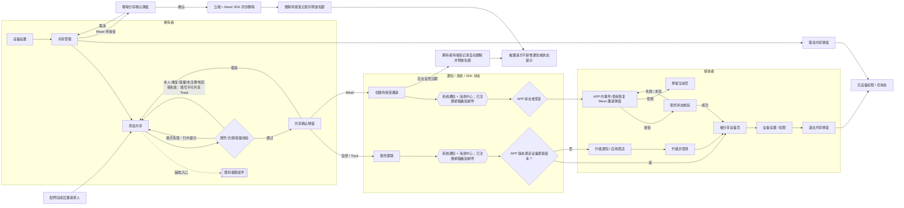
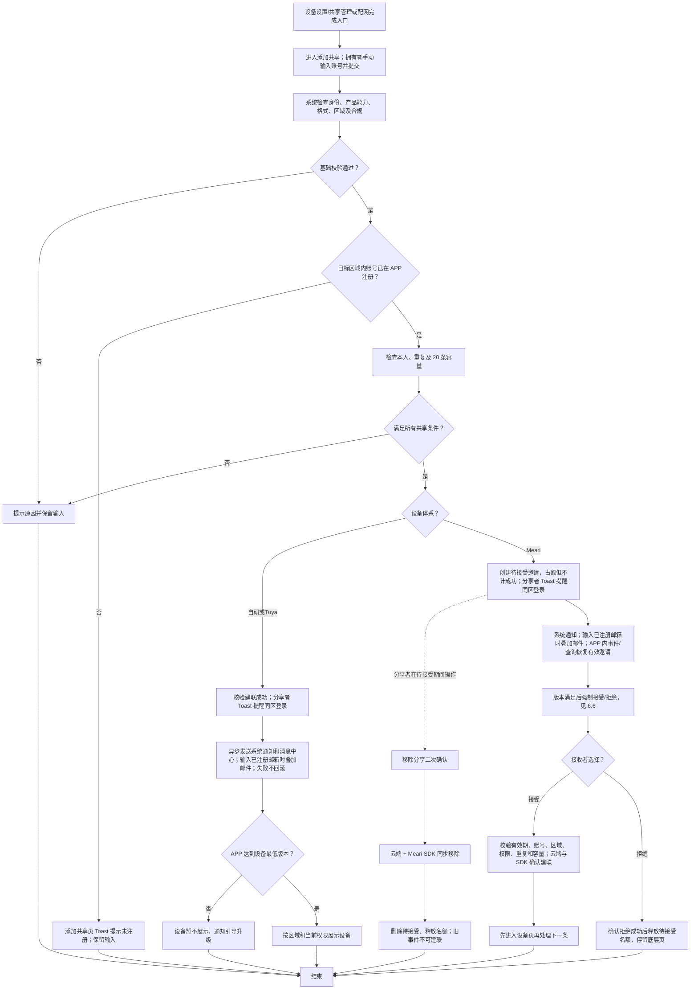

# 设备共享二期 PRD：已注册用户共享完整闭环

| 属性 | 内容 |
| --- | --- |
| 状态 | 已批准分期范围，需求评审稿 |
| 日期 | 2026-09-16 |
| 对照原文 | [飞书原始 PRD Rev.3356](https://momcozy-in.feishu.cn/wiki/Ao0BwgRIPi2r9IkVbUycOpDUnbc) |
| 原型 | [二期交互原型与页面规格](https://hawzz.github.io/root-interactivable-prototype/prototypes/device-sharing-phase-2/) |
| 本地已读来源 | `device-sharing/prd.md`、`device-sharing/raw/feishu-prd-reconciliation-2026-09-08.md`、`device-sharing/prototype/src/data/prd-specs.ts` |
| 核验声明 | Rev.3356 为历史对照来源；本版以最新用户批准的厂商分支规则为准；Meari 待接受邀请的云端与 SDK 同步移除能力已确认，7 天期限及其他待处理查询能力仍待技术确认 |

## 0. 对比原 PRD 的变更说明

对照基线：原飞书 PRD Rev.3356（历史规则）；对照日期：2026-09-10。最新用户批准规则优先于此前统一直接建联、无接受/拒绝的规则：全部厂商仅支持 APP 已注册账号；自研/Tuya 直接建联，仅 Meari 向已注册接收者发邀请并要求接受/拒绝。关系维护方和自动 SDK 账号映射前提继续保留，不扩展连接范围。

本章只记录相对 Rev.3356 的变化；未列出的原规则按正文继续执行，不在本章重复形成“沿用”清单。原文未明确、来自本次确认的规则须保留来源区分。

| 原章节／原规则 | 二期规则 | 变更类型 | 归属期次及原因 | 关联验收项 |
| --- | --- | --- | --- | --- |
| 配网成功后引导；后台配置；设备助手/新手引导优先；可跳过 | 不重新交付引导，只回归其共享落点 | 移出新增范围 | 一期已上线，仅拆交付归属 | P2-AC-13 |
| 手动手机号/邮箱输入，按注册区域支持手机号 | 邮箱全区域；US/CA 仅 +1，CN 仅 +86，其余仅邮箱；按分享者注册区域匹配账号 | 明确/收敛 | 二期确认匹配边界；+1 不等于 US/CA 互通 | P2-AC-03 |
| 本人、格式、重复、上限、频次校验，提交 Loading，失败保留输入 | 删除等待注册重复提示分支；取消同设备同账号每日 2 次限制，仅保留有效关系、待接受邀请和 20 条容量控制 | 规则调整 | 二期不支持未注册邀请，原反骚扰频控不再适用 | P2-AC-02、P2-AC-03、P2-AC-14 |
| 已注册账号直接建联，无接受/拒绝（历史 Rev.3356） | 自研/Tuya 保留；Meari 改为已注册邀请，接受后建联 | 最新用户覆盖 | 二期 Meari 例外，非未注册邀请 | P2-AC-03、P2-AC-14、P2-AC-15 |
| 未注册创建等待注册记录，发送注册提醒 | 格式合法并实际提交后，在添加共享页 Toast 提示账号未注册并终止；不创建记录、不发邀请、不计成功 | 替换 | 新用户能力归三期；二期仅反馈失败并保留输入 | P2-AC-03 |
| 等待注册、共享中、已取消、已退出、已过期 | 保留共享中/已取消/已退出；新增 Meari 待接受及拒绝/过期终态；失败不是关系状态 | 最新用户覆盖 | 待接受不等于等待注册；终态不展示在待处理列表 | P2-AC-02、P2-AC-14、P2-AC-15 |
| 共享管理以账号标识共享对象，未明确统一名称字段 | 待接受与共享中均以目标 APP 注册账号的 Nickname 为主名称，账号掩码为辅助信息 | 新增明确展示规则 | Nickname 为 APP 注册必填资料，直接复用，不新增昵称定义或编辑能力 | P2-AC-02 |
| 等待注册 30 天、到期失效、注册登录自动建联 | 二期不执行；注册完成后需要拥有者重新主动发起二期共享 | 移出 | 三期自研/Tuya 未注册邀请已统一为创建成功起 7 天（168 小时） | P2-AC-03 |
| 单台设备最多 20 条有效记录，共享中与等待注册合计 | 共享中 + Meari 待接受合计最多 20 条；分享者可二次确认后移除待接受邀请 | 计数集合与操作调整 | 二期没有等待注册；移除、拒绝或过期均释放待接受占额；Meari SDK 同步移除能力已确认 | P2-AC-02、P2-AC-15 |
| 同设备同账号每天最多成功发起 2 次，取消/退出不重置 | 二期移除该限制；关系或邀请终态后可同日重新发起，不设次数上限，也不新增替代频控 | 二期移除 | 原规则用于降低未注册用户骚扰；二期仅支持 APP 已注册账号，不再适用 | P2-AC-03、P2-AC-14 |
| 已注册 Push、消息中心、已绑定验证邮箱邮件并行；原文短信仅用于未注册手机号 | 三类设备均发送系统通知并同步消息中心；本次输入已注册登录邮箱时叠加邮件，输入已注册登录手机号时仅系统通知、不发短信。自研/Tuya 在最终建联后触发，Meari 在有效待接受邀请创建后触发 | 触发时机明确 | SDK 事件仅是 APP 内状态来源，不是触达渠道；不把未注册手机号短信扩展到二期 | P2-AC-04、P2-AC-05、P2-AC-06 |
| 未注册邮箱邮件、下载二维码、期限与注册指引 | 二期不发送、不展示成功结果 | 移出 | 三期已定义未注册邀请与注册指引，二期不提前交付 | P2-AC-03 |
| 未注册手机号短信及 HTML 注册指引，多语言，设备名称可展示，禁婴幼儿信息 | 二期不发送短信；原型仅保留短信/H5模板参考。`https://www.momcozy.com/guide` 仅为 URL 样例，指向参考文档中的 H5 模板，不是已冻结生产地址 | 移出并明确模板依赖 | 未注册手机号短信归三期；最终 H5 内容、地址与三期规则由模板负责人确认 | P2-AC-03、P2-AC-06 |
| 低于 IoT 配置设备最低 App 版本，关系仍建立、设备不显示 | 自研/Tuya 保留；Meari 保持待接受，升级后恢复仍有效邀请再决策 | 最新用户覆盖 | 沿用设备最低版本；Push/消息中心去商店、低版本邮件无跳转 | P2-AC-10、P2-AC-15 |
| 新注册用户区域错误不展示数据并发送一次邮件 | 二期无新注册自动建联；保留数据大区隔离，不新增已注册用户区域错误邮件触发规则 | 移至三期候选方案 | 注册后区域纠错随未注册链路后移；二期不扩大原通知人群 | P2-AC-10、P2-AC-12 |
| 设备直接进列表，无共享标识，跳过 onboarding | 自研/Tuya 直接展示；Meari 接受且云端/SDK 确认建联后进入设备页；展示样式保留 | 最新用户覆盖 | 待接受无设备访问权 | P2-AC-12、P2-AC-14 |
| 历史原文背景指出蓝牙共享缺口、控制依赖本地蓝牙或云端通信；历史本地规格称关系云端维护 | 采用方案 A：本需求不按蓝牙/WiFi 细分，只建立共享关系和权限；被分享者的实际控制依赖产品/面板已有的本地蓝牙或云端通信能力，见 6.0 | 用户确认覆盖旧口径 | 不新建蓝牙配对、多用户连接仲裁、固件或控制协议；按产品/面板实际能力提供控制 | P2-AC-03、P2-AC-09 |
| 拥有者取消、接收者主动移除、权限收回、双方列表同步、失效消息 | 保留全部已建联分支；Meari 待接受新增“移除分享”，由云端与 SDK 同步成功后删除待处理项并释放名额 | 新增明确能力 | Meari SDK 同步操作已确认，不会出现关系错位；旧邀请与迟到事件不得建联，审计历史保留 | P2-AC-02、P2-AC-11、P2-AC-15 |
| 原文成功指标含组件复用率、接入效率、共享发起成功率、设备共享率 | 执行指标收敛为设备共享率、共享发起成功率、主账号共用导致的登录异常客诉降低；前两项重定义可统计口径 | 指标调整与明确 | 非功能指标无法通过业务埋点统计；补充业务问题结果指标 | P2-AC-03、P2-AC-16 |
| 原文埋点引用为文档 | 新建独立飞书电子表格，按参考模板仅保留 A01/A02/B01/B02；旧埋点文档作为历史记录 | 交付物调整 | 埋点需求改为可维护表格并收敛范围 | P2-AC-16 |
| 添加共享页未明确客服快捷入口 | 右上角展示既有客服图标并调用既有客服组件；不定义客服内部流程、不新增埋点 | 新增明确入口 | 复用 APP 既有能力 | P2-AC-03 |

## 1. 产品概述与背景

家庭成员使用独立账号访问同一设备，可以减少共用主账号造成的异常登出，并明确设备管理权。二期实现拥有者向已注册账号共享设备、接收者使用、双方终止关系的完整 APP 闭环，承接原始共享组件的可复用能力。

“新用户”在本需求中指提交共享时目标区域内不存在对应已注册账号，不等同于首次收到共享、首次安装或低版本用户。已注册但版本低的账号仍属于二期。格式合法并提交后，未注册或地区校验失败在添加共享页通过 Toast 反馈。后续注册不会触发二期隐式共享。

## 2. 用户、场景与范围

| 角色 | 目标与场景 |
| --- | --- |
| 设备拥有者 | 从设置页或一期落点手动输入家人账号，查看关系并取消共享 |
| 已注册被分享者 | 从通知定位设备，使用控制与数据功能，查看只读信息或主动退出 |
| 账号/设备/通知服务 | 区域内匹配身份，鉴权及额度校验，建立/撤销关系，独立执行触达 |

用户故事：拥有者希望向已注册家人共享并查看当前状态；自研/Tuya 接收者直接获得关系，Meari 接收者必须明确接受或拒绝有效邀请；关系终止后双方希望状态一致且旧消息不能恢复权限。

In Scope：入口、共享列表、添加校验、合规、已注册建联及 Meari 已注册邀请的接受/拒绝/恢复/过期/分享者移除、通知、版本、地区隔离、设备展示、完整权限矩阵、取消和退出、异常、多语言及指标。关系目标不按蓝牙/WiFi 细分。Out of Scope：APP 通过共享关系连接蓝牙/WiFi 设备的连接与通信实现及测试、一期引导新增开发、未注册邀请及等待注册/注册建联、家庭组织、转分享、通讯录/扫码、历史迁移及具体接口/数据库设计。全部范围内业务为 P0；业务指标用于上线效果评估，不能替代功能验收。

## 3. 目标与指标

组件复用率、接入/开发效率提升无法通过业务埋点验证，不进入本版执行指标。其历史数值仅保留在第 0 章的来源变更说明中。

| 层级 | 指标 | 统计口径 | 规划目标 | 上线后数据 | 结论 |
| --- | --- | --- | --- | --- | --- |
| 主指标 | 设备共享率 | 月末至少存在一条“共享中”关系的去重设备数 ÷ 月末已绑定且支持共享的去重设备总数。以首个可取得同口径数据的完整月建立基准；缺少可比基线或基线为 0 时不计算提升 | 建立同口径基准；相对基准提升 ≥20% | 待填写 | 待验证 |
| 辅助 1 | 共享发起成功率 | 最终成功建联的去重请求数 ÷ 实际提交的去重共享请求数。确认取消不计分母；提交后失败计分母；重复提交、重试和重复回调按共享请求 ID 去重。Meari 接受关联原请求并回补原请求月份，接受不新增分母 | ≥80% | 待填写 | 待验证 |
| 辅助 2 | 主账号共用导致的登录异常客诉降低 | 按完整自然月统计明确归因为家庭成员共用主账号导致的登录互斥、异常登出等客诉。2026 年 6 月 7 条、7 月 17 条，完整月基线均值 12 条/月；8 月截至 8 月 12 日 4 条仅作背景，不纳入基线 | 上线后完整月均较基线下降 60%，即 ≤4.8 条/月 | 待填写 | 待验证 |

共享发起成功率的“提交”发生在用户完成必要合规确认并实际发出请求时；进入页面、输入、按钮不可用、点击取消均不记分母。自研/Tuya 在关系最终建立后计成功；Meari 发送、分享者移除、拒绝、过期均不计成功，接受并最终建联后回补原请求月份。二期不设置同设备同账号每日成功次数，也不需要成功日额度统计。客诉指标由客服业务数据核验，不展开 VOC 台账，也不纳入 APP 埋点。

## 4. 页面流转流程图

矩形为 APP 页面，双边框为既有客服组件，菱形为判断或弹窗，六边形为系统通知或已注册邮箱对应邮件渠道；SDK 事件仅作为 APP 内部状态来源。共享管理和配网完成两个入口均直接进入添加共享，实际提交才记录 A01；账号不可共享时留在本页展示 Toast。分享者可在共享管理对 Meari 待接受记录执行“移除分享”，仅云端与 SDK 同步成功后删除并释放名额。短信/H5模板仅属于未注册手机号历史链路参考，不进入二期页面主流程。节点名称与原型五组业务场景及页面步骤一致；客服辅助分支仅明确入口，不展开客服内部流程。

## 5. 核心流程与状态

流程说明：图表达正常业务分支，不规定后端校验接口顺序；Meari 低版本先升级再恢复有效邀请，失败保留弹窗重试、未知查询终态、过期阻断操作，详见 6.6。Meari 待接受移除由云端与 SDK 同步执行，能力已确认，不采用前端乐观删除。所有创建条件必须由服务端可靠校验；请求超时需查询最终关系事实，不能因重试重复建联。两个入口不产生 A01，实际提交才记录；未注册/地区校验失败无关系可查询，在添加共享页 Toast 反馈，注册或修正地区后仍需拥有者再次主动发起。

| 当前状态 | 触发 | 结果及列表变化 |
| --- | --- | --- |
| 无关系 | 自研/Tuya 已注册且全部校验通过 | 核实共享中，列表新增；关系不设邀请期限 |
| 无关系 | Meari 已注册且全部校验通过 | 待接受，拥有者列表显示并占额，无设备访问权、不计成功 |
| 待接受 | 接受且未过期、账号/区域/权限/重复/容量校验通过、云端与 SDK 确认建联 | 共享中，原占额转有效关系不重复占额；进入设备页 |
| 待接受 | 拒绝成功 | 已拒绝，移除待处理项并释放名额，停留底层页；不计成功 |
| 待接受 | 分享者确认“移除分享”，云端与 Meari SDK 同步成功 | 已移除，拥有者列表删除待接受项并释放名额；被邀请方旧通知、旧弹窗与迟到 SDK 事件均不得建联；不计成功、不新增通知，审计保留 |
| 待接受 | 从邀请创建起达到暂定 7 天 | 已过期，拥有者侧自动移除待接受项并释放名额；保留审计，不计成功。若被邀请方此前未打开 APP，则不新增过期通知、不更新初始系统通知/邮件，下次打开 APP 也不单独显示失效信息；期限及执行能力待技术确认 |
| 待接受 | 同设备同账号重复发送 | 阻止重复，不延长原有效期；分享者仍可从已有待接受记录执行移除 |
| 待接受 | 请求失败/结果未知/退出 APP | 不伪装拒绝或建联；失败保留弹窗重试，未知查询最终状态，退出后恢复 |
| 已移除/已拒绝/已过期 | 拥有者重新发起 | 重新校验后可创建新邀请，使用新创建时间；旧邀请不得恢复 |
| 无关系 | 格式合法提交后返回未注册或地区校验失败 | 留在添加共享页展示对应 Toast，保留输入与合规勾选；保持无关系，不新增邀请、通知、占额或成功计数 |
| 共享中 | 拥有者确认取消 | 已取消，双方列表移除相关项，收回权限，接收者系统消息新增取消通知 |
| 共享中 | 被分享者确认移除 | 已退出，双方列表移除相关项，收回权限 |
| 已取消/已退出 | 旧消息点击或并发重复操作 | 不恢复权限，以最新状态刷新并提示关系已失效 |
| 已取消/已退出 | 拥有者重新主动提交 | 重新校验全部条件；可在同一天再次建立关系，不设次数上限 |

## 6. 关键业务规则

### 6.0 关系范围与维护方

二期采用蓝牙方案 A：目标仅为建立和维护设备共享关系、ACL 与权限矩阵，不按蓝牙/WiFi 细分。被分享者的实际设备控制依赖对应产品/面板已有的本地蓝牙或云端通信能力；本需求不新建蓝牙配对、多用户连接仲裁、固件或控制协议。不得仅凭共享关系承诺设备可控，具体实现与控制项暂由产品/面板能力决定。此口径明确覆盖旧稿、历史原文对照及原型中的通信范围表述，既有业务校验继续保留。

| 设备体系 | 共享关系维护方 |
| --- | --- |
| 自研 | 云端维护 |
| 涂鸦 Tuya | 云端与 Tuya SDK 共同维护 |
| 觅睿 Meari | 云端与 Meari SDK 共同维护 |

账号映射前提：用户已确认 APP 注册时自动在 Tuya、Meari 两套 SDK 中注册对应映射账号；本次按此已确认规则定义需求，实际系统联调结果另行验收。分享时注册资格由 APP/后台仅检查目标账号是否已在 APP 注册，不另设 SDK 注册资格门槛，不要求接收者额外注册 SDK。既有格式、角色、区域、本人、重复、人数、合规、版本等规则保留。SDK 映射异常或运行失败按执行失败处理，不得误报为 APP 账号未注册；超时等结果不确定情况查询最终关系事实后处理，不提前计成功。

### 6.1 账号、区域与提交

| 分享者注册国家/地区 | 可输入账号 | 匹配约束 |
| --- | --- | --- |
| US | 邮箱或 +1 手机号 | 在 US 对应账号区域匹配，不因 +1 自动查找 CA 账号 |
| CA | 邮箱或 +1 手机号 | 在 CA 对应账号区域匹配，不因 +1 自动查找 US 账号 |
| CN | 邮箱或 +86 手机号 | 在 CN 对应账号区域匹配 |
| 其他 | 仅邮箱 | 不展示手机号共享能力；邮箱也遵循分享者注册区域匹配 |

共享管理点击“添加共享”和配网完成点击“邀请家人”时，两个入口均直接进入添加共享；入口不创建共享请求或业务状态。添加共享仅支持手动输入（含粘贴、清除）；格式与规范化沿用账号登录能力，不自创邮箱大小写或手机号去重规则。区号不得用于绕过分享者区域限制。格式错误在本页行内提示并阻断。注册资格仅由 APP/后台检查目标账号是否在 APP 注册，SDK 映射沿用 6.0 前提，不独立检查 SDK 注册资格。

格式合法并实际提交后，后台返回 `unregistered` 时在本页 Toast“该账号尚未注册，请对方注册后再发起共享”；返回 `region-mismatch` 时在本页 Toast“该账号暂时无法共享，请检查账号信息”。两类结果均保留输入与合规勾选，且无共享/等待/邀请记录、无通知或人数占额。国家/地区匹配能力待技术确认，Toast 不代表后台已经能提供更细的诊断信息。

成功反馈由分享者在发起结果确认后看到：自研/Tuya 最终建联成功时 Toast“分享成功，请提醒对方使用与你相同的国家/地区登录后查看设备”；Meari 有效待接受邀请创建成功时 Toast“邀请已发送，请提醒对方使用与你相同的国家/地区登录并处理邀请”。该提醒只属于分享者侧成功 Toast，不改变二期邮件、系统通知或消息中心模板。

本人账号、既有共享中关系、同设备同账号 Meari 待接受邀请、超额均拦截。重复待接受不续期；已移除/已拒绝/已过期可重新发起。格式不合格按钮不可提交；合规设备还需勾选。提交中禁重复点击，失败保留输入和勾选；具体错误优先，否则提示网络异常并允许重试。前端隐藏或禁用不能替代服务端校验。

### 6.2 容量与重复控制

单设备“共享中 + Meari 待接受”合计最多 20 条。共享管理中两类对象均使用目标 APP 已注册账号的 Nickname 作为主名称，账号掩码作为辅助识别信息；Nickname 直接取既有注册资料，不新增昵称定义、编辑或校验。达到 20 条后点击管理页“添加共享”即提示人数上限且不进入添加页；其他入口或并发请求仍由服务端拦截。低版本关系和待接受邀请均占额。Meari 待接受记录提供“移除分享”：分享者二次确认后，云端与 Meari SDK 同步执行，且仅同步成功才删除列表记录并释放名额；失败保留记录并允许重试。该同步能力已确认，不会出现云端与 SDK 关系错位。接受仅转换原占额；移除、拒绝成功或过期自动移除待处理项并释放名额，不删除审计历史。已建联取消或退出释放名额。自研/Tuya 已建立关系不因 7 天期限过期；该期限仅用于 Meari 待接受。

并发提交不得突破 20 条容量，也不得为同一设备和账号创建重复的共享中关系或有效待接受邀请；接口结果不确定时以服务端最终关系和邀请状态为准。有效关系或邀请终止后可在同一天重新发起，不设置次数上限、冷却时间、通知次数限制或其他替代频控。每次新关系或新邀请仍按现有通知规则触发。若真实环境已有历史等待注册记录，须先确认其隔离及容量口径；本期不擅自删除、迁移或自动激活历史记录。

### 6.3 合规与数据

BBM 等指定设备默认未勾选监护人/授权照护者声明；未勾选不可发起，勾选后才能进入共享确认。成功时保留勾选时间、IP、uid、设备 ID 审计记录。普通设备不展示该专用声明复选框，但与指定设备一样，点击“发起共享”后必须展示共享确认弹窗；用户确认后才实际提交，取消确认不提交。原声明文案仍待合规审定，不因分期标记为已审批。自研/Tuya 不添加接收者接受/拒绝流程；Meari 必须按 6.6 接受/拒绝，无论设备是否要求拥有者合规勾选。所有厂商均不新增接收者二次隐私确认。

仅共享设备及设备产生的实时/历史数据，不同步宝宝资料；双方每日例行记录的新增、编辑、删除不互相同步。区域不一致时不展示设备数据；不能因邮箱全地区可用而穿透数据区域边界。原文新注册用户区域错误邮件随注册邀请链路移至三期候选方案，二期不新增已注册接收者区域错误邮件触发规则。

### 6.4 完整权限矩阵（保持原规则）

| 能力 | 拥有者 | 被分享者 |
| --- | --- | --- |
| 设备控制页控制功能 | 可用 | 共享关系提供控制权限；实际可用性依赖产品/面板已有的本地蓝牙或云端通信能力，具体实现暂由产品/面板能力决定 |
| 实时及历史设备数据 | 可查看 | 可查看，受关系与区域约束 |
| 设备基础信息 | 可查看和修改 | 只读，不能改名称 |
| 网络重置/重新配网 | 可操作 | 不可操作 |
| 个性化设置（设备功能） | 可操作 | 无权限设置项隐藏 |
| 耗材管理 | 按产品能力可用 | 按产品能力可用 |
| 在线客服/智能设备助手 | 独立使用 | 独立使用 |
| OTA | 可操作 | 不可操作 |
| 发起共享 | 可操作 | 不可操作，无转分享 |
| 解绑/删除设备 | 可操作 | 不可操作 |
| 移除共享 | 管理侧取消关系 | 可主动退出，不能删除拥有者设备 |
| 设备推送/告警 | 按本人通知设置 | 按本人通知设置 |

被分享者卡片不加“共享”标识，跳过设备 onboarding。Rev.3356 评论 c23/c27 明确上述展示行为，c25 明确设备最低版本配置，c6/c28 明确按设备固定权限及由业务侧控制特殊场景；本期不新增平台动态权限配置系统。设备信息具体字段由设备模块定义，共享组件统一只读约束；设置页隐藏无权项，拥有者“删除”替换为接收者“移除共享”。关系范围与维护方以 6.0 本次确认覆盖旧口径；本节验收关系、ACL 与权限矩阵，不验收 APP 与设备的无线连接、传输、固件或控制协议实现，具体控制实现暂由产品/面板能力决定。

### 6.5 通知、版本及终止

通知文案来源：[设备分享邮箱/短信通知模板](https://momcozy-in.feishu.cn/wiki/Gw5YwnjlIigsw7kX2OXcaBTon0y)（核对 Rev.56）及原 PRD Rev.3356 的系统 Push、消息中心、版本兼容定义。业务侧只传分享者昵称、设备名称、接收账号及版本判断等模板变量，不在本 PRD 另造通知样式。

#### 6.5.1 通知渠道选择

通知渠道由本次分享时拥有者输入的目标登录账号决定，不读取该账号的其他绑定方式扩展发送：输入已注册登录邮箱时发送“系统通知 + 邮件”；输入已注册登录手机号时仅发送系统通知，不发送邮件或短信。系统通知面向已下载安装 APP 且注册登录的目标用户，并在消息中心同步保存系统消息。短信仅用于未注册手机号用户，属于三期/历史未注册邀请链路，不进入二期。SDK 不作为用户触达渠道；Meari 的 APP 内 SDK 分享事件或待处理查询仅负责在 APP 中恢复邀请状态。通知触发不参与关系事务，任一渠道失败均不得回滚、删除或重复创建共享关系/邀请。

| 渠道 | 发送条件 | 标题/正文 | 点击与结果 |
| --- | --- | --- | --- |
| 系统通知 | 三类设备都发送；自研/Tuya 在最终建联后触发，Meari 在有效待接受邀请创建后触发 | 沿用既有系统通知模板；Meari 文案表达待接受邀请，不得表达已建联 | 正常版本：唤起 APP 并定位消息中心对应消息；低版本：使用 6.5.3 升级通知并跳应用商店 |
| 消息中心-系统消息 | 与系统通知同步写入；不是第三种站外触达渠道 | 沿用对应系统通知标题/正文 | 自研/Tuya 正常版本进入设备列表并定位设备；Meari 恢复有效邀请后展示接受/拒绝弹窗 |
| 邮件 | 本次指定账号是已注册登录邮箱时发送；输入手机号时不发送 | 复用现有邮件模板；自研/Tuya 表达已共享，Meari 表达待接受邀请 | 同一关系/邀请一次，不催促；邮件内不直接接受；发送失败不影响业务状态 |
| 短信 | 二期不发送；仅未注册手机号用户适用，归三期/历史链路 | 模板 Rev.56：“{分享者昵称} 已将设备「{设备名称}」共享给你。请点击查看注册及使用指引：{HTML 指引链接}”仅作参考 | 样例 URL 指向同文档 H5 模板，不代表生产地址；原型可查看模板，但不把它作为二期通知结果 |

短信模板说明：参考文档当前唯一短信正文及 H5 是未注册手机号用户的“注册及使用指引”。`https://www.momcozy.com/guide` 仅为链接样例，语义上指向截图及模板文档中的 H5 页面，并非已确认生产地址。原型恢复“短信详情 -> 点击样例链接 -> H5 模板”的参考交互；最终地址、模板内容和三期规则由模板负责人确认。本 PRD 不把该模板用于二期已注册手机号用户，也不据此恢复未注册分享链路。

#### 6.5.2 Meari 待接受通知

Meari 创建有效待接受邀请后，按 6.5.1 发送系统通知；本次输入已注册登录邮箱时叠加邮件，输入已注册登录手机号时不发送短信。APP 在前台时可直接从内部 SDK 分享事件开始展示流程，但 SDK 事件不是触达用户的通知。通知只提醒打开 APP，不代表接受、不建立关系、不计成功。进入 APP 后必须由内部 SDK 事件或待处理查询匹配当前登录账号的有效邀请，再按 6.6 弹出接受/拒绝。Meari 接受成功后不重复发送邀请通知。

#### 6.5.3 版本兼容

| 条件/渠道 | 自研/Tuya | Meari |
| --- | --- | --- |
| 判断依据 | 接收者最近一次使用 APP 的版本与该设备在 IoT 后台配置的最低 APP 版本比较 | 同左，在接受前重新判断 |
| 低版本业务状态 | 共享关系保持“共享中”并占额，设备暂不展示；拥有者 Toast“分享成功，请提醒对方使用与你相同的国家/地区登录，并将 App 升级至最新版本后查看设备” | 邀请保持“待接受”并占额，不提前建联；分享者仍看到 6.1 的同区提醒 Toast；被分享者先升级，再恢复仍有效邀请并决策 |
| 系统通知 | 标题“设备共享”；正文“{分享者昵称} 已将设备「{设备名称}」共享给你，请升级至最新版本后查看和使用”；点击应用商店 | 使用邀请提醒进入 APP 时先引导升级；升级后恢复有效邀请 |
| 消息中心 | 标题和正文同系统通知；点击应用商店 | 仅展示可恢复的有效邀请状态，不允许绕过升级接受 |
| 邮件 | 仅本次输入邮箱时发送；使用低版本邮件且无跳转 | 使用对应低版本邀请提醒；无邮件内接受动作 |
| 短信 | 二期不发送；已注册手机号依赖系统通知/消息中心承担升级指引 | 同左；短信/H5模板仅为未注册链路参考 |
| 升级并登录 | 查询服务端最新关系，仅同步仍为共享中的设备；已取消/已退出不展示，无需拥有者重发 | 恢复未移除、未拒绝、未过期且仍有效的邀请；已移除/已拒绝/已过期不复活 |

原文评论中的升级弹窗不能自动覆盖原文正文的应用商店跳转规则。通知点击、APP 启动和设备页访问都必须以服务端最新关系、区域及版本结果为准，不能以旧系统通知或邮件恢复权限；未注册链路的旧短信/H5样例同样不是权限凭证。

#### 6.5.4 终止与通知失败

| 情形 | 处理规则 |
| --- | --- |
| 拥有者取消/移除 | 已建立关系使用“取消共享”，二次确认后撤权、移除设备/列表成员并提示取消成功，接收者消息中心新增只读“设备共享已取消”通知。Meari 待接受使用“移除分享”，二次确认后由云端与 SDK 同步移除；成功删除待接受并释放名额，不新增取消通知；失败保留记录可重试 |
| 被分享者移除 | 二次确认后状态已退出，双方列表同步、提示移除成功；不新增原文未要求的退出通知渠道 |
| 渠道失败 | 记录对应渠道失败并按现有通知服务策略处理；不得回滚关系、重复计业务成功或通过重建关系补发；其他渠道继续发送 |
| 并发/旧消息 | 关系已失效则刷新并阻断控制和数据访问，旧通知不恢复权限；重复操作不重复撤权计数 |

### 6.6 Meari 已注册邀请与强制决策

仅 Meari 适用。APP 不在前台时：系统通知 + 输入已注册邮箱时邮件 -> APP -> 内部 SDK 分享事件或待处理查询得到有效邀请 -> 强制接受/拒绝弹窗；输入已注册手机号时仅系统通知。APP 已在前台时从内部 SDK 事件开始；SDK 不作为用户触达渠道，通知本身不构成有效邀请或权限凭证。低版本按 6.5 先升级，再恢复有效邀请。

| 控制/时机 | 必须行为 |
| --- | --- |
| 有效邀请弹窗 | 仅“接受”“拒绝”两项决策；无关闭按钮，不允许遮罩、Escape、系统返回或返回手势关闭；退出 APP 不等于拒绝 |
| 登录、启动、回到前台 | 查询/重放未处理且有效邀请；按现有邀请/关系标识去重并排队，一次只显示一条；系统通知、账号对应渠道与 APP 内事件指向同一邀请，不得重复弹窗或提交 |
| 接受 | 提交期间防重复；校验邀请仍有效、账号/区域/权限、重复关系与容量；云端与 Meari SDK 均核验建联后才成功，完成设备页导航后再处理下一条邀请 |
| 拒绝 | 核验拒绝成功后移除待接受并释放名额；不进入设备页，停留原底层页面，再处理队列 |
| 分享者移除 | 共享管理的待接受行展示“移除分享”；二次确认后由云端与 Meari SDK 同步执行。仅同步成功才删除记录、释放名额并使旧通知、旧弹窗及迟到事件不可建联；失败保留记录并允许重试，不计成功、不新增通知 |
| 明确失败 | 保留当前弹窗及失败原因，允许重试；不提前移除或释放名额，不伪装成功 |
| 结果未知 | 查询云端/SDK 最终状态并归并原操作；确认前不新建操作、不跳转、不计成功；查询失败保持待核验并重试 |
| 弹窗期间过期或旧通知 | 用户正在查看有效邀请弹窗时到期：再次核验后阻断接受/拒绝等过期操作，提示邀请已失效并移除待处理项，刷新队列；迟到回调以权威终态为准，不复活旧邀请 |
| 后台自然过期 | 被邀请方从收到初始系统通知/邮件起直至到期都未打开 APP：拥有者侧自动删除“待接受”并释放名额；被邀请方不新增过期通知、不更新原通知/邮件，下次打开 APP 仅不恢复弹窗，不单独展示“邀请已失效” |
| 有效期 | 暂定从邀请创建时间起 7 天，不从通知送达、打开或恢复起算，重复邀请不续期；到期自动移除拥有者待接受列表并释放名额，保留审计历史 |

Meari 待接受邀请的云端与 SDK 同步移除能力已由技术确认，不再列为待确认项。有效期数值、权威时间与 SDK 查询、重放、拒绝、过期等其余能力仍待技术确认和生产联调；原型只验证需求交互，不代表真实接口联调通过。邀请过期或移除不终止已建立关系。邀请决策不是新增接收者隐私勾选。

## 7. 风险、依赖与非功能要求

| 类型 | 事项 | 处理要求 |
| --- | --- | --- |
| 未验证技术依赖 | Meari SDK 查询/重放、拒绝、过期与云端同步；暂定 7 天 | 平台/云端/APP 联调确认有效邀请恢复、幂等、权威终态、容量并发与期限支持；未提供证据前不标记已实现，不以 UI 演示替代 |
| 外部依赖 | 原文埋点及 UIUX 引用、未定义指标口径 | 原文引用埋点 Wiki `IydpwR2mfimkM3kd0igcBSdTneh` 和 Figma `duT2TznMnQLIIv7zoPeOzA`（82-3359）；外链正文本次未读，具体事件和设计另核对；冻结共享率分母 |
| 外部依赖 | 账号区域、设备能力及最低版本配置 | 账号/IoT 团队确认真实区域映射、支持产品清单和版本样本 |
| 外部依赖 | BBM 清单、文案与通知模板 | 合规与通知团队确认；系统通知沿用原 PRD，输入已注册邮箱时叠加邮件。短信仅用于未注册手机号链路；模板 Rev.56 的 URL 只是 H5 模板样例，最终地址、内容与三期使用方式由模板负责人确认 |
| 实施风险 | 未注册被误算成功、+1 跨区域误匹配 | 覆盖区域和零记录/零计数用例，成功对账服务端事实 |
| 实施风险 | 并发超额、超时重复建联、缓存未撤权 | 服务端校验与状态一致性联调；禁止仅靠页面状态控制权限 |
| 实施风险 | 旧等待记录的隔离和容量口径未明确 | 存量盘点并明确运行口径；不把数据迁移混入本期 |
| 实施风险 | 通知页面或场景导航遗漏，评审误判渠道被删除或并行发送 | 场景必须区分邮箱账号和手机号账号：两者都有系统通知/消息中心，邮箱叠加邮件，已注册手机号无站外短信；短信/H5单列为未注册链路模板参考；SDK 事件不列为触达渠道 |

非功能要求：已有账号与权限机制复用；通知故障不影响成功关系；关键失败可追踪且不泄露不必要个人信息；中英文提示与状态一致；正常设备使用不依赖通知送达。未获得原始性能阈值，不新增无依据的响应时间承诺。

## 8. 编号验收与原型映射

P2-AC-01～13 保留原编号并扩展必要子项；新增 P2-AC-14（Meari 决策）、P2-AC-15（恢复/生命周期）与 P2-AC-16（指标及采集）。邀请弹窗与恢复使用 `meari-invitation`；接受成功进入 `recipient-device` 设备页，不能以接收者设置页替代。统计验收归添加共享及接受结果，不要求在 APP 展示统计实现细节。

| AC | 前置条件与操作 | 预期结果 | 原型页面 |
| --- | --- | --- | --- |
| P2-AC-01 | 拥有者/被分享者、产品开关组合；绕过前端 | 仅拥有者且支持产品有入口；服务端阻断越权，不扩入家庭组织或转分享 | [共享入口](https://hawzz.github.io/root-interactivable-prototype/prototypes/device-sharing-phase-2/?page=share-entry) |
| P2-AC-02 | 查询空/非空列表、共享中与 Meari 待接受对象、19/20 条边界及并发；对待接受执行移除确认/放弃/失败，对共享中执行取消确认/放弃/网络异常 | 两类对象均以注册账号 Nickname 为主名称、账号掩码为辅助信息并合计占额；待接受展示“移除分享”，仅云端与 Meari SDK 同步成功才删除并释放名额，失败保留可重试，旧邀请不得建联；拒绝/过期同样释放名额且保留审计。20 条时添加入口提示且不进表单，服务端守上限；低版本有效关系占额；成功取消才移除、撤权、释放人数，放弃/失败不伪装成功 | [共享管理](https://hawzz.github.io/root-interactivable-prototype/prototypes/device-sharing-phase-2/?page=device-share) |
| P2-AC-03 | 从共享管理点击“添加共享”；覆盖区域/邮箱/手机号、本人/重复/未注册/地区校验失败/格式、普通设备与 BBM、声明勾选、共享确认取消/确认、同日重新发起、重试；检查成功 Toast 与右上角客服入口 | 直接进入添加共享。US/CA +1、CN +86、其他邮箱；非法格式页内阻断。普通设备不展示专用声明复选框，BBM 等指定设备默认未勾选且必须勾选；两类设备点击“发起共享”均先展示共享确认弹窗，确认后才实际提交，取消确认不提交。合法提交后未注册时在本页 Toast“该账号尚未注册，请对方注册后再发起共享”，地区校验失败时 Toast“该账号暂时无法共享，请检查账号信息”；两者均保留账号和适用的勾选状态，且无关系/邀请/通知/占额。自研/Tuya 建联成功 Toast 提醒对方使用相同国家/地区登录后查看设备；Meari 邀请创建成功 Toast 提醒对方使用相同国家/地区登录并处理邀请；不改通知模板。实际确认并提交才记 A01。Meari 接受后核实建联；二期不设同设备同账号每日次数上限，终态后可同日重发；客服图标展示并调用既有客服组件，不新增客服流程或埋点 | [添加共享](https://hawzz.github.io/root-interactivable-prototype/prototypes/device-sharing-phase-2/?page=add-share) |
| P2-AC-04 | 三类设备正常或低版本；模拟系统通知单渠道故障 | 自研/Tuya 最终建联、Meari 有效邀请创建后发送系统通知并同步消息中心；低版本通知去应用商店。Meari 进入 APP 后经内部 SDK 事件/待处理查询恢复决策，SDK 不触达用户；失败不回滚关系或待接受状态 | [App Push](https://hawzz.github.io/root-interactivable-prototype/prototypes/device-sharing-phase-2/?page=app-push) |
| P2-AC-05 | 点击自研/Tuya 共享、升级、取消和失效消息；点击 Meari 邀请消息 | 正常共享消息定位设备；升级消息去应用商店；Meari 必须恢复有效邀请后接受/拒绝，未建联不能直达设备；取消通知只读；旧消息不恢复权限 | [消息中心](https://hawzz.github.io/root-interactivable-prototype/prototypes/device-sharing-phase-2/?page=message-center) |
| P2-AC-06 | 三类设备覆盖邮箱/手机号输入、正常/低版本、未注册及发送故障；核对短信/H5模板参考 | 输入已注册登录邮箱：系统通知+邮件；输入已注册登录手机号：仅系统通知，不发邮件或短信。自研/Tuya 在建联后触发，Meari 在有效邀请创建后触发；同关系/邀请每适用渠道一次、不催促。未注册在二期阻断且不发送任何通知。短信仅用于未注册手机号历史/三期链路；样例 URL 在原型中打开 H5 模板，但不作为二期通知结果或已冻结生产地址 | [邮件通知](https://hawzz.github.io/root-interactivable-prototype/prototypes/device-sharing-phase-2/?page=email-notification)、[短信/H5模板参考](https://hawzz.github.io/root-interactivable-prototype/prototypes/device-sharing-phase-2/?page=sms-notification) |
| P2-AC-07 | 检查设置并主动移除，覆盖确认/取消/失败及拥有者先撤销 | 隐藏无权限项，耗材/客服/助手按矩阵；成功才退出且双方同步，并发失效不重复处理 | [接收者设置](https://hawzz.github.io/root-interactivable-prototype/prototypes/device-sharing-phase-2/?page=receiver-settings) |
| P2-AC-08 | 进入设备信息并尝试修改 | 字段沿用设备模块，全部只读，无改名/改网/OTA 权限 | [设备信息](https://hawzz.github.io/root-interactivable-prototype/prototypes/device-sharing-phase-2/?page=receiver-device-info) |
| P2-AC-09 | 逐项检查权限及宝宝/例行数据变更；按 6.0 验证蓝牙方案 A 边界 | 严格符合第 6 节矩阵；只共享设备及其数据，不同步宝宝与例行记录，无转分享；关系、ACL、授权与撤权可验证。被分享者控制依赖产品/面板已有的本地蓝牙或云端通信能力，具体实现暂由产品/面板能力决定；不测试新建蓝牙配对、多用户连接仲裁、固件或控制协议 | [权限](https://hawzz.github.io/root-interactivable-prototype/prototypes/device-sharing-phase-2/?page=permissions) |
| P2-AC-10 | 用接收者最近版本与 IoT 设备最低 APP 版本构造支持/不支持样本；升级前取消/退出对照；区域错误样本 | 自研/Tuya 低版本仍建联并占额但设备隐藏，拥有者提示对方升级，系统通知/消息中心去应用商店；邮箱输入对应的邮件无跳转，已注册手机号不发短信。Meari 保持待接受，升级后只恢复仍有效邀请再决策；跨区不展示数据，不新增已注册用户区域错误邮件触发规则 | [版本与区域](https://hawzz.github.io/root-interactivable-prototype/prototypes/device-sharing-phase-2/?page=version-compat) |
| P2-AC-11 | 并发撤销/退出、旧消息及弱网/无网/超时后查询 | 最新状态为准，失效设备移除且不可读数据或控制；超时不提前成功，重试不复活关系 | [设备已移除](https://hawzz.github.io/root-interactivable-prototype/prototypes/device-sharing-phase-2/?page=removed-empty) |
| P2-AC-12 | 正常、低版本、跨区、已取消/退出查询列表 | 已建联正常卡片无共享标识，跳过 onboarding；Meari 待接受无设备卡片和权限，接受成功后进入设备页；低版本不显示，跨区不展示数据，失效设备移除 | [设备列表](https://hawzz.github.io/root-interactivable-prototype/prototypes/device-sharing-phase-2/?page=device-tab) |
| P2-AC-13 | 从配网后引导点击“邀请家人” | 仅一期已上线入口上下文；带入当前设备并直接进入添加共享。返回添加页时回到配网引导；完成自研/Tuya 建联或 Meari 邀请提交后按配网来源进入 Device Tab；不把一期引导重新列为二期新增 | [一期入口上下文](https://hawzz.github.io/root-interactivable-prototype/prototypes/device-sharing-phase-2/?page=network-setup)、[添加共享](https://hawzz.github.io/root-interactivable-prototype/prototypes/device-sharing-phase-2/?page=add-share) |
| P2-AC-14 | Meari 有效邀请，前台 APP 内 SDK 事件，或后台系统通知及邮箱账号对应邮件进入 APP；接受/拒绝/失败/未知组合 | SDK 事件仅为 APP 内状态来源，不承担用户触达；已注册手机号无短信；强制二选一，无关闭/遮罩/Escape/返回；退出不等于拒绝；接受经有效期、账号/区域/权限、重复/容量及云端+SDK 核验后先导航设备页再弹下一条；拒绝成功停留底层页、释放待接受；失败保留弹窗重试，未知查询终态 | [邀请决策](https://hawzz.github.io/root-interactivable-prototype/prototypes/device-sharing-phase-2/?page=meari-invitation)、[接受后的设备页](https://hawzz.github.io/root-interactivable-prototype/prototypes/device-sharing-phase-2/?page=recipient-device) |
| P2-AC-15 | 登录/启动/前台恢复，重复与多邀请，分享者移除，低版本升级，创建满暂定 7 天及旧通知/并发 | 有效邀请去重排队；升级后恢复；待接受占额且可由分享者二次确认移除，云端与 SDK 同步成功后释放名额并阻断旧事件，重复不续期，移除/拒绝/过期后可重发。后台自然过期时拥有者侧自动删除待接受并释放名额；未打开 APP 的被邀请方不收到过期更新，下次打开 APP 不恢复弹窗也不单独显示失效提示。正打开弹窗时过期才提示失效并阻断操作；审计保留。自研/Tuya 已建联不受邀请期限影响；同步移除能力已确认，7 天及其他 SDK 生命周期能力待技术确认 | [邀请恢复与生命周期](https://hawzz.github.io/root-interactivable-prototype/prototypes/device-sharing-phase-2/?page=meari-invitation) |
| P2-AC-16 | 以去重请求、关系事实和月末设备快照构造跨月样本；加入提交失败、确认取消、重复重试、Meari 次月接受；核对客诉基线 | 共享发起成功率仅以实际提交去重请求为分母，取消不计；Meari 成功回补原请求月份且接受不增分母；月末共享率分子/分母按设备去重；6/7 月客诉基线 12 条/月，目标 ≤4.8 条/月，8 月不完整数据不纳入基线；上线数据留空且结论待验证 | [设备共享二期埋点需求表](https://momcozy-in.feishu.cn/sheets/WYD3sgmmRhFjxBtLXbycyU8bnEc) |

全页需验证中英文、失败提示与实际状态一致，通讯录/扫码旧演示不进入二期。Rev.3356 明确配网来源提交成功进入 Device Tab；具体导航按来源保留，不能统一改回管理列表而遗漏原文路径。

## 9. 测试用例

| 用例名称 | 前置条件 | 输入 | 操作 | 预期结果 |
| --- | --- | --- | --- | --- |
| 已注册成功 P2-AC-03 | 有权限且额度足够；沿用注册自动映射两套 SDK 的前提 | 同区域 APP 已注册账号，覆盖自研/Tuya/Meari | APP/后台检查 APP 注册状态，提交并按 6.0 维护方核对关系 | 自研/Tuya 唯一共享中关系且无接受步骤；Meari 创建待接受，明确接受且云端/SDK 验证后建联；均无独立 SDK 注册门槛 |
| SDK 执行失败 P2-AC-03 | APP 已注册且既有校验通过 | Tuya/Meari 映射异常或 SDK 明确运行失败 | 提交并核对失败结果、关系与计数 | 按执行失败提示并保留输入，不报 APP 未注册，不伪造建联或成功计数；结果不确定则查询最终事实 |
| 两入口直达 P2-AC-03、13 | 共享管理或配网完成入口 | 当前设备上下文 | 分别点击“添加共享”“邀请家人” | 两个入口均直接进入添加共享；返回回到各自入口；入口不记录 A01，不创建邀请、通知或关系 |
| 共享对象昵称 P2-AC-02 | 目标均为已注册账号，分别存在共享中关系与 Meari 待接受邀请 | 注册资料中的 Nickname 与登录账号 | 查看共享管理列表，并在 Meari 接受后再次查看 | 待接受、共享中以及待接受转共享中前后均以同一 Nickname 为主名称，账号掩码仅作辅助识别；不新增昵称编辑或校验 |
| Meari 待接受移除 P2-AC-02、15 | 拥有者列表存在一条 Meari 待接受邀请并占额 | 确认移除、放弃、同步失败、移除后迟到接受事件 | 点击“移除分享”并二次确认，分别模拟云端/SDK 同步结果 | 放弃不变；同步成功才删除待接受、释放名额且不计成功或新增通知，旧通知/弹窗/迟到事件不能建联；失败保留记录可重试；云端与 SDK 不出现关系错位 |
| 未注册/地区异常 P2-AC-03 | 区域内无目标账号或模拟地区校验失败 | 合法邮箱与合法手机号 | 实际提交后查看 Toast；修改并重新提交；查询记录、通知、占额和计数 | 留在添加共享页；未注册与地区校验失败展示对应 Toast，保留输入与勾选；无任何共享记录、Meari 待接受邀请、通知、占额或成功计数，注册后不自动建联 |
| 区域匹配 P2-AC-03 | US/CA/CN/其他各有样本 | +1、+86、邮箱 | 交叉提交 | 严格按注册区域与允许账号类型，不以区号代替区域 |
| 分享者成功 Toast P2-AC-03 | 目标为同区域已注册账号且其他校验通过 | 分别使用自研/Tuya 与 Meari 设备 | 发起共享并等待关系或邀请创建成功 | 自研/Tuya Toast 为“分享成功，请提醒对方使用与你相同的国家/地区登录后查看设备”；Meari Toast 为“邀请已发送，请提醒对方使用与你相同的国家/地区登录并处理邀请”；系统通知、消息中心和邮件模板不因本项改变 |
| 容量并发 P2-AC-02 | 已有 19 条共享中与待接受合计记录 | 两个不同注册账号 | 并发提交 | 最多新增一条，总数不超过 20 |
| 同日连续重建 P2-AC-03、P2-AC-14 | 容量可用且无有效重复关系/邀请 | 同设备同账号，覆盖自研/Tuya/Meari | 前两次分别在关系或邀请终止后重新发起，第三次仍在同一天发起并完成；同时保留一条有效关系/邀请作重复对照 | 自研/Tuya 取消或退出后第三次正常建联；Meari 拒绝、分享者移除、过期，或接受后取消/退出后均可同日重发并建联；已有共享中或有效待接受时仍阻断重复；无冷却或替代频控 |
| 合规与共享确认 P2-AC-03 | BBM 与普通设备 | BBM 勾选/未勾选；两类设备分别取消/确认共享弹窗 | 尝试发起并核对请求、成功日志与审计 | 仅 BBM 强制声明勾选和审计；普通设备不展示专用勾选；所有设备均展示共享确认弹窗，取消不提交、确认后才提交 |
| 账号对应通知 P2-AC-04、05、06 | 目标 APP 已注册；自研/Tuya 最终建联或 Meari 有效邀请创建 | 分别输入登录邮箱、登录手机号；正常版本 | 查看系统通知、消息中心及对应站外渠道 | 两类输入均有系统通知和消息中心；邮箱输入叠加邮件，已注册手机号不发邮件或短信；SDK 不触达用户；每关系/邀请每适用渠道一次 |
| 通知故障 P2-AC-04、P2-AC-05、P2-AC-06 | 关系已建立或有效待接受邀请已创建 | 分别让系统通知或适用邮件单渠道故障 | 查看关系/邀请与其他适用渠道 | 业务状态保持；失败渠道不重复创建关系/邀请，其他适用渠道继续发送；未注册仍零通知，二期不测试短信发送 |
| 升级状态查询 P2-AC-10 | 接收者最近版本低于 IoT 配置的设备最低 APP 版本 | 自研/Tuya/Meari；升级前取消/不取消 | 点击 Push/消息并升级登录查询设备或邀请 | Push/消息去应用商店；自研/Tuya 仅同步仍有效关系，Meari 仅恢复仍有效邀请；不需重发，不复活取消/退出/拒绝/过期状态 |
| 撤权结果查询 P2-AC-02、P2-AC-07、P2-AC-11 | 有效关系 | 取消与退出并发 | 再读数据及点击旧消息 | 双方列表一致，数据及控制访问阻断 |
| 权限与数据隔离 P2-AC-09 | 被分享者登录；准备不同控制能力的产品/面板 | 管理项、设备控制项及宝宝/例行数据 | 逐项访问、修改并查询双方结果 | 严格符合矩阵，非设备资料不互相同步；共享关系只提供权限，不把关系误判为控制能力；实际控制依赖产品/面板已有的本地蓝牙或云端通信能力，具体实现按对应产品/面板能力验收 |
| 指标口径 P2-AC-16 | 固定窗口可追溯实际提交请求与最终关系 | 10 个去重提交请求：6 个直接建联、2 个 Meari 次月接受、2 个提交后失败；另有 2 次确认取消和重复重试 | 按原请求月份回补并核对关系事实 | 分母 10、分子 8、80%；取消不计分母，重试去重，Meari 接受不新增请求，发送/拒绝/过期不计成功 |
| 月末共享率 P2-AC-16 | 月末设备绑定、共享能力和共享中关系快照 | 同设备多关系、无关系、已解绑、不支持共享样本 | 按设备去重计算并建立完整月基准 | 分子仅月末至少一条共享中关系的支持设备；分母仅月末已绑定且支持共享设备；基线缺失或为 0 不计算提升 |
| 客诉结果 P2-AC-16 | 客服完整月归因数据 | 2026 年 6 月 7 条、7 月 17 条、8 月截至 12 日 4 条 | 核对基线与目标 | 6/7 月均值 12 条/月，下降 60% 目标 ≤4.8 条/月；8 月仅背景；不要求 APP 埋点 |
| 强制弹窗 P2-AC-14 | Meari 已注册有效邀请 | 前台 APP 内 SDK 事件；后台系统通知，邮箱账号叠加邮件；手机号账号无短信 | 进入 APP；尝试关闭/遮罩/Escape/返回，再退出重进 | SDK 不作为触达渠道；有效事件/查询恢复后弹窗，不能关闭或绕过，退出不视为拒绝 |
| 接受与拒绝 P2-AC-14 | 多条有效邀请排队 | 接受、拒绝及重复 SDK 回调 | 分别提交并核对云端/SDK | 接受核验后先进入设备页再弹下一条；拒绝成功停留底层页并释放名额；同操作一次成功 |
| 失败与未知 P2-AC-14 | 正在决策 | 明确失败、超时、迟到成功 | 重试或查询终态 | 失败保持弹窗；未知查询原操作，不提前导航、释放或计数；最终事实一致 |
| 恢复与过期 P2-AC-15 | 有效/已移除/已拒绝/已过期邀请、低版本 | 登录/启动/回前台、升级、创建起暂定 7 天边界；分别覆盖弹窗已打开与从未打开 APP | 重放并发送重复/旧邀请事件 | 仅有效邀请去重排队；重复不续期。后台自然过期：拥有者记录自动删除并释放占额，被邀请方无过期更新、无失效页或 Toast；弹窗已打开时过期才提示失效并阻断操作。审计保留，移除/拒绝/过期可重发 |
| 期限隔离 P2-AC-15 | 自研/Tuya 共享中及 Meari 已接受 | 超过邀请创建 7 天 | 查询关系、列表与权限 | 已建立关系不因待接受 TTL 失效；7 天与 SDK 能力须真实联调确认 |

## 10. APP / SDK 与后台指标采集

详细需求：[设备共享二期埋点需求表（飞书电子表格）](https://momcozy-in.feishu.cn/sheets/WYD3sgmmRhFjxBtLXbycyU8bnEc)。历史文档 [设备共享二期 APP 埋点需求单](https://momcozy-in.feishu.cn/docx/REe5dbgBvoSejbxH7OxcOG7WnUh) 仅保留迁移说明与历史正文。

本次采集仅服务于第 3 章可由 APP/SDK 与后台计算的两项指标：**共享发起成功率 ≥80%**和**设备共享率相对基准提升 ≥20%**。登录异常客诉降低由客服业务数据核验，不纳入 APP 埋点；组件复用率、接入/开发效率提升不进入本版指标。

| 位置 | 保留的采集/统计 | 对应指标 |
| --- | --- | --- |
| APP A01 | 用户完成必要合规确认并实际提交共享请求时记录；生成/复用共享请求 ID。确认取消、不可用按钮和未提交输入不记录；重复提交与重试关联同一请求 | 共享发起成功率分母 |
| APP A02（含设备 SDK） | 关联 A01 记录最终执行结果：自研核对云端，Tuya/Meari 核对云端与对应 SDK 的关系结果；仅明确完成建联为成功，受理、超时或结果未知不得提前记成功 | 共享发起成功率分子与后台关系事实关联 |
| 后台 B01 | 按共享请求 ID 去重实际提交及最终关系事实。Meari 接受关联原请求并回补原请求月份，接受不新增分母 | 共享发起成功率 |
| 后台 B02 | 生成月末设备快照：去重已绑定且支持共享设备、其中至少一条共享中关系的设备；以首个同口径完整月建基线并计算相对提升 | 设备共享率及基线 |

成功率按“最终成功建联的去重请求数 ÷ 实际提交的去重共享请求数”计算。进入添加共享、输入、返回或未提交均不记录 A01；用户完成必要合规确认并实际提交时才记录。提交后未注册、地区校验失败、网络或 SDK 失败进入分母；确认取消不进入分母。自研/Tuya 低版本已建联仍计成功；Meari 待接受不计成功，接受结果关联原请求并回补原请求月份，接受不增加 A01。发送、分享者移除、拒绝、过期不计成功，也不新增埋点事件。APP 注册自动映射 Tuya/Meari 两套 SDK 是用户确认但未经生产验证的前提，不新增 SDK 注册资格检查；映射异常或 SDK 运行失败按执行失败关联，不归为 APP 未注册。SDK 仅受理不能当作成功；同一业务请求只计一次。不按蓝牙/WiFi 拆分采集，不采集设备连接或通信结果。

共享率严格使用第 3 章月末设备口径，不改成 PV/UV、访问率或共享次数增长。缺少可比基线或基线为 0 时不计算相对提升，不新增替代指标。

删除上一版页面浏览/曝光/时长、消息和Push打开、服务访问、确认弹窗、清空/勾选、取消/退出等独立APP埋点及辅助KPI；业务功能、必要共享状态及原合规审计保留。属性仅保留尝试/业务操作关联、产品设备与组件标识、结果来源及结果，复用现网字段，不采集账号输入或SDK响应全文。

验收仅检查上述四项采集需求：10 个去重提交请求、8 个真实成功为 80%；确认取消不计分母，重复/重试不多计；Meari 跨月接受回补原请求月；月末共享率按设备去重且基线同口径。本节不代表真实 SDK 或生产数据联调已通过。
