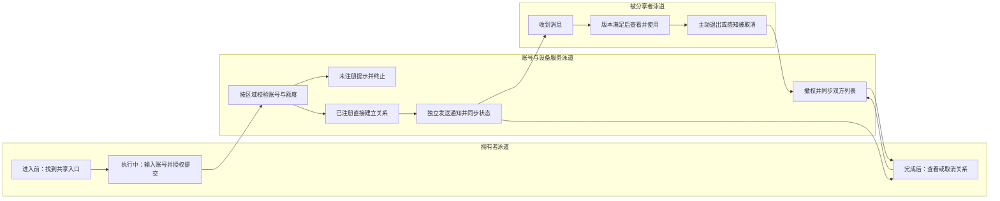
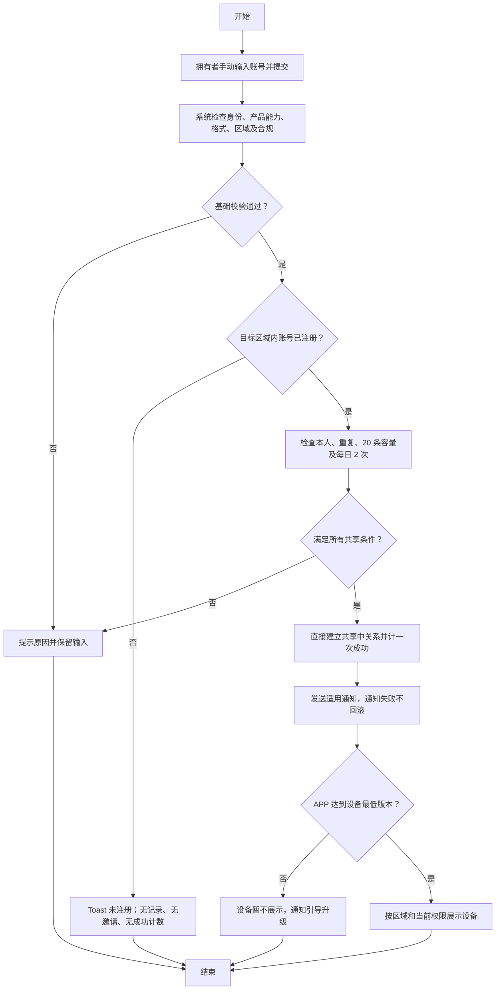

# 设备共享二期 PRD：已注册用户共享完整闭环

| 属性 | 内容 |
| --- | --- |
| 状态 | 已批准分期范围，需求评审稿 |
| 日期 | 2026-09-10 |
| 对照原文 | [飞书原始 PRD Rev.3356](https://momcozy-in.feishu.cn/wiki/Ao0BwgRIPi2r9IkVbUycOpDUnbc) |
| 原型 | [二期交互原型与页面规格](https://hawzz.github.io/root-interactivable-prototype/prototypes/device-sharing-phase-2/) |
| 本地已读来源 | `device-sharing/prd.md`、`device-sharing/raw/feishu-prd-reconciliation-2026-09-08.md`、`device-sharing/prototype/src/data/prd-specs.ts` |
| 核验声明 | 已结构化读取 `raw/feishu-prd-rev3356.json` 的 `data.document.content`，核对成功指标、需求范围、产品方案、网络异常、权限管理及附属引用，并对齐 `prototype/src/phases/specs.ts` |

## 0. 对比原 PRD 的变更说明

对照基线：原飞书 PRD Rev.3356；对照日期：2026-09-10。变更依据为本次已确认的三期范围和账号输入、地区、复选框联动补充。

二期承接原 PRD 中除“已上线配网后引导”和“新用户共享”以外的全部范围。未列为移出或调整的原有要求继续适用，尤其不因分期删除权限、合规、通知、版本及数据隔离。下表“原文”列为 Rev.3356 规则摘要；原文未明确、来自本地原型补充的规则须保留来源区分。原文埋点及 UIUX 引用继续作为依赖，其标题中的“一期”不直接等同于本次第一阶段。

| 原章节／原规则 | 二期规则 | 变更类型 | 归属期次及原因 | 关联验收项 |
| --- | --- | --- | --- | --- |
| 配网成功后引导；后台配置；设备助手/新手引导优先；可跳过 | 不重新交付引导，只回归其共享落点 | 移出新增范围 | 一期已上线，仅拆交付归属 | P2-AC-13 |
| 设置页共享入口仅拥有者可见，产品能力开关控制 | 保留，服务端同时鉴权并阻断关闭产品请求 | 不变 | 二期原有核心入口 | P2-AC-01 |
| 手动手机号/邮箱输入，按注册区域支持手机号 | 邮箱全区域；US/CA 仅 +1，CN 仅 +86，其余仅邮箱；按分享者注册区域匹配账号 | 明确/收敛 | 二期确认匹配边界；+1 不等于 US/CA 互通 | P2-AC-03 |
| 本人、格式、重复、上限、频次校验，提交 Loading，失败保留输入 | 保留适用校验；删除等待注册重复提示分支 | 保留并收敛 | 二期无等待注册状态 | P2-AC-02、P2-AC-03 |
| 已注册账号直接建联，无接受/拒绝 | 完整保留 | 不变 | 二期主要成功路径 | P2-AC-03 |
| 未注册创建等待注册记录，发送注册提醒 | 仅提示账号未注册 Toast 后结束；不创建记录、不发邀请、不计成功 | 替换 | 新用户能力归三期；二期明确拒绝结果 | P2-AC-03 |
| 等待注册、共享中、已取消、已退出、已过期 | 二期业务状态仅共享中、已取消、已退出；失败不是关系状态 | 收敛 | 等待注册及过期属三期待评估 | P2-AC-02、P2-AC-03、P2-AC-07、P2-AC-11 |
| 等待注册 30 天、到期失效、注册登录自动建联 | 二期不执行；注册完成后需要拥有者重新主动发起二期共享 | 移出 | 三期重新评估期限和建联方式，未定稿 | P2-AC-03 |
| 单台设备最多 20 条有效记录，共享中与等待注册合计 | 单台设备最多 20 条已建立且共享中的关系 | 数值保留、计数集合收敛 | 二期没有等待注册；不是调整为 20 次发送 | P2-AC-02 |
| 同设备同账号每天最多成功发起 2 次，取消/退出不重置 | 数值与维度保留，仅成功建立关系计数 | 数值保留、成功口径收敛 | 排除未注册与其他失败提交 | P2-AC-03 |
| BBM 等合规勾选、共享确认、成功记录时间/IP/uid/设备 ID | 完整保留，普通设备不展示，不增加接收方二次隐私确认 | 不变 | 二期授权与审计底线 | P2-AC-03 |
| 已注册 Push、消息中心、已绑定验证邮箱邮件并行 | 完整保留；同一关系邮件仅一次、不催促；通知失败不回滚建联 | 不变 | 二期触达闭环 | P2-AC-04、P2-AC-05、P2-AC-06 |
| 未注册邮箱邮件、下载二维码、期限与注册指引 | 二期不发送、不展示成功结果 | 移出 | 三期能力草案，不提前承诺邀请 | P2-AC-03 |
| 未注册手机号短信及 HTML 指引，多语言，设备名称可展示，禁婴幼儿信息 | 二期不触发该渠道；隐私约束作为三期底线保留 | 移出触发路径 | 三期核实供应商与地区支持 | P2-AC-03 |
| 低于 IoT 配置设备最低 App 版本，关系仍建立、设备不显示 | 完整保留；Push/消息中心去商店，验证邮箱邮件无跳转；升级登录同步最新关系 | 不变 | 二期兼容已有账号，不增加第二套流程版本判断 | P2-AC-10 |
| 新注册用户区域错误不展示数据并发送一次邮件 | 二期无新注册自动建联；保留数据大区隔离，不新增已注册用户区域错误邮件触发规则 | 移至三期候选方案 | 注册后区域纠错随未注册链路后移；二期不扩大原通知人群 | P2-AC-10、P2-AC-12 |
| 设备直接进列表，无共享标识，跳过 onboarding | 完整保留，受版本与服务端关系状态约束 | 不变 | 二期被分享者使用路径 | P2-AC-12 |
| 设备控制、实时/历史数据、基础信息只读、受限设置、耗材/客服/助手、告警权限 | 完整保留权限矩阵，见第 6 节 | 不变 | 二期并非仅添加共享页面 | P2-AC-07、P2-AC-08、P2-AC-09 |
| 仅共享设备及其数据，不同步宝宝资料和每日例行记录变更 | 完整保留 | 不变 | 二期隐私与数据范围 | P2-AC-09 |
| 原文背景指出蓝牙不支持共享的覆盖缺口，权限矩阵明确控制依赖本地蓝牙或云端通信；本地冻结规格补充关系云端维护 | 保留蓝牙共享覆盖，按产品配置与实际通信能力生效，不承诺两个 APP 同时连接 BLE | 保留原文能力范围及既有规格补充 | 二期设备能力边界；云端维护为既有规格说明，不冒称原文逐字规则 | P2-AC-09 |
| 拥有者取消、接收者主动移除、权限收回、双方列表同步、失效消息 | 保留全部已建联分支；等待记录取消不适用 | 保留并收敛 | 二期关系终止闭环 | P2-AC-02、P2-AC-05、P2-AC-07、P2-AC-11 |
| 中英文规格、异常提示与版本规则 | 保留适用页面，不把旧原型演示当新增需求 | 不变 | 二期完整体验 | P2-AC-01～13 |
| 成功指标：复用率 ≥70%、新设备接入效率提升 ≥50%、发起成功率 ≥80%、设备共享率提升 ≥20% | 四项指标保留；发起成功分子排除等待记录，仅实际建联；共享率提升不替换为次数增长 | 保留指标、成功集合收敛 | 二期排除新用户等待记录 | P2-AC-03 |
| 原文仅手动输入，转分享受权限限制；家庭组织及迁移未列原文，本地 PRD 明确排除 | 继续排除，不扩展 | 保持范围边界 | 二期不新增未定义能力 | P2-AC-01、P2-AC-03、P2-AC-09 |
| 网络异常：弱网/无网/超时阻断当前操作并提示 | 全部操作保留，不提前成功或移除；恢复后重试并核对状态 | 不变 | 二期新增及终止均覆盖 | P2-AC-02、P2-AC-03、P2-AC-07、P2-AC-11 |
| 数据埋点需求与一期 UIUX 链接 | 保留引用，按本次分期核对事件及页面 | 归属澄清 | 不删除附属依赖，不将外链未读内容当作已核实 | P2-AC-03、P2-AC-13 |

### 沿用原 PRD 的内容

- 拥有者与被分享者权限边界、设备共享能力配置、设备及设备数据范围继续适用。
- 指定婴童设备的合规勾选、共享确认和成功审计要求保留；普通设备不增加专用确认门槛。
- 已注册用户 Push、消息中心、验证邮箱通知及通知失败不回滚关系的规则保留。
- IoT 配置的设备最低 APP 版本判断、低版本通知与升级后同步规则保留。
- 取消共享、主动退出、双方状态同步、权限收回、通用网络异常和并发兜底保留。
- 上述规则具体映射见第 6 节及 P2-AC-01～13；延期的未注册能力并非永久删除。

## 1. 产品概述与背景

家庭成员使用独立账号访问同一设备，可以减少共用主账号造成的异常登出，并明确设备管理权。二期实现拥有者向已注册账号共享设备、接收者使用、双方终止关系的完整 APP 闭环，承接原始共享组件的可复用能力。

“新用户”在本需求中指提交共享时目标区域内不存在对应已注册账号，不等同于首次收到共享、首次安装或低版本用户。已注册但版本低的账号仍属于二期。未注册目标在二期仅获得拥有者端失败提示，后续注册不会触发二期隐式共享。

## 2. 用户、场景与范围

| 角色 | 目标与场景 |
| --- | --- |
| 设备拥有者 | 从设置页或一期落点手动输入家人账号，查看关系并取消共享 |
| 已注册被分享者 | 从通知定位设备，使用控制与数据功能，查看只读信息或主动退出 |
| 账号/设备/通知服务 | 区域内匹配身份，鉴权及额度校验，建立/撤销关系，独立执行触达 |

用户故事：拥有者希望一次提交就让已注册家人使用设备；被分享者希望无需接受邀请就找到设备，同时理解管理权限边界；关系终止后双方希望状态一致且旧消息不能恢复权限。

In Scope：入口、共享列表、添加校验、合规、已注册建联、通知、版本、地区隔离、设备展示、完整权限矩阵、取消和退出、异常、多语言及指标。Out of Scope：一期引导新增开发、新用户邀请及等待/过期/注册建联、家庭组织、转分享、通讯录/扫码、历史迁移及具体接口/数据库设计。全部范围内业务为 P0；业务指标用于上线效果评估，不能替代功能验收。

## 3. 目标与指标

Rev.3356“成功指标”原文为：“通用能力复用率≥70%”；“新设备接入设备共享组件的效率提升≥50%”；“设备共享发起成功率（成功创建‘共享中’关系或‘等待注册’记录的次数 ÷ 点击【发起共享】次数）≥80%”；“设备共享率提升≥20%（使用了新的设备共享组件后的共享率跟没使用之前的设备共享率）”。二期保留四项指标及阈值，仅按分期收敛成功分子。原文未给复用清单、效率细化公式、共享率分母及观察窗口；以下统计建议需评审冻结。

| 指标 | 保留目标 | 二期计算与边界 |
| --- | --- | --- |
| 组件复用率 | ≥70%（>=70%） | 按原文组件复用清单核算；复用项/适用项，分子分母采用同一粒度。原文未给细化公式，清单由研发评审冻结 |
| 接入/开发效率提升 | ≥50%（>=50%） | 建议以可比接入工作量计算（基线工时－二期工时）/基线工时；原文未给细化公式，任务复杂度与基线须评审冻结，不以主观打分替代 |
| 共享成功率 | ≥80%（>=80%） | 分子为统计窗口内归因至二期发起行为、实际成功建立的共享关系数；分母为同窗口“发起共享”点击次数。未注册、本人、重复、限额、网络失败等已发生的发起点击保留在分母，不能只取校验通过请求 |
| 设备共享率提升 | ≥20%（>=20%） | 对比新组件使用后共享率与使用前共享率。原文未定义共享率分母、按账号或设备计算的粒度、观察周期及提升算法，均待数据评审冻结；分子仅基于实际已建立共享关系，两组采用同一粒度与去重口径，不计等待记录或邀请。不以共享次数增长替代原指标，不在分母未冻结时宣称达标 |

一期“邀请家人”导航点击不属于“发起共享”点击。二次确认是同一发起行为的后续步骤，不新增第二个分母事件；Loading 禁用按钮不产生新的有效点击事件，取消确认的既有点击仍留在分母。服务端重试或重复回调只归因一次关系成功。通知成功、未注册 Toast、注册完成均不能增加成功分子。低版本账号关系已建立则计成功，即使设备暂时不展示。

建议观察漏斗为入口到达、发起点击、校验结果、建联结果、通知结果、设备可见/访问、取消/退出；按区域、产品、APP 版本分层。日志避免明文账号扩散，统计需能对账关系事实，不要求在 PRD 中设计埋点接口。

## 4. 用户旅程泳道

旅程说明：进入前保留设置入口与一期衔接；执行中最大风险是账号区域错误、误以为未注册也分享成功，因此失败需明确停留；完成后关系事实优先于通知，低版本提供升级路径，取消/退出均及时回收访问权。

## 5. 核心流程与状态

流程说明：图表达业务条件，不规定后端校验接口顺序。所有创建条件必须由服务端可靠校验；请求超时需查询最终关系事实，不能因重试重复建联。未注册无关系可查询，注册后需拥有者再次主动发起。

| 当前状态 | 触发 | 结果及列表变化 |
| --- | --- | --- |
| 无关系 | 已注册且全部校验通过 | 共享中，列表新增，成功计数 +1 |
| 无关系 | 未注册或其他失败 | 保持无关系，提示原因，不新增业务记录或成功计数 |
| 共享中 | 拥有者确认取消 | 已取消，双方列表移除相关项，收回权限，接收者系统消息新增取消通知 |
| 共享中 | 被分享者确认移除 | 已退出，双方列表移除相关项，收回权限 |
| 已取消/已退出 | 旧消息点击或并发重复操作 | 不恢复权限，以最新状态刷新并提示关系已失效 |
| 已取消/已退出 | 拥有者重新主动提交 | 重新校验全部条件；仍受当日累计 2 次限制 |

## 6. 关键业务规则

### 6.1 账号、区域与提交

| 分享者注册国家/地区 | 可输入账号 | 匹配约束 |
| --- | --- | --- |
| US | 邮箱或 +1 手机号 | 在 US 对应账号区域匹配，不因 +1 自动查找 CA 账号 |
| CA | 邮箱或 +1 手机号 | 在 CA 对应账号区域匹配，不因 +1 自动查找 US 账号 |
| CN | 邮箱或 +86 手机号 | 在 CN 对应账号区域匹配 |
| 其他 | 仅邮箱 | 不展示手机号共享能力；邮箱也遵循分享者注册区域匹配 |

仅支持手动输入（含粘贴、清除）；格式与规范化沿用账号登录能力，不自创邮箱大小写或手机号去重规则。区号不得用于绕过分享者区域限制。目标区域内未匹配到已注册账号：拥有者端 Toast 明确“该账号尚未注册，请对方注册后再发起共享”，停止流程；无共享/等待/邀请记录、无邮件短信邀请、无成功 Toast、无人数或每日成功计数变化。

本人账号、既有共享中关系、超额均拦截。格式不合格按钮不可提交；合规设备还需勾选。提交中禁重复点击，失败保留输入和勾选；具体错误优先，否则提示网络异常并允许重试。前端隐藏或禁用不能替代服务端校验。

### 6.2 容量与频次

单设备最多同时 20 条有效共享关系，二期有效集合仅“共享中”。达到 20 条后点击管理页“添加共享”即提示人数上限且不进入添加页；其他入口或并发请求仍由服务端拦截。低版本暂不可见的共享中关系仍占额。取消或退出释放有效人数名额，但不回退成功次数。同一设备、同一账号、同一天最多成功建立 2 次关系；不同账号不能误共用这个 2 次配额，不能改成全设备每日 2 次。未注册、校验失败、请求失败未建联及重复回调均不计成功。

并发提交不得突破人数或日限额，接口结果不确定时以服务端最终关系和计数为准。日界线需沿用现网定义并在联调冻结，本文不默认 UTC 或用户本地时区。若真实环境已有历史等待注册记录，须先确认其隔离及容量口径；本期不擅自删除、迁移或自动激活历史记录。

### 6.3 合规与数据

BBM 等指定设备默认未勾选监护人/授权照护者声明；未勾选不可提交，勾选后提交仍需共享确认。成功时保留勾选时间、IP、uid、设备 ID 审计记录。普通设备不展示专用勾选及确认弹窗。原声明文案仍待合规审定，不因分期标记为已审批，不添加接收者接受/拒绝或二次隐私确认流程。

仅共享设备及设备产生的实时/历史数据，不同步宝宝资料；双方每日例行记录的新增、编辑、删除不互相同步。区域不一致时不展示设备数据；不能因邮箱全地区可用而穿透数据区域边界。原文新注册用户区域错误邮件随注册邀请链路移至三期候选方案，二期不新增已注册接收者区域错误邮件触发规则。

### 6.4 完整权限矩阵（保持原规则）

| 能力 | 拥有者 | 被分享者 |
| --- | --- | --- |
| 设备控制页控制功能 | 可用 | 可用，依赖本地蓝牙或云端实际通信 |
| 实时及历史设备数据 | 可查看 | 可查看，受关系与区域约束 |
| 设备基础信息 | 可查看和修改 | 只读，不能改名称 |
| 网络重置/重新配网 | 可操作 | 不可操作 |
| 个性化设置（设备功能） | 可操作 | 无权限设置项隐藏 |
| 耗材管理 | 按产品能力可用 | 按产品能力可用 |
| 在线客服/智能设备助手 | 独立使用 | 独立使用 |
| OTA | 可操作 | 不可操作 |
| 发起共享 | 可操作 | 不可操作，无转分享 |
| 解绑/删除设备 | 可操作 | 不可操作 |
| 移除共享 | 管理侧取消关系 | 可主动退出，不能删除拥有者设备 |
| 设备推送/告警 | 按本人通知设置 | 按本人通知设置 |

被分享者卡片不加“共享”标识，跳过设备 onboarding。Rev.3356 评论 c23/c27 明确上述展示行为，c25 明确设备最低版本配置，c6/c28 明确按设备固定权限及由业务侧控制特殊场景；本期不新增平台动态权限配置系统。设备信息具体字段由设备模块定义，共享组件统一只读约束；设置页隐藏无权项，拥有者“删除”替换为接收者“移除共享”。蓝牙可纳入共享，关系云端维护，不据联网类型统一禁止；共享成立不等于本地通信已连接。

### 6.5 通知、版本及终止

| 情形 | 保留规则 |
| --- | --- |
| 已注册正常版本 | Push、消息中心并行；绑定且验证邮箱时同时邮件。Push 唤起 APP 并定位消息，点击消息定位设备；没有接受/拒绝 |
| 邮件 | 同一共享关系仅发送一次，不重复催促；通知失败不回滚关系，不能通过重建关系补发 |
| 低版本 | 按接收者最近使用版本与 IoT 配置的设备最低 App 版本判断；不阻断创建，关系共享中，设备不展示；拥有者提示对方需升级 |
| 低版本通知 | Push 和消息中心点击去对应应用商店；邮件仅验证邮箱接收且不设置跳转。原文评论中的升级弹窗不自动覆盖正文规则 |
| 升级登录 | 按服务端最新关系同步，无需重发；已取消或退出的设备不再出现 |
| 拥有者取消 | 二次确认后撤权、移除设备/列表成员并提示取消成功；接收者消息中心新增只读取消通知 |
| 被分享者移除 | 二次确认后状态已退出，双方列表同步、提示移除成功；不凭空新增原文未要求的退出通知渠道 |
| 并发/旧消息 | 关系已失效则刷新并阻断控制和数据访问，旧通知不恢复权限；重复操作不重复撤权计数 |

## 7. 风险、依赖与非功能要求

| 类型 | 事项 | 处理要求 |
| --- | --- | --- |
| 外部依赖 | 原文埋点及 UIUX 引用、未定义指标口径 | 原文引用埋点 Wiki `IydpwR2mfimkM3kd0igcBSdTneh` 和 Figma `duT2TznMnQLIIv7zoPeOzA`（82-3359）；外链正文本次未读，具体事件和设计另核对；冻结共享率分母 |
| 外部依赖 | 账号区域、设备能力及最低版本配置 | 账号/IoT 团队确认真实区域映射、支持产品清单和版本样本 |
| 外部依赖 | BBM 清单、文案与通知模板 | 合规与通知团队确认，不将旧文案当最终审定 |
| 实施风险 | 未注册被误算成功、+1 跨区域误匹配 | 覆盖区域和零记录/零计数用例，成功对账服务端事实 |
| 实施风险 | 并发超额、超时重复建联、缓存未撤权 | 服务端校验与状态一致性联调；禁止仅靠页面状态控制权限 |
| 实施风险 | 旧等待记录及计数日界线未明确 | 存量盘点并明确运行口径；不把数据迁移混入本期 |
| 实施风险 | 原型仍残留等待注册、短信和独立邀请页 | 只验收二期指定页面规格与本稿分期规则，差异提交主任务 |

非功能要求：已有账号与权限机制复用；通知故障不影响成功关系；关键失败可追踪且不泄露不必要个人信息；中英文提示与状态一致；正常设备使用不依赖通知送达。未获得原始性能阈值，不新增无依据的响应时间承诺。

## 8. 编号验收与原型映射

以下编号与分期规格完全一致，每个页面 AC 包含完整业务子项；跨页业务需联合验证。统计验收归添加共享 AC，不要求把统计实现细节展示在 APP 中。

| AC | 前置条件与操作 | 预期结果 | 原型页面 |
| --- | --- | --- | --- |
| P2-AC-01 | 拥有者/被分享者、产品开关组合；绕过前端 | 仅拥有者且支持产品有入口；服务端阻断越权，不扩入家庭组织或转分享 | [共享入口](https://hawzz.github.io/root-interactivable-prototype/prototypes/device-sharing-phase-2/?page=share-entry) |
| P2-AC-02 | 查询空/非空列表、19/20 条边界及并发；取消确认/放弃/网络异常 | 仅共享中；20 条时添加入口提示且不进表单，服务端守上限；低版本有效关系占额；成功取消才移除、撤权、释放人数，放弃/失败不伪装成功 | [共享管理](https://hawzz.github.io/root-interactivable-prototype/prototypes/device-sharing-phase-2/?page=device-share) |
| P2-AC-03 | 区域/邮箱/手机号、本人/重复/未注册/格式、BBM 勾选及确认、每日 2 次、重试和指标样本 | US/CA +1、CN +86、其他邮箱；未注册精确 Toast，无记录/邀请/通知/成功计数，注册后不自动建联；已注册直接建联；合规成功审计完整，取消确认无请求；取消退出不清当日次数；失败保留输入，幂等不重复计数；四项目标保留，成功率分母点击、分子仅建联 | [添加共享](https://hawzz.github.io/root-interactivable-prototype/prototypes/device-sharing-phase-2/?page=add-share) |
| P2-AC-04 | 正常/低版本建联，模拟 Push 故障 | 正常 Push 定位消息中心，低版本去商店，无未注册邀请；失败不回滚关系 | [App Push](https://hawzz.github.io/root-interactivable-prototype/prototypes/device-sharing-phase-2/?page=app-push) |
| P2-AC-05 | 点击共享、取消和失效消息 | 正常消息定位设备，无接受/拒绝；取消通知只读；旧消息不恢复权限，低版本去商店 | [消息中心](https://hawzz.github.io/root-interactivable-prototype/prototypes/device-sharing-phase-2/?page=message-center) |
| P2-AC-06 | 验证/未验证邮箱、正常/低版本、未注册及发送故障组合 | 仅适用已注册验证邮箱发送；同关系一次、不催促，低版本无跳转；未注册不发邀请，失败不回滚 | [邮件通知](https://hawzz.github.io/root-interactivable-prototype/prototypes/device-sharing-phase-2/?page=email-notification) |
| P2-AC-07 | 检查设置并主动移除，覆盖确认/取消/失败及拥有者先撤销 | 隐藏无权限项，耗材/客服/助手按矩阵；成功才退出且双方同步，并发失效不重复处理 | [接收者设置](https://hawzz.github.io/root-interactivable-prototype/prototypes/device-sharing-phase-2/?page=receiver-settings) |
| P2-AC-08 | 进入设备信息并尝试修改 | 字段沿用设备模块，全部只读，无改名/改网/OTA 权限 | [设备信息](https://hawzz.github.io/root-interactivable-prototype/prototypes/device-sharing-phase-2/?page=receiver-device-info) |
| P2-AC-09 | 逐项检查权限、蓝牙/云端通信及宝宝/例行数据变更 | 严格符合第 6 节矩阵；只共享设备及其数据，不同步宝宝与例行记录；实际通信不可用不冒充控制成功，无转分享 | [权限](https://hawzz.github.io/root-interactivable-prototype/prototypes/device-sharing-phase-2/?page=permissions) |
| P2-AC-10 | 低版本建联，升级前取消/退出对照；区域错误样本 | 按设备最低版本判断，关系成功但设备暂不可见；升级仅同步有效关系；跨区不展示数据，不新增已注册用户区域错误邮件触发规则 | [版本与区域](https://hawzz.github.io/root-interactivable-prototype/prototypes/device-sharing-phase-2/?page=version-compat) |
| P2-AC-11 | 并发撤销/退出、旧消息及弱网/无网/超时后查询 | 最新状态为准，失效设备移除且不可读数据或控制；超时不提前成功，重试不复活关系 | [设备已移除](https://hawzz.github.io/root-interactivable-prototype/prototypes/device-sharing-phase-2/?page=removed-empty) |
| P2-AC-12 | 正常、低版本、跨区、已取消/退出查询列表 | 正常卡片无共享标识，跳过 onboarding；低版本不显示，跨区不展示数据，失效设备移除 | [设备列表](https://hawzz.github.io/root-interactivable-prototype/prototypes/device-sharing-phase-2/?page=device-tab) |
| P2-AC-13 | 从配网后引导进入添加共享 | 仅一期已上线入口上下文，带入当前设备并衔接二期规则，不重新列为二期新增 | [一期入口上下文](https://hawzz.github.io/root-interactivable-prototype/prototypes/device-sharing-phase-2/?page=network-setup) |

全页需验证中英文、失败提示与实际状态一致，通讯录/扫码旧演示不进入二期。Rev.3356 明确配网来源提交成功进入 Device Tab；具体导航按来源保留，不能统一改回管理列表而遗漏原文路径。

## 9. 测试用例

| 用例名称 | 前置条件 | 输入 | 操作 | 预期结果 |
| --- | --- | --- | --- | --- |
| 已注册成功 P2-AC-03 | 有权限且额度足够 | 同区域已注册账号 | 提交并查询列表 | 唯一共享中关系，无接受步骤 |
| 未注册终止 P2-AC-03 | 区域内无目标账号 | 合法邮箱/手机号 | 提交后查询记录、通知和计数；再注册 | 仅 Toast，无任何共享记录或邀请，注册不建联 |
| 区域匹配 P2-AC-03 | US/CA/CN/其他各有样本 | +1、+86、邮箱 | 交叉提交 | 严格按注册区域与允许账号类型，不以区号代替区域 |
| 容量并发 P2-AC-02 | 已有 19 条共享中 | 两个不同注册账号 | 并发提交 | 最多新增一条，总数不超过 20 |
| 每日额度 P2-AC-03 | 同设备同账号当天成功两次后终止 | 相同账号 | 第三次提交，换设备/账号对照 | 第三次被拒，其他维度独立判断 |
| 合规确认 P2-AC-03 | BBM 与普通设备 | 勾选/未勾选 | 尝试提交并核对成功日志 | BBM 强制确认和审计，普通设备不增加专用门槛 |
| 通知故障 P2-AC-04、P2-AC-05、P2-AC-06 | 关系已建立 | 邮件故障 | 查看关系与其他通道 | 关系保持，适用通知规则不变 |
| 升级状态查询 P2-AC-10 | 低版本关系已建联 | 升级前取消/不取消 | 升级登录查询设备 | 仅有效关系同步，不需重发，不复活取消关系 |
| 撤权结果查询 P2-AC-02、P2-AC-07、P2-AC-11 | 有效关系 | 取消与退出并发 | 再读数据及点击旧消息 | 双方列表一致，数据及控制访问阻断 |
| 权限与数据隔离 P2-AC-09 | 被分享者登录 | 管理项及宝宝/例行数据 | 逐项访问、修改并查询双方结果 | 严格符合矩阵，非设备资料不互相同步 |
| 指标口径 P2-AC-03 | 固定窗口可追溯点击与关系样本 | 10 次发起点击，8 次建联含低版本，2 次未注册 | 核对计数与成功率 | 分母 10、分子 8、成功率 80%；未注册不占成功次数 |
