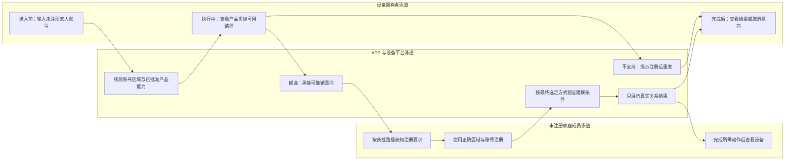
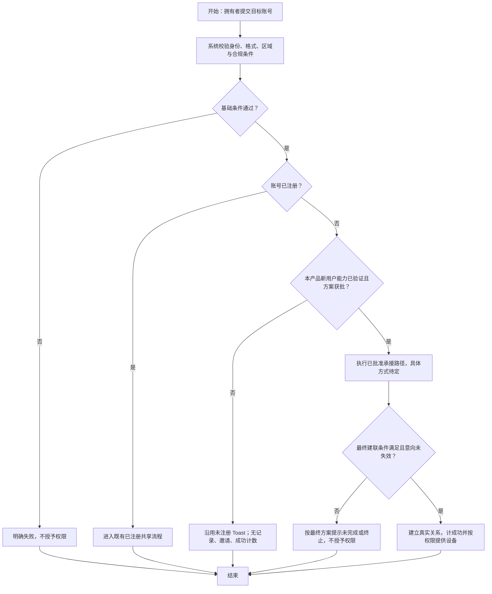

# 设备共享三期 PRD：新用户共享能力草案

| 属性 | 内容 |
| --- | --- |
| 状态 | 能力评估草案；分期归属已批准，平台支持与具体方案未定稿，不可据此直接承诺开发或上线 |
| 日期 | 2026-09-10 |
| 原文 | [飞书原始 PRD Rev.3356](https://momcozy-in.feishu.cn/wiki/Ao0BwgRIPi2r9IkVbUycOpDUnbc) |
| 原型 | [三期能力草案原型与规格](https://hawzz.github.io/root-interactivable-prototype/prototypes/device-sharing-phase-3/) |
| 本地证据 | `device-sharing/prd.md`、`device-sharing/raw/feishu-prd-reconciliation-2026-09-08.md`、`device-sharing/prototype/src/data/prd-specs.ts` |
| 证据说明 | 已读取 `raw/feishu-prd-rev3356.json` 的 `data.document.content` 及 `prototype/src/phases/specs.ts`。分期规格记录用户提供“Tuya 已支持生成邀请”，尚未独立核验；自研及 Meari 待确认，未取得三平台完整链路证据 |

## 1. 背景、目标与用户

当前已注册用户可以建立共享关系，目标区域内未注册账号在二期只会触发拥有者端提示，不产生记录或邀请。三期评估如何让拥有者向尚未注册的家人发起共享意图，并在账号满足条件后安全完成共享，降低需要线下提醒和重新输入的成本。

评估必须覆盖自研设备、涂鸦 Tuya 设备、觅睿 Meari 设备，不能以其中一个平台的实现推断其他平台支持。三期目标先形成可验证的能力结论、跨平台差异和方案决策，再冻结可交付范围。原基线“等待注册 30 天、注册登录后自动建联”仅为历史方案，不是本期已批准规则。

主要用户是设备拥有者与未注册家庭成员；影响角色包括账号、各设备平台、通知、合规和测试团队。用户故事：拥有者希望明确知道对方尚未注册时能做什么；家庭成员希望使用正确区域和账号注册后明确知道是否已获得设备权限；拥有者希望取消后不会在对方未来注册时意外授予权限。

## 2. 范围与优先级

| 分类 | 范围 | 优先级 |
| --- | --- | --- |
| In Scope：能力评估 | 三个平台逐产品核实身份映射、注册事件、共享前置条件、建联与撤销、通知和额度能力 | P0 |
| In Scope：方案草案 | 未注册提示、可选意向承接、注册指引、完成共享、取消/失效/异常与不可用路径 | P0，均需标记待决策 |
| In Scope：安全约束 | 未建联无权限、区域隔离、合规授权、撤权一致性、设备数据边界 | P0 |
| Out of Scope | 直接承诺所有平台通用能力、确定 30 天或自动建联、直接上线、重做一期引导或二期已注册能力、家庭组织/转分享/通讯录/扫码、历史迁移 | 不纳入 |

能力未验证或产品不支持时维持二期确定行为：未注册 Toast 终止、无记录、无邀请、无成功计数。该兜底不是对三期方案的最终取舍，也不构成静默启用邀请功能的许可。

## 3. 平台能力核实矩阵

用户提供信息：Tuya 已支持生成邀请；该信息尚未独立核验，不能推导兑换、撤销、跨安装恢复或自动建联已支持。其他“待核实”表示缺少证据，不表示支持或不支持。结论应细化到产品/设备型号、SDK 或服务版本、区域，不只填写平台名称。

| 核实项 | 自研设备 | 涂鸦 Tuya | 觅睿 Meari | 所需证据/判断标准 |
| --- | --- | --- | --- | --- |
| APP 账号与设备平台身份映射 | 待核实 | 待核实 | 待核实 | 身份唯一性、注册时序、区域映射及测试账号 |
| 邀请生成及无接收者 UID 时的前置条件 | 待设计验证 | 用户提供支持生成邀请；具体前置条件和独立验证待完成 | 待确认 | 文档/接口约束；生成能力不等于成功兑换或真实共享关系 |
| 注册完成事件或后续查询能力 | 待核实 | 待核实 | 待核实 | 事件可用性、重复/延迟/丢失处理及查询兜底 |
| 关系建立的前置条件 | 待核实 | 待核实 | 待核实 | 是否需接收动作、平台账号、登录态或其他明确条件 |
| 取消意向、撤销已建关系与同步 | 待核实 | 待核实 | 待核实 | 取消先于/同时于注册，最终权限可证明一致 |
| 有效期与平台硬限制 | 待核实 | 待核实 | 待核实 | 平台是否有强制时限；不预填 30 天 |
| 容量、每日额度与幂等 | 待核实 | 待核实 | 待核实 | 平台限制与 APP 20 条、每日 2 次约束的兼容性 |
| 数据大区与手机号/邮箱支持 | 待核实 | 待核实 | 待核实 | US/CA +1、CN +86、其他邮箱的账号匹配证据 |
| 通知、链接及注册回流 | 待核实 | 待核实 | 待核实 | 渠道可达性、合规、误账号/误区域回流处理 |
| 控制、设备数据与权限回收 | 待核实 | 待核实 | 待核实 | 共享前后控制/历史数据及撤权测试，覆盖真实通信方式 |

平台负责人需给出“支持/条件支持/不支持/待核实”、依据日期和限制。不支持的产品不得出现承诺可完成邀请的路径；条件支持须在原型规格明确触发条件，不能只在文档附注隐藏限制。

## 4. 待决策项与方案比较

| 决策 ID | 问题 | 可评估方向 | 当前结论与完成条件 |
| --- | --- | --- | --- |
| D01 | 是否持久化未注册共享意图 | 无意向记录并提示注册后重发；保存可撤销意向 | 未定，需平台能力、隐私与成本证据 |
| D02 | 注册后如何完成共享 | 拥有者重新发起；用户显式继续；满足已审条件后自动建联 | 未定，自动建联不是默认方案，需身份与取消竞态验证 |
| D03 | 意向有效期 | 平台允许范围内选择期限及展示方式 | 未定，不预设 30 天；需时区、到期边界及过期动作决策 |
| D04 | 等待意向是否占 20 条容量及每日 2 次 | 不占关系额度但单独防滥用；占用预留额度 | 未定，必须区分意向和已建关系；不能直接照搬旧合计规则 |
| D05 | 是否触达及使用哪些渠道 | 邮件、事务短信、APP 内引导或可支持组合 | 未定，按区域及平台验证；二期未注册不触达规则继续生效直到能力批准 |
| D06 | 接收者是否需明确确认 | 按授权和平台能力评估 | 未定；不能沿用旧演示假设必有接受/拒绝，也不能默认无接收动作 |
| D07 | 误区域、错账号、重复注册事件 | 明确阻断、纠正后继续或重新发起 | 未定，任何分支均不得跨区域泄露设备数据 |
| D08 | 多平台交付一致性 | 统一已验证最小能力；按产品能力差异展示 | 未定，以三平台证据和体验可解释性决定 |

无意向方案实现依赖较少但需要拥有者重发；保存意向可减少重复操作，却增加身份绑定、取消和过期的一致性成本；自动建联可能减少操作，但只有在授权、账号与区域可信且撤销竞争可控后才能评估。三种方向仅供比较，不宣称已有选型结论。

### 4.1 当前原型候选与演示边界

`invitation-draft` 仅 Tuya 选项展示 `momcozy://share/example`，自研和 Meari 不展示候选链接；该字符串仅为样例，无真实兑换能力。`invitation-recovery` 区分已安装与未安装：已安装候选为唤起 APP → 登录 → 校验账号、区域及有效性 → 确认后尝试兑换；未安装候选为应用商店 → 安装登录 → 重新打开原链接或输入邀请码恢复上下文。原型不实际打开商店，不调用 SDK，不发送邀请、不建联、不显示兑换成功。确认动作是候选交互，不替代 D02/D06 的正式决策；跨安装自动恢复未获承诺。

## 5. 用户旅程泳道（候选，不代表冻结流程）

旅程说明：进入前需明确区分账号不存在与已有账号；执行中只展示经验证能力，避免“已发送”误导；完成后只把实际建联视为成功。触达渠道、是否持久化意向、注册后是否还需动作均待决策，图中候选路径不能作为研发默认状态机。

## 6. 核心流程（能力门控）

流程说明：能力门控既要求平台证据，也要求产品方案获批，原型演示不能满足门控。节点“意向未失效”仅在最终方案采用意向时适用；不隐含固定期限或后台自动监听。需要重新发起的方案必须由拥有者显式操作，不能被后台替代。

## 7. 确定约束与候选状态

| 约束 | 确定要求 |
| --- | --- |
| 身份与入口 | 仅拥有者可发起；IoT 产品能力决定可用范围；接收者不得转分享 |
| 区域匹配 | 邮箱可用于各区域；分享者注册区域 US/CA 手机号为 +1、CN 为 +86，其余仅邮箱；+1 不等于跨区互通 |
| 授权 | 建联前不开放控制或数据；BBM 等保留监护人/授权照护者约束与审计，具体采集时机随方案审定 |
| 数据边界 | 只共享设备及其数据，不同步宝宝资料及双方每日例行记录变更；不得跨区域泄露数据 |
| 已建联额度 | 单设备最多 20 条有效共享关系、同设备同账号每天成功最多 2 次；取消/退出不重置当日累计。意向是否预占及发送限额另决策 |
| 成功定义 | 实际建立关系才是共享成功；发送通知、创建意向、完成注册均不能直接当作共享成功 |
| 撤销 | 已取消或已失效意向不得授予权限；已建关系终止必须回收权限；并发、重试、延迟事件不可复活关系 |
| 建联后权限 | 控制与实时/历史数据按设备能力开放；基础信息只读；禁止改网、个性化设置、OTA、解绑/删除和转分享；耗材按能力，客服/助手独立，通知按个人设置；可主动退出 |
| 建联后兼容 | 按设备最低 App 版本判断，低版本关系保持但设备不展示；Push/消息中心指向商店，验证邮箱邮件无跳转；升级登录同步最新有效关系 |
| 通知与隐私 | 若批准未注册通知，须先确认渠道和语言；短信/HTML 不展示婴幼儿信息，设备名称可按合规模板展示；下载二维码若采用旧通用方案，不携带账号、邀请 ID、设备等个人数据 |

候选状态“待注册/待完成/已过期”仅用于讨论，尚不构成产品状态枚举；其生成、占额、终止条件须随 D01～D04 冻结。确定的已建关系仍用共享中、已取消、已退出。不能把原始 30 天期限或自动建联写入默认文案、倒计时、验收期待或统计公式。

## 8. 指标、风险与依赖

三期暂不冻结新增业务数值目标。能力评估完成度需按三平台、实际产品和矩阵逐项给出证据；后续可观察未注册提交、获准承接、注册完成、真实建联与撤销结果。注册转化率与共享成功率必须分别定义，不能合并；若未来沿用原共享成功率指标，分母仍须明确发起点击，成功分子仅建联，目标另经评审。

| 类型 | 风险/依赖 | 处理 |
| --- | --- | --- |
| 外部依赖 | Tuya/Meari SDK、API 和服务权限及区域限制 | 平台负责人提供版本化证据和真实测试结果，未验证标待核实 |
| 外部依赖 | 自研账号注册事件与设备身份映射 | 确认重复、延迟、丢失和错账号情况，不假设存在自动回调 |
| 外部依赖 | 法务、短信/邮件供应商与语言模板 | 冻结触达合法性、必要信息、发送频控和失败策略 |
| 实施风险 | 意向被误当授权、取消与注册竞态 | 建联前复核全部授权与有效性，按最终方案做竞争条件测试 |
| 实施风险 | 30 天和自动建联从旧原型意外带入 | 页面标候选/待决策，定稿前逐页检查模板、倒计时及状态说明 |
| 实施风险 | 平台能力不一致但界面承诺一致 | 逐产品门控并明确不支持路径，不能用自研结果替代三方验证 |
| 证据风险 | 原文及原型已核对，但平台生成信息仅用户提供 | 保留证据层级；实际 SDK/平台能力须独立核实，不把原型演示当证明 |

## 9. 编号验收与原型映射

本期首先验收“能力草案可评审、未决事项不伪装为结论”。运行验收须在方案冻结后执行。原型规格已读取，页面使用 `invitation-draft`、`invitation-recovery`、`invitation-history`，分别对应 AC-01、02、03；每个页面编号覆盖下列详细场景。

| AC | 前置条件与操作 | 预期结果 | 原型页面 | 验收阶段 |
| --- | --- | --- | --- | --- |
| P3-AC-01 | 切换自研/Tuya/Meari，检查能力矩阵、候选邀请及未支持产品行为 | 自研待设计验证，Meari 待确认；Tuya 仅用户提供生成能力，尚未独立核实。仅 Tuya 显示 `momcozy://share/example` 样例，非真实可兑换链接；示例设备不代表真实供应商；无 SDK、发送、建联或兑换成功；未验证产品继续二期 Toast 兜底 | [邀请能力草案](https://hawzz.github.io/root-interactivable-prototype/prototypes/device-sharing-phase-3/?page=invitation-draft) | 草案 |
| P3-AC-02 | 切换已安装/未安装；检查恢复、身份区域、撤销/失效/重复、权限、额度及统计候选要求 | 已安装候选为唤起、登录、校验、确认后尝试兑换；未安装候选为商店、安装登录、重开链接或输入邀请码；不承诺安装后自动恢复。区域遵循 US/CA +1、CN +86、其他邮箱；未授权不展示数据；撤销/失效不复活；建联后遵守权限、20 条/每日 2 次与版本规则；意向占额未定；通知/注册不计成功。运行测试待方案冻结 | [邀请恢复候选](https://hawzz.github.io/root-interactivable-prototype/prototypes/device-sharing-phase-3/?page=invitation-recovery) | 草案及未来运行 |
| P3-AC-03 | 检查旧等待记录、邮件/短信、30 天、过期、自动建联及额度说明 | 全部明确历史参考，均退出二期且不自动成为三期要求；D01～D08 无证据时保持未决，模板/倒计时不得伪装冻结承诺 | [历史方案](https://hawzz.github.io/root-interactivable-prototype/prototypes/device-sharing-phase-3/?page=invitation-history) | 草案 |

## 10. 测试用例与定稿门槛

| 用例名称 | 前置条件 | 输入 | 操作 | 预期结果 |
| --- | --- | --- | --- | --- |
| 不支持路径 P3-AC-01 | 产品能力未验证或不支持 | 未注册账号 | 发起共享 | 沿用 Toast 终止，无记录、邀请或成功计数 |
| 能力状态查询 P3-AC-01 | 三个平台证据清单 | 产品、区域、平台版本 | 逐项查阅 | 有可追溯证据或明确待核实，无推断支持 |
| 获批路径成功 P3-AC-02 | 某产品方案已批准且能力验证 | 正确区域和账号 | 执行所选承接与完成路径 | 满足全部条件后才建联并开放规定权限 |
| 错区域失败 P3-AC-02 | 方案已冻结 | 同区号不同区域账号 | 注册并尝试完成共享 | 不误匹配，不跨区展示数据 |
| 取消结果查询 P3-AC-02 | 最终方案采用可撤销意向 | 取消与注册事件竞争 | 查询最终关系并访问设备 | 已取消意向不建联，访问被拒 |
| 历史假设检查 P3-AC-03 | 期限和建联方式未决 | 原型文案和规格 | 搜索 30 天、自动建联及倒计时 | 仅历史候选或待决策说明，无冻结承诺 |
| 成功口径校验 P3-AC-02 | 存在意向、注册及建联样本 | 重复事件和通知记录 | 对账成功统计 | 仅实际建联计成功，意向/通知/注册不计成功 |

定稿门槛：平台矩阵完成所选产品证据核验；D01～D08 明确决策与依据；账号/合规/通知评审通过；原型页面及 AC 映射落实；按选定方案补齐状态及异常验收。未满足时本文保持能力草案，不输出开发完成或上线结论。
