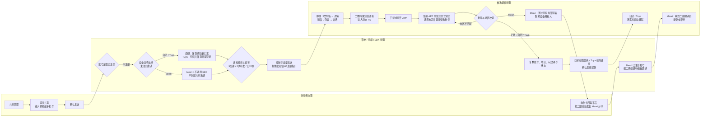

# 设备共享三期 PRD：未注册用户共享

| 属性 | 内容 |
| --- | --- |
| 状态 | 需求已收敛；自研/Tuya 未注册链路进入评审，其待注册撤销能力待技术确认 |
| 更新日期 | 2026-09-15 |
| 原始 PRD | [飞书原始 PRD Rev.3356](https://momcozy-in.feishu.cn/wiki/Ao0BwgRIPi2r9IkVbUycOpDUnbc) |
| 二期边界 | 已注册用户分享；Meari 接受/拒绝沿用二期，不在三期重做 |
| 交互原型 | [三期未注册用户共享原型与页面规格](https://hawzz.github.io/root-interactivable-prototype/prototypes/device-sharing-phase-3/) |
| 通知模板 | [设备分享邮件/短信通知模板](https://momcozy-in.feishu.cn/wiki/Gw5YwnjlIigsw7kX2OXcaBTon0y) |

## 1. 背景与问题

二期要求分享者指定已注册 Momcozy APP 账号。家庭成员尚未注册时，分享者只能等待对方注册后再次发起，链路中断。三期为具备技术能力的设备增加“先邀请、注册后直接建联”，同时避免为了形式统一而让所有厂商承担无法兑现或更繁琐的流程。

已确认 Meari SDK 无法在目标账号未注册时创建邀请，且必须由分享者在 APP 内调用 SDK。因此三期不保存无执行价值的 Meari 云端邀请意图，不承诺注册后自动补建 Meari 邀请。为减少用户反复沟通成本，Meari 未注册账号提交后改为按账号类型发送注册指引：邮箱发送邮件，手机号发送短信并通过模板链接进入 H5；被分享人注册登录后仍需从外部链路联系设备拥有人重新发起分享。

## 2. 目标与成功口径

### 2.1 业务目标

- 自研与 Tuya 设备可向未注册邮箱或手机号发送邀请，并在被邀请方正确注册登录后直接建立共享关系；待注册记录支持受控补发通知。
- Meari 设备不向未注册账号创建共享邀请，但可向未注册邮箱或手机号发送注册指引；同账号再次提交可受控补发，注册登录后仍需联系拥有者重新分享。
- 三类设备沿用相同发起入口、表单和确认方式，将厂商差异限制在提交结果与后台执行。
- 未建立有效关系前不授予设备权限；过期、撤销及账号/地区不匹配不得被迟到事件越权恢复。
- 通过 5 分钟补发冷却、单链路最多 2 次补发、固定日 20 条实际通知上限及接口幂等降低未注册邀请骚扰；该规则不能完全消除多分享者共同触达同一接收者的风险。

### 2.2 成功口径

- 仅云端确认有效共享关系成立计为共享成功。
- 邀请创建、通知发送、注册完成、链接获取或 SDK 受理均不计共享成功。
- Meari 注册指引邮件/短信、邀请过期、主动撤销及建联失败均不计共享成功。
- 指标数值沿用设备共享版本统一目标，本期不新增接受率、通知点击率等非业务指标。

## 3. 范围

| 设备类型 | 已注册账号 | 未注册账号 | 关系成立方式 | 三期结论 |
| --- | --- | --- | --- | --- |
| 自研 | 沿用二期，直接建联 | 支持 | 注册登录后从云端拉取分享关系并直接建联 | In Scope |
| Tuya | 沿用二期，直接建联 | 支持 | 分享者生成 Tuya 链接，包装为 Momcozy 链接并由云端保存；接收者注册后拉取并直接建联 | In Scope；包装、云端存储、过期配置已技术确认 |
| Meari | 沿用二期，接收者接受/拒绝 | 不支持创建共享邀请；支持邮件/短信注册指引 | 按账号类型发送注册指引；注册登录后被分享人外部联系拥有者，拥有者按二期重新发起 | In Scope：注册指引触达；Out of Scope：未注册共享邀请 |

### 3.1 不在范围内

- Meari 未注册共享邀请、云端代替分享者调用 Meari SDK、注册后自动补建 Meari 邀请或自动弹出邀请确认。
- 修改二期自研/Tuya 已注册直接共享及 Meari 已注册接受/拒绝链路。
- 蓝牙/Wi-Fi 连接实现、设备控制协议、家庭组织、扫码、通讯录邀请和转分享。
- 真实 SDK、生产 H5、应用商店、App Link 与账号系统联调；原型仅使用模拟事件。

## 4. 用户角色与 JTBD

1. 作为自研/Tuya 设备拥有者，当家人尚未注册时，我想直接发送共享邀请，以便不必等待注册后再重新输入账号。
2. 作为被邀请者，当我从邮件或短信打开邀请时，我想知道应使用哪个账号和国家/地区，以便注册后看到正确设备。
3. 作为设备拥有者，当邀请不再需要时，我想撤销待处理邀请，以避免旧链接未来产生授权；该能力当前待技术确认。
4. 作为平台系统，我需要在关系最终成立前隔离设备权限，并对过期、撤销和迟到事件保持一致终态。
5. 作为 Meari 设备的被分享人，我希望收到可执行的注册指引，并在注册登录后知道需要联系设备拥有人重新分享，而不是误以为设备已共享成功。
6. 作为设备拥有者，当对方未收到首次邮件或短信时，我希望在不重建邀请、不续期和不重复占额的前提下补发通知。
7. 作为平台系统，我需要限制未注册通知的补发频率和每日发送总量，同时允许用户撤销错误账号后向正确账号重新发起。

## 5. 用户旅程

### 旅程说明

- 分享者：三类设备共用入口、字段校验、合规勾选和共享确认，不选择也不识别厂商。
- 被邀请者：邮件先进入收件箱再打开详情；短信先进入列表再打开 Momcozy 会话。邮件二维码/网页指引或短信正文链接进入静态 H5。自研/Tuya 链接携带邀请上下文；Meari 只携带注册指引上下文。
- 系统：自研/Tuya 注册后直接建联，不要求被邀请者接受/拒绝，不展示处理中页面；Meari 未注册时不调用 SDK、不创建共享邀请，只发送注册指引邮件或短信。
- 登录：注册与登录复用 APP 常规页面，三期不新增登录页或登录交互。
- 恢复：国家/地区不匹配时不建联，登录后没有 Toast、弹窗、设备或其他响应。重新登录正确国家/地区后，自研/Tuya 对有效邀请自动建联；Meari 注册指引链路仍无 APP 内响应，必须由被分享人从外部链路联系拥有者重新发起，随后才进入二期邀请确认。

## 6. 核心流程与规则

### 6.1 发起与能力分流

1. 分享者从既有共享管理进入添加共享，输入邮箱或当前地区支持的手机号，完成合规勾选并确认。
2. 后台校验格式、账号注册状态、设备能力、重复关系、单设备额度、通知冷却、补发次数、固定日发送上限和请求幂等。
3. 未注册账号：
   - 自研：创建不授予权限的待注册邀请并存储于云端。
   - Tuya：由分享者调用 SDK 生成分享链接，包装为 Momcozy 动态链接并保存于云端。
   - Meari：不调用 SDK、不创建共享邀请；邮箱账号发送注册指引邮件，手机号发送注册指引短信；同账号再次提交按补发规则处理。
4. Meari 首次提交后提示“注册指引邮件/短信已发送”；满足补发条件的同账号再次提交后提示“注册指引邮件/短信已重新发送”。
5. Meari 注册指引不创建关系或管理记录、不占用额度、不计共享成功。后台只保留通知历史用于补发、固定日频控与幂等。被分享人注册登录后，需通过原有外部联系方式联系设备拥有人；拥有者重新输入已注册账号并按二期重新发起。

### 6.2 通知与 H5

- 未注册邮箱：首次发送及每次成功人工补发各产生一封邮件，复用“设备分享 邮件通知模板-发给未注册用户”的视觉结构和注册步骤。
- 未注册手机号：首次发送及每次成功人工补发各产生一条短信，复用“设备分享 短信通知”的结构；正文样例链接进入注册引导 H5。
- 自研/Tuya 邮件、短信和 H5 承载同一条有效共享邀请，展示 7 天有效期及邀请上下文；补发不重建邀请、不更换关系标识、不延长有效期。
- Meari 邮件、短信和 H5 仅提供下载、国家/地区、注册及登录指引，不代表设备已共享，不展示邀请有效期。文案必须提示注册登录后从外部链路联系设备拥有人重新发起分享。
- 邮件交互为收件箱 → 邮件详情；短信交互为短信列表 → Momcozy 会话 → H5。打开邮件或短信本身不得直接唤起 APP。
- H5 不提供独立注册登录表单。自研/Tuya 动态参数携带邀请上下文；Meari 参数只用于注册指引展示，不可兑换共享关系。
- H5 的“打开 APP”后复用 APP 现有注册/登录页面；APP Link 及安装后上下文恢复由技术定义。
- 重开通知/H5、切换地区或重新登录均不自动补发。自研/Tuya 仅可从共享管理的待注册记录主动补发；Meari 仅可在添加共享页再次提交同一账号补发。
- 自研/Tuya 邀请过期时分享者列表自动删除记录；被邀请者不收到新的过期通知或信息更新。Meari 注册指引没有邀请记录和邀请有效期。

### 6.3 通知补发、防骚扰与幂等

- 首次通知发送成功后至少等待 5 分钟才可补发；自研/Tuya 每条待注册邀请最多补发 2 次，合计最多 3 次实际通知。
- Meari 无共享邀请记录，后台按同一分享者、设备、接收账号、厂商和渠道识别一轮注册指引；首次发送及后续两次补发构成同一通知链路，固定日切换不重置该链路次数。
- 同一分享者在固定自然日窗口内，跨设备、跨厂商合计最多实际发送 20 条未注册邮件或短信。首次发送与人工补发均计数，邮件和短信合并统计。
- 固定窗口复用后台统一业务时区，每日 `00:00:00–23:59:59`；平台未配置统一值时使用 `UTC+8`。
- 固定日切换只重置当日 20 条总量，不重置同一通知链路的 5 分钟间隔和最多 2 次补发历史；撤销、过期也不重置该历史。
- 邮件/短信服务受理成功后计入次数；明确发送失败不计。接口重试使用同一幂等键，不重复发送、不重复计数。
- 频控拦截时不创建新邀请、不发送通知、不新增额度占用。5 分钟冷却提示“请等待 5 分钟后再发送”；补发用尽或固定日超限统一提示“操作过于频繁，请稍后再试”；发送失败提示“通知发送失败，请重试”。
- 分享错误时可撤销旧待注册记录并立即邀请其他账号；旧通知仍计入当日上限。撤销或过期不清除通知历史，重新邀请同一账号不能绕过冷却、补发次数或固定日上限。
- 当前版本不定义跨分享者针对同一接收账号的固定聚合阈值，仅保留后台风控扩展能力；本规则降低但不承诺完全消除多分享者骚扰风险。

### 6.4 注册后建联

- 被邀请者必须在 APP 既有注册/登录页面使用受邀账号，并手动选择与邀请一致的国家/地区。
- 自研：注册登录后从云端拉取待注册关系，校验通过后直接建联。
- Tuya：注册登录后从云端拉取 Momcozy 包装的 Tuya 分享链接，校验并直接建联。
- Meari 未注册注册指引：注册登录后不自动建联、不弹邀请确认；被分享人需外部联系设备拥有人重新发起。重新发起成功后，按二期恢复接受/拒绝邀请弹窗；接受后建联，拒绝后停留当前页。
- 账号或地区不匹配不建联；登录后不展示任何提示或结果，设备列表保持不变。自研/Tuya 未过期邀请保留，用户重新登录正确地区后再拉取。Meari 只有拥有者重新发起后才存在可恢复的待接受邀请。
- 建联过程接近瞬时。前端只在最终关系成立后从当前页切换至设备页，不增加 `processing` 状态或页面。
- 自研/Tuya 建联失败时提示“暂时无法添加设备，请设备拥有人重新分享设备”，不开放设备权限，不向被邀请方提供重试；设备拥有人必须重新发起分享。

## 7. 状态、额度与生命周期

| 前端状态 | 适用设备 | 展示身份 | 权限 | 占额 |
| --- | --- | --- | --- | --- |
| 待注册 `pending_registration` | 自研/Tuya | 脱敏邮箱或手机号 | 无 | 1 |
| 待接受 `pending_acceptance` | Meari 已注册邀请，沿用二期 | Nickname + 脱敏账号 | 无 | 1 |
| 共享中 `active` | 全部 | Nickname + 脱敏账号 | 按共享权限开放 | 1 |

- 三类可见记录合计最多 20 条；状态转换原位更新，不重复占额。
- Meari 未注册注册指引邮件/短信不创建任何可见状态或管理记录，不占用 20 条额度。
- 待注册邀请有效期暂定为创建成功起 7 天。正式上线前由技术冻结服务端时区与到期边界。
- 过期或撤销后记录自动从共享管理删除并释放额度，不展示“已撤销/已过期”状态或筛选项。
- 服务端保留终态、通知历史与审计，用于阻止旧通知、旧链接及迟到事件恢复权限，并确保撤销或过期不能重置频控。
- 同设备、同账号已有待注册邀请时阻止重复创建，不续期；需要再次触达时从该记录的操作菜单选择“重新发送通知”。
- 待注册记录的补发不新增记录、不重复占额。共享管理操作菜单展示脱敏账号、邮件/短信渠道及累计发送次数，提供“重新发送通知”和“撤销邀请”。

## 8. 待注册主动撤销（暂定）与二期复用

- 设备拥有者可对三期自研/Tuya“待注册”记录发起撤销并二次确认；Meari 已注册“待接受”记录直接沿用二期已确认的“移除分享”。
- 前端不得乐观删除。仅云端与对应 SDK 最终确认撤销成功后删除记录并释放额度。
- 撤销结果仅分为成功或失败。失败保留记录并允许重新发起撤销；失败包含明确失败响应、超时和未知错误码，不存在“结果未知”中间状态。
- 成功撤销后，旧自研/Tuya 邀请邮件、短信、H5、Tuya 链接和迟到事件均不得建联。撤销释放共享额度但不清除通知历史；可重新发起分享，向同一账号发送新通知仍受既有冷却、补发次数与固定日上限约束。Meari 注册指引通知本身不具备建联能力，不适用撤销；注册后的待接受邀请按二期规则移除。
- 自研云端、Tuya 链接的待注册撤销、失效及并发终态仍待技术验证；Meari 已注册待接受邀请的云端与 SDK 同步移除已作为二期确认能力，不属于本期技术风险。
- 三期只继续定义未注册链路的撤销。Meari 用户注册后由拥有者重新发起并形成待接受邀请时，直接沿用二期“移除分享”规则，不在三期重复定义。

## 9. 依赖与风险

| 项目 | 状态 | 完成条件 |
| --- | --- | --- |
| 自研/Tuya 接口契约 | 待技术定义 | 明确字段、触发时序、幂等、失败返回与迟到事件处理；被邀请方不承担建联重试 |
| Tuya 包装链接 | 技术可行性已确认 | 完成真实 SDK、云端存储、签名、防篡改和过期联调 |
| APP Link | 待技术定义 | 明确 iOS/Android、已安装/未安装、安装后上下文恢复和兜底 |
| 7 天有效期 | 产品暂定 | 冻结时区、边界时刻、缓存与并发处理 |
| 邮件/短信模板 | 指定复用 | 自研/Tuya 保留邀请语义；Meari 改为注册指引语义且不得声称已共享或展示邀请有效期；最终文案由模板负责人确认 |
| 待注册主动撤销 | 待技术确认 | 自研/Tuya 待注册邀请可失效，云端/SDK 一致返回成功或失败；Meari 已注册待接受移除沿用二期确认能力 |
| 通知补发与固定日频控 | 产品已定义，待技术落地 | 后台原子校验 5 分钟冷却、单链路最多 2 次补发、固定日 20 条、渠道受理结果和幂等键；默认业务日时区为 UTC+8 |

主要风险：底层实现差异导致状态映射不一致；安装后动态参数丢失；错误地区注册造成无法建联；撤销与注册/建联并发导致旧链接越权；并发发送或渠道超时导致重复计数；多分享者绕开单分享者限制共同触达同一接收账号。关系风险以云端最终关系与不可逆终态判定，通知风险以后台原子频控、渠道受理事实和幂等历史判定。

## 10. 验收索引

| ID | 验收主题 | 结果要求 | 原型页面 |
| --- | --- | --- | --- |
| P3-AC-01 | 统一入口与能力分流 | 正常 APP 不显示厂商；自研/Tuya 进入待注册；Meari 仅发送注册指引 | 页面流转图、添加共享 |
| P3-AC-02 | 状态、额度与待注册操作 | 仅三种可见状态合计 20 条；待注册操作菜单提供补发与撤销，补发不新增记录或占额；Meari 注册指引无记录、不占额 | 共享管理 |
| P3-AC-03 | 未注册提交 | 格式与合规有效才可提交；自研/Tuya 重复待注册阻止建单并引导从管理页补发；Meari 同账号再次提交按补发规则处理 | 添加共享、Meari 能力边界 |
| P3-AC-04 | 邮件 | 首次发送及每次成功补发各产生一封；自研/Tuya 不续期，Meari 仅注册指引且提示外部联系拥有者 | 邮件收件箱与详情 |
| P3-AC-05 | 短信 | 首次发送及每次成功补发各产生一条；短信列表 → 会话 → H5；样例链接仅指向 H5 模板 | 短信列表与会话 |
| P3-AC-06 | H5 与动态链接 | 无独立登录表单；自研/Tuya 承载邀请，Meari 仅承载注册指引 | 注册引导 H5 |
| P3-AC-07 | 注册与地区恢复 | 复用常规登录页；自研/Tuya 正确地区自动建联；Meari 等待外部联系及拥有者重发 | 登录后的设备结果 |
| P3-AC-08 | 成功与失败 | 自研/Tuya 无 processing 自动建联；失败终止且被邀请方无重试；Meari 恢复二期确认 | 登录后的设备结果 |
| P3-AC-09 | 撤销与过期 | 撤销仅成功/失败；成功删除，失败保留；过期自动释放；两者均不清除通知历史 | 撤销与过期 |
| P3-AC-10 | Meari 边界 | 未注册不创建共享邀请；首次发送及再次提交补发均仅为注册指引；注册后外部联系拥有者重新按二期发起 | Meari 能力边界 |
| P3-AC-11 | 补发、防骚扰与幂等 | 5 分钟冷却、最多 2 次补发、固定日实际发送 20 条；失败不计、幂等重试不重复，跨设备和厂商合并统计 | 共享管理、添加共享、评审时间控制 |

## 11. 测试用例

| 用例 | 前置条件 | 操作 | 预期结果 | 关联验收 |
| --- | --- | --- | --- | --- |
| 自研未注册邮箱 | 设备支持共享，19 条及以下占额 | 输入合法未注册邮箱并确认 | 创建待注册；发送一封邮件；占 1 条；无设备权限 | P3-AC-03/04 |
| Tuya 未注册手机号 | 链接生成成功 | 输入合法未注册手机号并确认 | 包装链接保存云端；发送一条短信；不暴露原始 Tuya URL | P3-AC-03/05/06 |
| Meari 未注册邮箱 | Meari 设备 | 提交合法未注册邮箱 | Toast 提示注册指引邮件已发送；发送一封邮件；零邀请、零管理记录、零占额、零成功 | P3-AC-01/03/04/10 |
| Meari 未注册手机号 | Meari 设备 | 提交合法未注册手机号 | Toast 提示注册指引短信已发送；发送一条短信；零邀请、零管理记录、零占额、零成功 | P3-AC-01/03/05/10 |
| 邮件打开 | 已发送未注册邮箱通知 | 打开收件箱并点击 Momcozy 邮件 | 自研/Tuya 展示邀请；Meari 展示注册指引并提示外部联系拥有者；不直接打开 APP | P3-AC-04/06 |
| 短信打开 | 已发送未注册手机号通知 | 打开短信列表、进入 Momcozy 会话并点击正文链接 | 先显示短信内容再进入 H5；Meari H5 不声称已共享并提示外部联系拥有者 | P3-AC-05/06 |
| 地区不匹配 | 邀请要求中国，仍在 7 天内 | 以美国地区登录受邀账号 | 设备列表保持原样，无 Toast、弹窗或设备；邀请保留且不补发通知 | P3-AC-07 |
| 正确地区恢复 · 自研/Tuya | 未过期邀请，受邀账号 | 重新以中国地区登录 | 自动拉取并近实时建联；无接受/拒绝和 processing | P3-AC-07/08 |
| Meari 注册后未重新分享 | 已收到 Meari 注册指引并完成注册登录 | 打开 APP | 不自动建联、不弹窗；被分享人需从外部链路联系拥有者 | P3-AC-07/10 |
| 拥有者重新发起 · Meari | 对方已注册，拥有者按二期重新分享并创建有效待接受邀请 | 被分享人以正确地区登录 | 弹出二期接受/拒绝弹窗；接受后显示设备，拒绝后停留当前列表 | P3-AC-07/08/10 |
| 建联失败 | 自研/Tuya 云端或 SDK 返回失败 | 登录后执行建联 | 提示指定文案，不开放权限且无被邀请方重试入口；需拥有者重新分享 | P3-AC-08 |
| 20 条额度 | 待注册、待接受、共享中合计 20 条 | 发起新邀请 | 提交被阻断，不创建记录或通知 | P3-AC-02 |
| 7 天过期 | 待注册达到到期边界 | 执行过期任务后打开旧链接 | 列表删除并释放额度；接收方无过期更新；旧链接不可建联 | P3-AC-06/09 |
| 重复邀请 | 同设备同账号已有待注册 | 再次从添加共享提交 | 不新增、不续期，提示从共享管理的原记录补发 | P3-AC-02/03 |
| 待注册邮件补发 | 自研/Tuya 待注册，首次发送已受理 | 未满 5 分钟补发；推进至 5 分钟后再次补发 | 首次提示等待；满足间隔后发送一封邮件，原记录仍占 1 条且有效期不变 | P3-AC-02/04/11 |
| 待注册短信补发上限 | 待注册手机号邀请 | 每隔至少 5 分钟连续补发 3 次 | 前 2 次成功，第 3 次统一频控提示；合计最多 3 条短信 | P3-AC-05/11 |
| Meari 同账号补发 | 已发送一次 Meari 注册指引，无管理记录 | 5 分钟后在添加共享重新提交同一账号 | 提示注册指引已重新发送；仍零邀请、零管理记录、零占额、零成功 | P3-AC-03/10/11 |
| 固定日 20 条 | 同一分享者当日跨设备、厂商已有 19 条实际通知 | 发送第 20 条和第 21 条，随后进入下一固定日 | 第 20 条成功；第 21 条频控拦截且无新记录/通知/占额；次日重新计数 | P3-AC-11 |
| 发送失败与幂等 | 渠道失败或客户端超时重试 | 先模拟失败，再以同一幂等键重试 | 失败不计次数；同一幂等键最多实际发送并计数一次 | P3-AC-11 |
| 撤销后改错账号 | 待注册邀请已向错误账号发送 | 撤销后立即向不同账号发起 | 允许创建新邀请；旧通知仍计入当日 20 条 | P3-AC-09/11 |
| 撤销后同账号重发 | 原待注册邀请已撤销 | 立即对同账号重新发起 | 不通过撤销绕过 5 分钟、补发次数与固定日上限 | P3-AC-09/11 |
| 撤销成功（暂定） | 待注册/待接受，可撤销 | 确认撤销 | 最终成功后才删除并释放；旧链路失效 | P3-AC-09 |
| 撤销失败（暂定） | 明确失败响应、超时或未知错误码 | 确认撤销 | 统一按失败处理并保留记录，可由分享者再次撤销；无“结果未知”状态 | P3-AC-09 |

## 12. 交付说明

- 页面字段、文案、按钮状态、弹窗、异常反馈和双语规则以三期交互原型右侧规格为准。
- 原型评审导航收敛为“发起未注册分享、注册登录后处理、共享管理”三组及 7 个必要分支；页面步骤跟随当前分支，不再把邮箱/手机号、容量满、过期和撤销结果分别做成场景。
- 补发、撤销和频控结果由手机页面内操作体现；左栏仅增加 `+5 min`、`+1 day` 评审时间控制，不新增业务场景分支，也不属于 C 端 APP UI。
- 邮箱或手机号由评审者在添加共享页实际输入决定，提交后才在左侧页面步骤关联对应邮件或短信、H5及登录后结果；这些页面是外部渠道评审内容，不在 C 端 APP 内增加通知内容或模板预览入口。
- 原型使用模拟云端/SDK 结果，不代表生产接口、模板、H5、App Link 或真实设备联调通过。
- 一期、二期及原始设备共享原型不因本 PRD 更新而改变。
