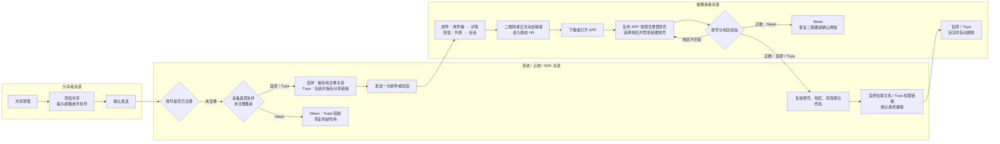

# 设备共享三期 PRD：未注册用户共享

| 属性 | 内容 |
| --- | --- |
| 状态 | 需求已收敛；自研/Tuya 未注册链路进入评审，主动撤销能力待技术确认 |
| 更新日期 | 2026-09-14 |
| 原始 PRD | [飞书原始 PRD Rev.3356](https://momcozy-in.feishu.cn/wiki/Ao0BwgRIPi2r9IkVbUycOpDUnbc) |
| 二期边界 | 已注册用户分享；Meari 接受/拒绝沿用二期，不在三期重做 |
| 交互原型 | [三期未注册用户共享原型与页面规格](https://hawzz.github.io/root-interactivable-prototype/prototypes/device-sharing-phase-3/) |
| 通知模板 | [设备分享邮件/短信通知模板](https://momcozy-in.feishu.cn/wiki/Gw5YwnjlIigsw7kX2OXcaBTon0y) |

## 1. 背景与问题

二期要求分享者指定已注册 Momcozy APP 账号。家庭成员尚未注册时，分享者只能等待对方注册后再次发起，链路中断。三期为具备技术能力的设备增加“先邀请、注册后直接建联”，同时避免为了形式统一而让所有厂商承担无法兑现或更繁琐的流程。

已确认 Meari SDK 无法在目标账号未注册时创建邀请，且必须由分享者在 APP 内调用 SDK。因此三期不保存无执行价值的 Meari 云端邀请意图，不承诺注册后自动补建 Meari 邀请。

## 2. 目标与成功口径

### 2.1 业务目标

- 自研与 Tuya 设备可向未注册邮箱或手机号发送一次邀请，并在被邀请方正确注册登录后直接建立共享关系。
- 三类设备沿用相同发起入口、表单和确认方式，将厂商差异限制在提交结果与后台执行。
- 未建立有效关系前不授予设备权限；过期、撤销及账号/地区不匹配不得被迟到事件越权恢复。

### 2.2 成功口径

- 仅云端确认有效共享关系成立计为共享成功。
- 邀请创建、通知发送、注册完成、链接获取或 SDK 受理均不计共享成功。
- Meari 未注册阻断、邀请过期、主动撤销及建联失败均不计共享成功。
- 指标数值沿用设备共享版本统一目标，本期不新增接受率、通知点击率等非业务指标。

## 3. 范围

| 设备类型 | 已注册账号 | 未注册账号 | 关系成立方式 | 三期结论 |
| --- | --- | --- | --- | --- |
| 自研 | 沿用二期，直接建联 | 支持 | 注册登录后从云端拉取分享关系并直接建联 | In Scope |
| Tuya | 沿用二期，直接建联 | 支持 | 分享者生成 Tuya 链接，包装为 Momcozy 链接并由云端保存；接收者注册后拉取并直接建联 | In Scope；包装、云端存储、过期配置已技术确认 |
| Meari | 沿用二期，接收者接受/拒绝 | 不支持 | 未注册提交后阻断；注册后由分享者按二期重新发起 | Out of Scope：Meari 未注册分享 |

### 3.1 不在范围内

- Meari 未注册邀请、云端代替分享者调用 Meari SDK、注册后自动补建 Meari 邀请。
- 修改二期自研/Tuya 已注册直接共享及 Meari 已注册接受/拒绝链路。
- 蓝牙/Wi-Fi 连接实现、设备控制协议、家庭组织、扫码、通讯录邀请和转分享。
- 真实 SDK、生产 H5、应用商店、App Link 与账号系统联调；原型仅使用模拟事件。

## 4. 用户角色与 JTBD

1. 作为设备拥有者，当家人尚未注册时，我想直接发送共享邀请，以便不必等待注册后再重新输入账号。
2. 作为被邀请者，当我从邮件或短信打开邀请时，我想知道应使用哪个账号和国家/地区，以便注册后看到正确设备。
3. 作为设备拥有者，当邀请不再需要时，我想撤销待处理邀请，以避免旧链接未来产生授权；该能力当前待技术确认。
4. 作为平台系统，我需要在关系最终成立前隔离设备权限，并对过期、撤销和迟到事件保持一致终态。

## 5. 用户旅程

### 旅程说明

- 分享者：三类设备共用入口、字段校验、合规勾选和共享确认，不选择也不识别厂商。
- 被邀请者：邮件先进入收件箱再打开详情；短信先进入列表再打开 Momcozy 会话。邮件二维码/网页指引或短信正文链接进入携带动态邀请参数的静态 H5。
- 系统：自研/Tuya 注册后直接建联，不要求被邀请者接受/拒绝，不展示处理中页面；Meari 未注册直接阻断。
- 登录：注册与登录复用 APP 常规页面，三期不新增登录页或登录交互。
- 恢复：国家/地区不匹配时不建联，登录后没有 Toast、弹窗、设备或其他响应；邀请在有效期内保留。重新登录正确国家/地区后，自研/Tuya 自动建联，Meari 弹出二期邀请确认，不补发通知。

## 6. 核心流程与规则

### 6.1 发起与能力分流

1. 分享者从既有共享管理进入添加共享，输入邮箱或当前地区支持的手机号，完成合规勾选并确认。
2. 后台校验格式、账号注册状态、设备能力、重复关系和单设备额度。
3. 未注册账号：
   - 自研：创建不授予权限的待注册邀请并存储于云端。
   - Tuya：由分享者调用 SDK 生成分享链接，包装为 Momcozy 动态链接并保存于云端。
   - Meari：返回“当前设备暂不支持向未注册账号分享，请对方注册后重新发起。”
4. Meari 阻断不创建邀请、关系或管理记录，不发送通知、不占用额度、不计成功。

### 6.2 通知与 H5

- 未注册邮箱：每次邀请有且仅有一封邮件，复用“设备分享 邮件通知模板-发给未注册用户”。
- 未注册手机号：每次邀请有且仅有一条短信，复用“设备分享 短信通知”。
- 邮件复用原始原型结构：收件箱 → 邮件详情。详情包含发件人、主题、7 天有效期、二维码、地区选择示意、受邀邮箱及 Device Tab 示意；打开邮件本身不得直接唤起 APP。
- 短信复用原始原型结构：短信列表 → Momcozy 会话。正文样例链接指向注册引导 H5，不得直接跳 APP。
- H5 页面模板静态，展示邀请摘要、7 天有效期、二维码、地区选择示意、受邀账号与 Device Tab 示意；动态参数携带邀请上下文。H5 不提供独立注册登录表单。
- H5 的“打开 APP”后复用 APP 现有注册/登录页面；APP Link 及安装后上下文恢复由技术定义。
- 重开通知/H5、切换地区或重新登录均不补发；不提供催促或再次发送。
- 过期时分享者列表自动删除记录；被邀请者不收到新的过期通知或信息更新。

### 6.3 注册后建联

- 被邀请者必须在 APP 既有注册/登录页面使用受邀账号，并手动选择与邀请一致的国家/地区。
- 自研：注册登录后从云端拉取待注册关系，校验通过后直接建联。
- Tuya：注册登录后从云端拉取 Momcozy 包装的 Tuya 分享链接，校验并直接建联。
- Meari：重新登录正确国家/地区后，恢复二期的接受/拒绝邀请弹窗；接受后建联，拒绝后停留当前页。
- 账号或地区不匹配不建联；登录后不展示任何提示或结果，设备列表保持不变。未过期邀请保留，用户重新登录正确地区后再拉取。
- 建联过程接近瞬时。前端只在最终关系成立后从当前页切换至设备页，不增加 `processing` 状态或页面。
- 自研/Tuya 建联失败时提示“暂时无法添加设备，请设备拥有人重新分享设备”，不开放设备权限，不向被邀请方提供重试；设备拥有人必须重新发起分享。

## 7. 状态、额度与生命周期

| 前端状态 | 适用设备 | 展示身份 | 权限 | 占额 |
| --- | --- | --- | --- | --- |
| 待注册 `pending_registration` | 自研/Tuya | 脱敏邮箱或手机号 | 无 | 1 |
| 待接受 `pending_acceptance` | Meari 已注册邀请，沿用二期 | Nickname + 脱敏账号 | 无 | 1 |
| 共享中 `active` | 全部 | Nickname + 脱敏账号 | 按共享权限开放 | 1 |

- 三类可见记录合计最多 20 条；状态转换原位更新，不重复占额。
- 待注册邀请有效期暂定为创建成功起 7 天。正式上线前由技术冻结服务端时区与到期边界。
- 过期或撤销后记录自动从共享管理删除并释放额度，不展示“已撤销/已过期”状态或筛选项。
- 服务端保留终态与审计，用于阻止旧通知、旧链接及迟到事件恢复权限。
- 同设备、同账号已有待注册邀请时阻止重复创建，不续期、不重复通知。

## 8. 主动撤销（暂定，待技术确认）

- 设备拥有者可对“待注册”和“待接受”记录发起撤销并二次确认。
- 前端不得乐观删除。仅云端与对应 SDK 最终确认撤销成功后删除记录并释放额度。
- 撤销结果仅分为成功或失败。失败保留记录并允许重新发起撤销；失败包含明确失败响应、超时和未知错误码，不存在“结果未知”中间状态。
- 成功后旧邮件、短信、H5、Tuya 链接、Meari 邀请和迟到事件均不得建联。
- 自研云端、Tuya 链接与 Meari SDK 的撤销、失效及并发终态均待技术验证。
- Meari 待接受撤销会改变二期“不提供撤销”的既有规则，技术确认与跨期评审前不得视为冻结需求，也不得直接改动二期实现。

## 9. 依赖与风险

| 项目 | 状态 | 完成条件 |
| --- | --- | --- |
| 自研/Tuya 接口契约 | 待技术定义 | 明确字段、触发时序、幂等、失败返回与迟到事件处理；被邀请方不承担建联重试 |
| Tuya 包装链接 | 技术可行性已确认 | 完成真实 SDK、云端存储、签名、防篡改和过期联调 |
| APP Link | 待技术定义 | 明确 iOS/Android、已安装/未安装、安装后上下文恢复和兜底 |
| 7 天有效期 | 产品暂定 | 冻结时区、边界时刻、缓存与并发处理 |
| 邮件/短信模板 | 指定复用 | 研发直接使用模板负责人确认后的生产版本，不以原型示例替代 |
| 主动撤销 | 待技术确认 | 三类待处理邀请均可失效，云端/SDK 一致返回成功或失败 |

主要风险：底层实现差异导致状态映射不一致；安装后动态参数丢失；错误地区注册造成无法建联；撤销与注册/建联并发导致旧链接越权。所有风险均以云端最终关系与不可逆终态为判定依据。

## 10. 验收索引

| ID | 验收主题 | 结果要求 | 原型页面 |
| --- | --- | --- | --- |
| P3-AC-01 | 统一入口与能力分流 | 正常 APP 不显示厂商；自研/Tuya 进入待注册，Meari 阻断 | 页面流转图、添加共享 |
| P3-AC-02 | 状态与额度 | 仅三种可见状态合计 20 条；终态自动移除 | 共享管理 |
| P3-AC-03 | 未注册提交 | 格式与合规有效才可提交；Meari 零副作用 | 添加共享、Meari 能力边界 |
| P3-AC-04 | 邮件 | 未注册邮箱每次邀请一封；收件箱 → 详情，结构复用原始原型 | 邮件收件箱与详情 |
| P3-AC-05 | 短信 | 未注册手机号每次邀请一条；短信列表 → 会话 → H5 | 短信列表与会话 |
| P3-AC-06 | H5 与动态链接 | 静态模板携带邀请上下文；无独立登录表单；过期/撤销后失效 | 注册引导 H5 |
| P3-AC-07 | 注册与地区恢复 | 复用常规登录页；错地区无响应；正确地区按厂商恢复 | 登录后的设备结果 |
| P3-AC-08 | 成功与失败 | 自研/Tuya 无 processing 自动建联；失败终止且被邀请方无重试；Meari 恢复二期确认 | 登录后的设备结果 |
| P3-AC-09 | 撤销与过期 | 撤销仅成功/失败；成功删除，失败保留；过期自动释放 | 撤销与过期 |
| P3-AC-10 | Meari 边界 | 未注册不创建、不通知、不占额；注册后重新按二期发起 | Meari 能力边界 |

## 11. 测试用例

| 用例 | 前置条件 | 操作 | 预期结果 | 关联验收 |
| --- | --- | --- | --- | --- |
| 自研未注册邮箱 | 设备支持共享，19 条及以下占额 | 输入合法未注册邮箱并确认 | 创建待注册；发送一封邮件；占 1 条；无设备权限 | P3-AC-03/04 |
| Tuya 未注册手机号 | 链接生成成功 | 输入合法未注册手机号并确认 | 包装链接保存云端；发送一条短信；不暴露原始 Tuya URL | P3-AC-03/05/06 |
| Meari 未注册 | Meari 设备 | 提交合法未注册账号 | 显示指定 Toast；零记录、零通知、零占额、零成功 | P3-AC-01/10 |
| 邮件打开 | 已发送邮箱邀请 | 打开收件箱并点击 Momcozy 邮件 | 显示邮件详情及完整注册指引；不直接打开 APP；二维码/网页入口可进入 H5 | P3-AC-04/06 |
| 短信打开 | 已发送手机号邀请 | 打开短信列表、进入 Momcozy 会话并点击正文链接 | 先显示短信内容；样例链接进入 H5，不直接打开 APP | P3-AC-05/06 |
| 地区不匹配 | 邀请要求中国，仍在 7 天内 | 以美国地区登录受邀账号 | 设备列表保持原样，无 Toast、弹窗或设备；邀请保留且不补发通知 | P3-AC-07 |
| 正确地区恢复 · 自研/Tuya | 未过期邀请，受邀账号 | 重新以中国地区登录 | 自动拉取并近实时建联；无接受/拒绝和 processing | P3-AC-07/08 |
| 正确地区恢复 · Meari | 有效待接受邀请 | 重新以中国地区登录 | 弹出二期接受/拒绝弹窗；接受后显示设备，拒绝后停留当前列表 | P3-AC-07/08 |
| 建联失败 | 自研/Tuya 云端或 SDK 返回失败 | 登录后执行建联 | 提示指定文案，不开放权限且无被邀请方重试入口；需拥有者重新分享 | P3-AC-08 |
| 20 条额度 | 待注册、待接受、共享中合计 20 条 | 发起新邀请 | 提交被阻断，不创建记录或通知 | P3-AC-02 |
| 7 天过期 | 待注册达到到期边界 | 执行过期任务后打开旧链接 | 列表删除并释放额度；接收方无过期更新；旧链接不可建联 | P3-AC-06/09 |
| 重复邀请 | 同设备同账号已有待注册 | 再次提交或重开 H5 | 不新增、不续期、不重发通知 | P3-AC-02/03 |
| 撤销成功（暂定） | 待注册/待接受，可撤销 | 确认撤销 | 最终成功后才删除并释放；旧链路失效 | P3-AC-09 |
| 撤销失败（暂定） | 明确失败响应、超时或未知错误码 | 确认撤销 | 统一按失败处理并保留记录，可由分享者再次撤销；无“结果未知”状态 | P3-AC-09 |

## 12. 交付说明

- 页面字段、文案、按钮状态、弹窗、异常反馈和双语规则以三期交互原型右侧规格为准。
- 原型使用模拟云端/SDK 结果，不代表生产接口、模板、H5、App Link 或真实设备联调通过。
- 一期、二期及原始设备共享原型不因本 PRD 更新而改变。
