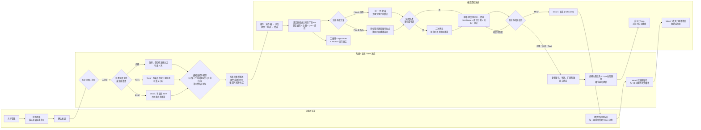

# 设备共享三期 PRD：未注册用户共享

| 属性 | 内容 |
| --- | --- |
| 状态 | 2026-09-21 评审发布版：自研待注册 7 天、Tuya 待注册及分享码 1 小时、Meari 待接受 7 天；邮件/短信/H5拆为三套模板；完整注册提供 Plan A 同页复用与 Plan B 同标签页跳转两套评审方案；待注册撤销能力待技术确认 |
| 更新日期 | 2026-09-21 |
| 评审来源 | [2026-09-20 产品内部评审智能纪要](https://momcozy-in.feishu.cn/docx/NK0sdH3sGopBzgxp2VFcirPtnjd)；本文以产品经理会后确认口径为准 |
| 原始 PRD | [飞书原始 PRD Rev.3356](https://momcozy-in.feishu.cn/wiki/Ao0BwgRIPi2r9IkVbUycOpDUnbc) |
| 二期边界 | 已注册用户分享；Meari 接受/拒绝沿用二期，不在三期重做 |
| 本地交互原型 | `prototype/dist-phases/phase-3/`；单文件 `prototype/artifacts/device-sharing-phase-3.html` |
| 线上交互原型 | [设备共享三期交互原型](https://hawzz.github.io/root-interactivable-prototype/prototypes/device-sharing-phase-3/) |
| 发布状态 | 2026-09-21 同步更新飞书三期 PRD 与 GitHub Pages；生产 APP、SDK、通知及后台联调仍未执行 |
| 通知模板 | [设备分享邮件/短信通知模板](https://momcozy-in.feishu.cn/wiki/Gw5YwnjlIigsw7kX2OXcaBTon0y) |

## 1. 背景与问题

二期要求分享者指定已注册 Momcozy APP 账号。家庭成员尚未注册时，分享者只能等待对方注册后再次发起，链路中断。三期为具备技术能力的设备增加“先邀请、注册后直接建联”，同时避免为了形式统一而让所有厂商承担无法兑现或更繁琐的流程。

已确认 Meari SDK 无法在目标账号未注册时创建邀请，且必须由分享者在 APP 内调用 SDK。因此三期不保存无执行价值的 Meari 云端邀请意图，不承诺注册后自动补建 Meari 邀请。为减少用户反复沟通成本，Meari 未注册账号提交后改为按账号类型发送注册指引：邮箱发送邮件，手机号发送短信，两类通知均进入共用结构的 Meari 注册指引 H5；被分享人注册登录后仍需联系分享者 Nickname 对应的用户重新发起分享。

## 2. 目标与成功口径

### 2.1 业务目标

- 自研与 Tuya 设备可向未注册邮箱或手机号发送邀请，并在被邀请方正确注册登录后直接建立共享关系；待注册记录支持受控补发通知。
- Meari 设备不向未注册账号创建共享邀请，但可向未注册邮箱或手机号发送注册指引；同账号再次提交可受控补发，注册登录后仍需联系拥有者重新分享。
- 三类设备沿用相同发起入口、表单和确认方式，将厂商差异限制在提交结果与后台执行。
- 未建立有效关系前不授予设备权限；过期、撤销及账号/地区不匹配不得被迟到事件越权恢复。
- 分享者发起时固定记录其账号国家/地区；分享结果和被邀请者邮件/H5必须说明使用相同国家/地区注册登录，否则无法查看共享设备及设备数据。
- 通过 5 分钟补发冷却、单邀请生命周期最多 3 次实际发送、同一“分享者+设备+接收账号”固定日最多 3 次实际发送、第 3 次发送前机器验证及接口幂等降低骚扰；该规则不能完全消除多分享者共同触达同一接收者的风险。
- “中国默认手机号、海外默认邮箱”属于二期临时方案候选，不纳入三期需求或本次原型改造。

### 2.2 成功口径

- 仅云端确认有效共享关系成立计为共享成功。
- 邀请创建、通知发送、注册完成、链接获取或 SDK 受理均不计共享成功。
- Meari 注册指引邮件/短信、邀请过期、主动撤销及建联失败均不计共享成功。
- 指标数值沿用设备共享版本统一目标，本期不新增接受率、通知点击率等非业务指标。

## 3. 范围

| 设备类型 | 已注册账号 | 未注册账号 | 关系成立方式 | 三期结论 |
| --- | --- | --- | --- | --- |
| 自研 | 沿用二期，直接建联 | 支持；待注册有效 7 天 | 注册登录后从云端拉取分享关系并直接建联 | In Scope |
| Tuya | 沿用二期，直接建联 | 支持；待注册与分享码均有效 1 小时 | 分享者生成 Tuya 链接，包装为 Momcozy 链接并由云端保存；接收者在时效内注册后拉取并直接建联 | In Scope；包装、云端存储及分享码 1 小时有效期已技术确认 |
| Meari | 沿用二期，接收者接受/拒绝；待接受有效 7 天 | 不支持创建共享邀请；支持邮件/短信注册指引 | 按账号类型发送注册指引；注册登录后被分享人联系 `{nickname}`，分享者按二期重新发起 | In Scope：注册指引触达；Out of Scope：未注册共享邀请 |

### 3.1 不在范围内

- Meari 未注册共享邀请、云端代替分享者调用 Meari SDK、注册后自动补建 Meari 邀请或自动弹出邀请确认。
- 修改二期自研/Tuya 已注册直接共享及 Meari 已注册接受/拒绝链路。
- 蓝牙/Wi-Fi 连接实现、设备控制协议、家庭组织、扫码、通讯录邀请和转分享。蓝牙采用方案 A：三期建联后只继承二期关系、ACL 与权限，实际控制依赖产品/面板已有的本地蓝牙或云端通信能力，具体实现暂由产品/面板能力决定。
- 真实 SDK、生产 H5、应用商店、App Link 与账号系统联调；原型仅使用模拟事件。

## 4. 用户角色与 JTBD

1. 作为自研/Tuya 设备拥有者，当家人尚未注册时，我想直接发送共享邀请，以便不必等待注册后再重新输入账号。
2. 作为被邀请者，当我从邮件或短信打开邀请时，我想知道应使用哪个账号和国家/地区，以便注册后看到正确设备。
3. 作为设备拥有者，当邀请不再需要时，我想撤销待处理邀请，以避免旧链接未来产生授权；该能力当前待技术确认。
4. 作为平台系统，我需要在关系最终成立前隔离设备权限，并对过期、撤销和迟到事件保持一致终态。
5. 作为 Meari 设备的被分享人，我希望收到可执行的注册指引，并在注册登录后知道需要联系 `{nickname}` 重新分享，而不是误以为设备已共享成功。
6. 作为设备拥有者，当对方未收到首次邮件或短信时，我希望在不重建邀请、不续期和不重复占额的前提下补发通知。
7. 作为平台系统，我需要限制未注册通知的补发频率和每日发送总量，同时允许用户撤销错误账号后向正确账号重新发起。

## 5. 用户旅程

### 旅程说明

- 分享者：三类设备共用入口、字段校验、合规勾选和共享确认，不选择也不识别厂商。
- 被邀请者：邮件先进入收件箱再打开详情；短信先进入列表再打开 Momcozy 会话。两类通知的正文链接均进入对应厂商能力的 H5。自研模板携带 7 天邀请上下文；Tuya 模板携带 1 小时分享码上下文；Meari 模板只携带注册指引上下文。
- 系统：自研/Tuya 注册后直接建联，不要求被邀请者接受/拒绝，不展示处理中页面；Meari 未注册时不调用 SDK、不创建共享邀请，只发送注册指引邮件或短信。
- 注册与下载：H5 首屏同时提供注册入口、二维码、App Store 与 Android 应用商店入口，注册为主操作但不阻止先下载。点击注册后完成既有完整注册流程：邮箱/短信验证码、密码、First Name、Child’s Birthday/Due Date、地区及必选协议；Newsletter 为可选。三期定义预填、A/B 承载方式、修改确认、过期处理与邀请关联边界，不复制账号系统的密码强度、验证码时效、日期范围、协议正文或安全规则。
- 恢复：邮件/H5在注册前已告知必须选择与分享者相同的国家/地区。国家/地区不匹配时不建联，登录后没有 Toast、弹窗、设备或其他响应；自研可在原 7 天内改用正确地区登录后建联，Tuya 仅可在原 1 小时分享码有效期内恢复，过期后必须联系分享者重新发起。Meari 注册指引链路仍无 APP 内响应，必须由被分享人从外部链路联系拥有者重新发起，随后才进入二期邀请确认。

## 6. 核心流程与规则

### 6.1 发起与能力分流

1. 分享者从既有共享管理进入添加共享，输入邮箱或当前地区支持的手机号，完成合规勾选并确认。
2. 后台校验格式、账号注册状态、设备能力、重复关系、单设备额度、通知冷却、邀请生命周期发送次数、目标固定日发送上限、机器验证和请求幂等。
3. 未注册账号：
   - 自研：创建不授予权限的待注册邀请并存储于云端。
   - Tuya：由分享者调用 SDK 生成分享链接，包装为 Momcozy 动态链接并保存于云端。
   - Meari：不调用 SDK、不创建共享邀请；邮箱账号发送注册指引邮件，手机号发送注册指引短信；同账号再次提交按补发规则处理。
4. 自研/Tuya 邀请创建成功后提示“分享已发送，请提醒对方使用与你相同的国家/地区注册并登录后查看设备。”该提示表示邀请已发出，不计为共享关系成功。
5. Meari 首次或补发成功均使用单按钮强调弹窗，动态说明“注册指引邮件/短信已发送（或已重新发送）”，提醒对方使用相同国家/地区注册登录并联系 `{nickname}` 重新发起分享；关闭后停留添加共享页。
6. 所有未注册发起结果记录分享者国家/地区、APP 语言和 Nickname 并写入通知上下文。Meari 注册指引不创建关系或管理记录、不占用额度、不计共享成功；后台只保留通知历史用于补发、固定日频控、机器验证与幂等。被分享人注册登录后联系 `{nickname}`，分享者重新输入已注册账号并按二期重新发起。

### 6.2 三套邮件、短信与 H5 模板

- 邮件、短信和 H5按厂商能力拆为三套模板。三套模板复用既有通知视觉结构、注册模块、二维码及应用商店组件，但有效期、邀请语义和注册后动作不得混用。
- **自研模板**：承载待注册邀请，明确邀请自创建成功起有效 7 天（168 小时）；使用原受邀账号和分享者国家/地区注册登录后从云端拉取关系并直接建联。
- **Tuya 模板**：承载待注册邀请及 Momcozy 包装的 Tuya 分享码，明确分享链接仅有效 1 小时（60 分钟），强调尽快完成注册并登录；超过 1 小时后旧分享码不可获取或兑换，需联系 `{nickname}` 重新发起。
- **Meari 模板**：仅提供注册指引，不代表设备已共享，不创建未注册邀请且不展示邀请有效期；注册登录后提示联系 `{nickname}` 重新发起分享。重新发起形成的已注册 `pending_acceptance` 记录有效 7 天（168 小时）。
- 未注册邮箱：首次发送及每次成功人工补发各产生一封对应厂商模板的邮件，复用“设备分享 邮件通知模板-发给未注册用户”的视觉结构和注册步骤。
- 未注册手机号：首次发送及每次成功人工补发各产生一条对应厂商模板的短信，复用“设备分享 短信通知”的结构；正文样例链接进入同厂商的 H5 模板。
- 三套模板均展示分享者国家/地区，并强调需使用相同国家/地区注册登录；不一致时无法查看共享设备及设备数据。
- 邮件交互为收件箱 → 邮件详情；短信交互为短信列表 → Momcozy 会话 → H5。打开邮件或短信本身不得直接唤起 APP。
- 三套 H5 首屏均提供“注册”主操作、二维码、App Store 和 Android 应用商店按钮；应用商店 URL 与二维码内容待技术冻结。注册成功后继续展示下载/打开 APP 入口。
- 点击注册后提供两套可评审承载方式：**Plan A（推荐）**在同一 H5 会话中复用完整注册模块；**Plan B（技术备选）**在同一浏览器标签页跳转既有账号注册页，携带签名邀请上下文、预填信息与 `return_url`，完成后回到邀请完成页重新校验。禁止 iframe、新窗口和无法恢复邀请上下文的普通外链。A/B 切换仅存在于原型左侧评审栏，不是 C 端功能。
- 两种方案使用同一完整注册能力：邮箱邀请预填邮箱并使用邮箱验证码；手机号邀请预填手机号并使用短信验证码；其余必填字段为密码、First Name（最长 50 个字符）、Child’s Birthday/Due Date、国家/地区以及隐私政策和服务条款勾选。Newsletter 订阅为可选，不影响 `Create account`。
- 验证码发送、倒计时、重新发送、密码显隐、字段校验和账号安全规则复用既有账号能力。验证码时效、密码强度、孩子日期范围、协议正文及错误码不由三期重新定义；`Create account` 仅在既有能力判定全部必填项有效时可点击。
- 预填受邀账号、分享者国家/地区，页面语言沿用分享者 APP 语言。账号和地区允许修改；Plan A 返回邀请首屏时保留邀请上下文及未提交表单，Plan B 浏览器返回时回到邀请 H5且不得丢失邀请来源。
- 用户修改账号或地区并提交时必须二次确认：“继续注册后，该账号不会关联本次设备分享。”取消返回修改；继续则完成普通注册，但不触发原邀请建联。自研/Tuya 只有使用原邀请账号及地区注册登录才可直接建联。
- 中国国内 Android 模板固定为中国，不展示国家/地区选择；其他端默认分享者地区并允许修改。
- 自研动态参数携带云端邀请上下文；Tuya 动态参数携带包装分享码上下文；Meari 参数只用于注册指引展示，不可兑换共享关系。APP Link 及安装后上下文恢复由技术定义。
- 邀请在注册过程中到期时不打断账号创建。页面更新为邀请已过期，仍允许完成普通注册；完成后不建联并提示联系 `{nickname}` 重新分享。自研仍以原 7 天边界、Tuya 仍以原 1 小时边界判断，不因进入注册页、发送验证码或提交资料而锁定资格或延长有效期。
- 重开通知/H5、切换地区或重新登录均不自动补发。自研/Tuya 仅可从共享管理的待注册记录主动补发；Meari 仅可在添加共享页再次提交同一账号补发。
- 自研在 7 天、Tuya 在 1 小时到期时从分享者列表自动删除记录；被邀请者不收到新的过期通知或信息更新。Meari 注册指引没有邀请记录和邀请有效期；其已注册待接受邀请按 7 天到期。

### 6.3 通知补发、防骚扰与幂等

- 首次通知发送成功后至少等待 5 分钟才可补发；自研/Tuya 每条待注册邀请最多补发 2 次，合计最多 3 次实际通知。
- Meari 无共享邀请记录，后台按同一分享者、设备和规范化接收账号识别一轮注册指引；首次发送及后续两次补发构成同一通知生命周期，固定日切换不重置该生命周期次数。
- 按“分享者账号 + 设备 + 规范化接收账号”统计固定自然日发送配额，每日最多实际发送 3 封邮件或短信；首发、补发及撤销后重建产生的通知合并计数。不同设备或不同接收账号分别统计。
- 固定窗口复用后台统一业务时区，每日 `00:00:00–23:59:59`；平台未配置统一值时使用 `UTC+8`。
- 当日第 3 次实际发送前必须完成人机验证；验证失败或取消时不发送、不计数，允许重新发起验证。原型仅模拟成功、失败和取消，不定义验证码算法或生产风控策略。
- 固定日切换只重置目标账号当日 3 次配额，不重置同一邀请生命周期最多 3 次的记录；撤销或过期不清除当日计数、5 分钟冷却与通知历史。撤销后重建为新的邀请生命周期，但仍受当日剩余配额约束。
- 邮件/短信服务受理成功后计入次数；明确发送失败不计。接口重试使用同一幂等键，不重复发送、不重复计数。
- 频控拦截时不创建新邀请、不发送通知、不新增额度占用。5 分钟冷却提示“请等待 5 分钟后再发送”；生命周期用尽或固定日超限统一提示“操作过于频繁，请稍后再试”；验证失败提示“验证未通过，请重试”；发送失败提示“通知发送失败，请重试”。
- 分享错误时可撤销旧待注册记录并立即邀请其他账号；旧通知仍计入原账号当日配额。重新邀请同一账号不能绕过冷却或固定日上限；新邀请拥有独立的生命周期发送次数。
- 当前版本不定义跨分享者针对同一接收账号的固定聚合阈值，仅保留后台风控扩展能力；本规则降低但不承诺完全消除多分享者骚扰风险。

### 6.4 注册后建联

- 被邀请者必须在 APP 既有注册/登录页面使用受邀账号，并手动选择与邀请一致的国家/地区。
- 自研：注册登录后从云端拉取待注册关系，校验通过后直接建联。
- Tuya：注册登录后从云端拉取 Momcozy 包装的 Tuya 分享链接，校验并直接建联。
- Meari 未注册注册指引：注册登录后不自动建联、不弹邀请确认；完成页提示联系 `{nickname}` 重新发起。重新发起成功后，按二期恢复接受/拒绝邀请弹窗；接受后建联，拒绝后停留当前页。
- 账号或地区不匹配不建联；登录后不展示任何提示或结果，设备列表保持不变。自研可在 7 天内、Tuya 可在 1 小时内重新登录正确地区后再拉取；Tuya 分享码过期后不可恢复。Meari 只有拥有者重新发起后才存在可恢复的 7 天待接受邀请。
- 建联过程接近瞬时。前端只在最终关系成立后从当前页切换至设备页，不增加 `processing` 状态或页面。
- 自研/Tuya 建联失败时提示“暂时无法添加设备，请联系 `{nickname}` 重新分享设备”，不开放设备权限，不向被邀请方提供重试；分享者必须重新发起分享。
- 自研/Tuya 最终进入 `active` 后，完整继承二期“共享中”规则：设备最低 APP 版本校验、设备列表展示、无“共享”标识、跳过 onboarding、权限矩阵、取消共享、被分享者主动退出、网络异常、并发与旧通知失效处理。同时继承二期蓝牙方案 A：共享关系只提供 ACL 与权限，不新建蓝牙配对、多用户连接仲裁、固件或控制协议；被分享者实际控制依赖产品/面板已有的本地蓝牙或云端通信能力，具体实现暂由产品/面板能力决定。三期只补充未注册邀请和注册后建联，不另建一套共享中规则。
- 建联后的系统 Push 与消息中心按二期触发；邀请阶段已发送的邮件或短信不因建联再次发送。已注册手机号在二期及三期建联后均不新增短信，短信只用于三期未注册手机号邀请或 Meari 注册指引。

## 7. 状态、额度与生命周期

| 前端状态 | 适用设备 | 展示身份 | 权限 | 占额 |
| --- | --- | --- | --- | --- |
| 待注册 `pending_registration` | 自研 | 脱敏邮箱或手机号 | 无 | 1 |
| 待注册 `pending_registration` | Tuya | 脱敏邮箱或手机号 | 无 | 1 |
| 待接受 `pending_acceptance` | Meari 已注册邀请，沿用二期 | Nickname + 脱敏账号 | 无 | 1 |
| 共享中 `active` | 全部 | Nickname + 脱敏账号 | 按共享权限开放 | 1 |

- 三类可见记录合计最多 20 条；状态转换原位更新，不重复占额。
- Meari 未注册注册指引邮件/短信不创建任何可见状态或管理记录，不占用 20 条额度。
- 生命周期按厂商与状态分别计算，以服务端创建成功时间为起点：自研 `pending_registration` 为 7 天（168 小时）；Tuya `pending_registration` 与对应分享码均为 1 小时（60 分钟）；Meari `pending_acceptance` 为 7 天（168 小时）；Meari 未注册注册指引不创建邀请，因此没有邀请有效期。
- 达到各自 `expires_at` 即过期。补发、跨日、重新登录和地区不匹配均不延长有效期；Tuya 待注册记录与分享码必须在同一 1 小时边界失效。
- 过期或撤销后记录自动从共享管理删除并释放额度，不展示“已撤销/已过期”状态或筛选项。
- 服务端保留终态、通知历史与审计，用于阻止旧通知、旧链接及迟到事件恢复权限，并确保撤销或过期不能重置频控。
- 同设备、同账号已有待注册邀请时阻止重复创建，不续期；需要再次触达时从该记录的操作菜单选择“重新发送通知”。
- 待注册记录的补发不新增记录、不重复占额。共享管理操作菜单展示脱敏账号、邮件/短信渠道及累计发送次数，提供“重新发送通知”和“撤销邀请”。

## 8. 待注册主动撤销（暂定）与二期复用

- 设备拥有者可对三期自研/Tuya“待注册”记录发起撤销并二次确认；Meari 已注册“待接受”记录直接沿用二期已确认的“移除分享”。
- 前端不得乐观删除。仅云端与对应 SDK 最终确认撤销成功后删除记录并释放额度。
- 撤销结果仅分为成功或失败。失败保留记录并允许重新发起撤销；失败包含明确失败响应、超时和未知错误码，不存在“结果未知”中间状态。
- 成功撤销后，旧自研/Tuya 邀请邮件、短信、H5、Tuya 链接和迟到事件均不得建联。撤销释放共享额度但不清除通知历史；可重新发起分享，向同一账号发送新通知仍受既有冷却、补发次数与固定日上限约束。Meari 注册指引通知本身不具备建联能力，不适用撤销；注册后的待接受邀请按二期规则移除。
- 自研云端、Tuya 链接的待注册撤销、失效及并发终态仍待技术验证；Meari 已注册待接受邀请的云端与 SDK 同步移除已作为二期确认能力，不属于本期技术风险。
- 三期只继续定义未注册链路的撤销。Meari 用户注册后由拥有者重新发起并形成待接受邀请时，直接沿用二期“移除分享”规则，不在三期重复定义。

## 9. 依赖与风险

| 项目 | 状态 | 完成条件 |
| --- | --- | --- |
| 自研/Tuya 接口契约 | 待技术定义 | 明确字段、触发时序、幂等、失败返回与迟到事件处理；被邀请方不承担建联重试 |
| Tuya 包装链接与 1 小时有效期 | 已技术确认 | 完成真实 SDK、云端存储、签名、防篡改和到期联调；待注册记录与分享码使用同一 60 分钟边界 |
| H5 完整注册 A/B 接入与 APP Link | 待 A/B 评审及技术定义 | 优先验证 Plan A 同页复用；Plan B 需明确签名邀请上下文、同标签页跳转、预填、`return_url`、浏览器返回、注册完成后的邀请复核及安装后恢复；禁止 iframe 和无上下文外链 |
| 应用商店与二维码 | 待技术定义 | 冻结 App Store、Android 应用商店地址及二维码承载内容 |
| 机器验证服务 | 待技术定义 | 明确第 3 次发送前的验证供应方、接口、异常降级和风控审计；产品不定义验证算法 |
| 自研与 Meari 7 天有效期 | 产品已确认 | 自研待注册及 Meari 已注册待接受分别按创建成功起 168 小时实现并验证边界、缓存与并发处理 |
| 三套邮件/短信/H5模板 | 产品已定义，待模板落地 | 自研明确 7 天邀请；Tuya 明确 1 小时分享链接并强调时效；Meari 仅为注册指引且不展示邀请有效期。三套均展示分享者国家/地区及区域不一致影响 |
| 待注册主动撤销 | 待技术确认 | 自研/Tuya 待注册邀请可失效，云端/SDK 一致返回成功或失败；Meari 已注册待接受移除沿用二期确认能力 |
| 通知补发与固定日频控 | 产品已定义，待技术落地 | 后台原子校验 5 分钟冷却、单邀请生命周期最多 3 次、目标固定日最多 3 次、第 3 次机器验证、渠道受理结果和幂等键；默认业务日时区为 UTC+8 |
| 产品/面板既有控制能力 | 采用方案 A，逐产品验收 | 建联只建立关系、ACL 与权限；实际控制依赖已有本地蓝牙或云端通信能力，具体实现由对应产品/面板能力决定，不因关系成立直接承诺可控 |

主要风险：底层实现差异导致状态映射不一致；安装后动态参数丢失；错误地区注册造成无法建联；撤销与注册/建联并发导致旧链接越权；并发发送或渠道超时导致重复计数；多分享者绕开单分享者限制共同触达同一接收账号。关系风险以云端最终关系与不可逆终态判定，通知风险以后台原子频控、渠道受理事实和幂等历史判定。

## 10. 验收索引

| ID | 验收主题 | 结果要求 | 原型页面 |
| --- | --- | --- | --- |
| P3-AC-01 | 统一入口与能力分流 | 正常 APP 不显示厂商；自研/Tuya 进入待注册；Meari 仅发送注册指引 | 页面流转图、添加共享 |
| P3-AC-02 | 状态、额度与待注册操作 | 仅三种可见状态合计 20 条；待注册操作菜单提供补发与撤销，补发不新增记录或占额；Meari 注册指引无记录、不占额 | 共享管理 |
| P3-AC-03 | 未注册提交 | 格式与合规有效才可提交；自研/Tuya 重复待注册阻止建单并引导从管理页补发；Meari 同账号再次提交按补发规则处理 | 添加共享、Meari 能力边界 |
| P3-AC-04 | 三套邮件 | 自研展示 7 天、Tuya 展示 1 小时、Meari 仅注册指引；首次发送及每次成功补发各产生一封；先打开详情再进入对应 H5；均展示分享者国家/地区 | 邮件收件箱与详情 |
| P3-AC-05 | 三套短信 | 自研展示 7 天、Tuya 展示 1 小时、Meari 仅注册指引；首次发送及每次成功补发各产生一条；短信列表 → 会话 → 对应 H5 | 短信列表与会话 |
| P3-AC-06 | 三套 H5 完整注册与下载 | 首屏提供注册、二维码与双平台商店入口；A/B 均覆盖邮箱/短信验证码、密码、First Name、孩子日期、地区、必选协议及可选 Newsletter；账号/地区/语言预填；国内 Android 固定中国；A/B 切换仅在评审栏 | 注册与下载 H5 |
| P3-AC-07 | 注册与地区恢复 | 错误地区不建联；自研在 7 天内、Tuya 在 1 小时内改用正确地区登录后自动建联；Tuya 过期分享码不可恢复；Meari 等待外部联系及拥有者重发 | 登录后的设备结果 |
| P3-AC-08 | 成功、失败与建联后继承 | 自研/Tuya 无 processing 自动建联；失败终止且被邀请方无重试；成功进入 active 后继承二期版本、展示、权限、通知、取消/退出、网络与并发规则及蓝牙方案 A；关系只提供 ACL 与权限，实际控制依赖产品/面板已有能力；Meari 恢复二期确认 | 登录后的设备结果 |
| P3-AC-09 | 撤销与过期 | 撤销仅成功/失败；自研待注册 7 天、Tuya 待注册及分享码 1 小时、Meari 待接受 7 天；到期自动释放且不清除通知历史 | 撤销与过期 |
| P3-AC-10 | Meari 边界 | 未注册不创建共享邀请；首次发送及补发成功使用强调弹窗；注册后联系 `{nickname}`，由分享者按二期重新发起 | Meari 能力边界 |
| P3-AC-11 | 补发、防骚扰与幂等 | 5 分钟冷却、单邀请生命周期最多 3 次；同一分享者+设备+账号固定日最多 3 次，第 3 次先机器验证；失败不计、幂等重试不重复 | 共享管理、添加共享、评审时间控制 |

## 11. 测试用例

| 用例 | 前置条件 | 操作 | 预期结果 | 关联验收 |
| --- | --- | --- | --- | --- |
| 自研未注册邮箱 | 设备支持共享，19 条及以下占额 | 输入合法未注册邮箱并确认 | 创建待注册；发送一封邮件；占 1 条；无设备权限 | P3-AC-03/04 |
| Tuya 未注册手机号 | 链接生成成功 | 输入合法未注册手机号并确认 | 包装链接保存云端；发送一条短信；不暴露原始 Tuya URL | P3-AC-03/05/06 |
| Meari 未注册邮箱 | Meari 设备 | 提交合法未注册邮箱 | 单按钮强调弹窗提示注册指引邮件已发送；发送一封邮件；零邀请、零管理记录、零占额、零成功 | P3-AC-01/03/04/10 |
| Meari 未注册手机号 | Meari 设备 | 提交合法未注册手机号 | 单按钮强调弹窗提示注册指引短信已发送；发送一条短信；零邀请、零管理记录、零占额、零成功 | P3-AC-01/03/05/10 |
| 邮件打开 | 已发送未注册邮箱通知 | 打开收件箱、进入邮件详情并点击正文链接 | 先显示邮件详情再进入 H5；展示分享者国家/地区及区域不一致影响；Meari 提示联系 `{nickname}`，不直接打开 APP | P3-AC-04/06/07 |
| 短信打开 | 已发送未注册手机号通知 | 打开短信列表、进入 Momcozy 会话并点击正文链接 | 先显示短信内容再进入同一 H5；Meari 不声称已共享并提示联系 `{nickname}` | P3-AC-05/06 |
| H5 默认注册 | 邀请携带账号、地区、分享者语言 | 从邮件/短信详情进入 H5 | 首屏预填邀请账号和地区，使用分享者 APP 语言，同时展示注册主操作、二维码及两类应用商店按钮 | P3-AC-06 |
| Plan A 完整注册 | H5 使用推荐的同页复用方案 | 点击注册，发送验证码并填写密码、First Name、孩子日期、地区和协议 | 全程处于同一 H5 会话；邮箱使用邮箱验证码、手机号使用短信验证码；Newsletter 不影响提交；返回首屏后邀请与表单状态可恢复 | P3-AC-06 |
| Plan B 完整注册 | H5 使用同标签页跳转方案 | 点击注册进入账号站点，完成同一套注册字段后回跳 | 不打开新窗口或 iframe；预填账号、地区和语言；完成后通过回跳地址返回并重新校验邀请 | P3-AC-06 |
| H5 修改账号/地区 | H5 已加载原邀请上下文 | 修改账号或地区并提交注册 | 弹出脱离邀请二次确认；取消返回修改；继续完成普通注册但不触发原邀请建联 | P3-AC-06/07 |
| 注册中邀请过期 | 已进入注册表单，自研达到 7 天或 Tuya 达到 1 小时边界 | 继续填写并创建账号 | 不打断创建账号；页面提示原邀请过期；注册完成后不建联并提示联系 `{nickname}` 重新分享；不延长原有效期 | P3-AC-06/07/09 |
| 国内 Android H5 | 分享者为中国区，终端为国内 Android 模板 | 进入 H5 | 地区固定中国且不展示地区选择；二维码与应用商店入口仍可见 | P3-AC-06 |
| 分享者区域提示 | 分享者为中国区，目标账号未注册 | 完成自研/Tuya 或 Meari 未注册提交 | 自研/Tuya 提示分享已发送并提醒对方使用相同国家/地区；Meari 提示注册指引已发送、同区注册登录及注册后重新发起 | P3-AC-03/04/07/10 |
| 地区不匹配 · 自研 | 邀请要求中国，仍在 7 天内 | 以美国地区登录受邀账号 | 无响应；邀请保留且不补发，重新以中国区登录后可在原 7 天期限内建联 | P3-AC-07 |
| 地区不匹配 · Tuya | 邀请要求中国，仍在 1 小时内 | 以美国地区登录受邀账号，再于 1 小时内/后切回中国 | 时效内切回可建联；超过 1 小时后旧分享码失效，无响应且需联系分享者重发 | P3-AC-07 |
| 正确地区恢复 · 自研/Tuya | 对应厂商邀请未过期，受邀账号 | 重新以中国地区登录 | 自动拉取关系或分享码并近实时建联；无接受/拒绝和 processing | P3-AC-07/08 |
| Meari 注册后未重新分享 | 已收到 Meari 注册指引并完成注册登录 | 打开 APP | 不自动建联、不弹窗；被分享人需从外部链路联系拥有者 | P3-AC-07/10 |
| 拥有者重新发起 · Meari | 对方已注册，拥有者按二期重新分享并创建有效待接受邀请 | 被分享人以正确地区登录 | 弹出二期接受/拒绝弹窗；接受后显示设备，拒绝后停留当前列表 | P3-AC-07/08/10 |
| 建联失败 | 自研/Tuya 云端或 SDK 返回失败 | 登录后执行建联 | 提示指定文案，不开放权限且无被邀请方重试入口；需拥有者重新分享 | P3-AC-08 |
| 20 条额度 | 待注册、待接受、共享中合计 20 条 | 发起新邀请 | 提交被阻断，不创建记录或通知 | P3-AC-02 |
| 自研 7 天过期 | 自研待注册达到 `created_at + 168h` | 执行过期任务后打开旧链接 | 列表删除并释放额度；接收方无过期更新；旧链接不可建联 | P3-AC-06/09 |
| Tuya 1 小时过期 | Tuya 待注册及分享码达到 `created_at + 60m` | 执行过期任务后打开旧链接 | 列表删除并释放额度；分享码不可获取或兑换；补发不续期 | P3-AC-06/09 |
| Meari 待接受 7 天过期 | 已注册 Meari 待接受达到 `created_at + 168h` | 登录或回到前台恢复邀请 | 不再恢复弹窗，记录自动移除并释放额度；不新增过期通知 | P3-AC-09/10 |
| 建联后继承二期规则 | 自研/Tuya 待注册邀请有效且账号、地区正确；准备不同控制能力的产品/面板 | 注册登录并完成建联后检查版本、设备列表、权限、控制、取消和主动退出 | active 关系按二期规则及蓝牙方案 A 执行；设备无共享标识并跳过 onboarding；关系只提供 ACL 与权限，实际控制按产品/面板已有的本地蓝牙或云端能力验收；已注册手机号不发送短信；邀请邮件/短信不重复发送 | P3-AC-07/08 |
| 重复邀请 | 同设备同账号已有待注册 | 再次从添加共享提交 | 不新增、不续期，提示从共享管理的原记录补发 | P3-AC-02/03 |
| 待注册邮件补发 | 自研或 Tuya 待注册，首次发送已受理 | 未满 5 分钟补发；推进至 5 分钟后再次补发 | 首次提示等待；满足间隔后发送对应模板邮件，原记录仍占 1 条；自研 7 天或 Tuya 1 小时有效期均不改变 | P3-AC-02/04/11 |
| 待注册短信补发上限 | 待注册手机号邀请 | 每隔至少 5 分钟连续补发 3 次 | 前 2 次成功，第 3 次统一频控提示；合计最多 3 条短信 | P3-AC-05/11 |
| Meari 同账号补发 | 已发送一次 Meari 注册指引，无管理记录 | 5 分钟后在添加共享重新提交同一账号 | 提示注册指引已重新发送；仍零邀请、零管理记录、零占额、零成功 | P3-AC-03/10/11 |
| 固定日目标 3 次 | 同一分享者、设备、接收账号当日已有 2 次实际通知 | 发起第 3 次并完成机器验证，再尝试第 4 次；随后进入下一固定日 | 第 3 次验证通过后发送；验证失败/取消不发送不计数；第 4 次被拦截；次日目标日配额重置 | P3-AC-11 |
| 发送失败与幂等 | 渠道失败或客户端超时重试 | 先模拟失败，再以同一幂等键重试 | 失败不计次数；同一幂等键最多实际发送并计数一次 | P3-AC-11 |
| 撤销后改错账号 | 待注册邀请已向错误账号发送 | 撤销后立即向不同账号发起 | 允许创建新邀请；不同账号独立统计目标日配额 | P3-AC-09/11 |
| 撤销后同账号重发 | 原待注册邀请已撤销 | 立即对同账号重新发起 | 新邀请获得新的生命周期次数，但不能绕过 5 分钟冷却和同目标当日 3 次上限 | P3-AC-09/11 |
| 撤销成功（暂定） | 待注册/待接受，可撤销 | 确认撤销 | 最终成功后才删除并释放；旧链路失效 | P3-AC-09 |
| 撤销失败（暂定） | 明确失败响应、超时或未知错误码 | 确认撤销 | 统一按失败处理并保留记录，可由分享者再次撤销；无“结果未知”状态 | P3-AC-09 |

## 12. 交付说明

- 页面字段、文案、按钮状态、弹窗、异常反馈和双语规则以三期交互原型右侧规格为准。
- 原型评审导航收敛为“发起未注册分享、注册登录后处理、共享管理”三组及 8 个必要分支；自研、Tuya、Meari 分支用于核对三套模板与生命周期，邮箱/手机号、容量满、过期和撤销结果不再单独拆场景。
- 补发、撤销和频控结果由手机页面内操作体现；左栏提供 Plan A/B 注册方案切换及 `+5 min`、`+1 hour`、`+1 day` 评审时间控制，不新增业务场景分支，且均不属于 C 端 APP UI。
- 邮箱或手机号由评审者在添加共享页实际输入决定，提交后才在左侧页面步骤关联对应邮件或短信、H5及登录后结果；这些页面是外部渠道评审内容，不在 C 端 APP 内增加通知内容或模板预览入口。
- 原型使用模拟云端/SDK 结果，不代表生产接口、模板、H5、App Link 或真实设备联调通过。
- 一期、二期及原始设备共享原型不因本 PRD 更新而改变。
